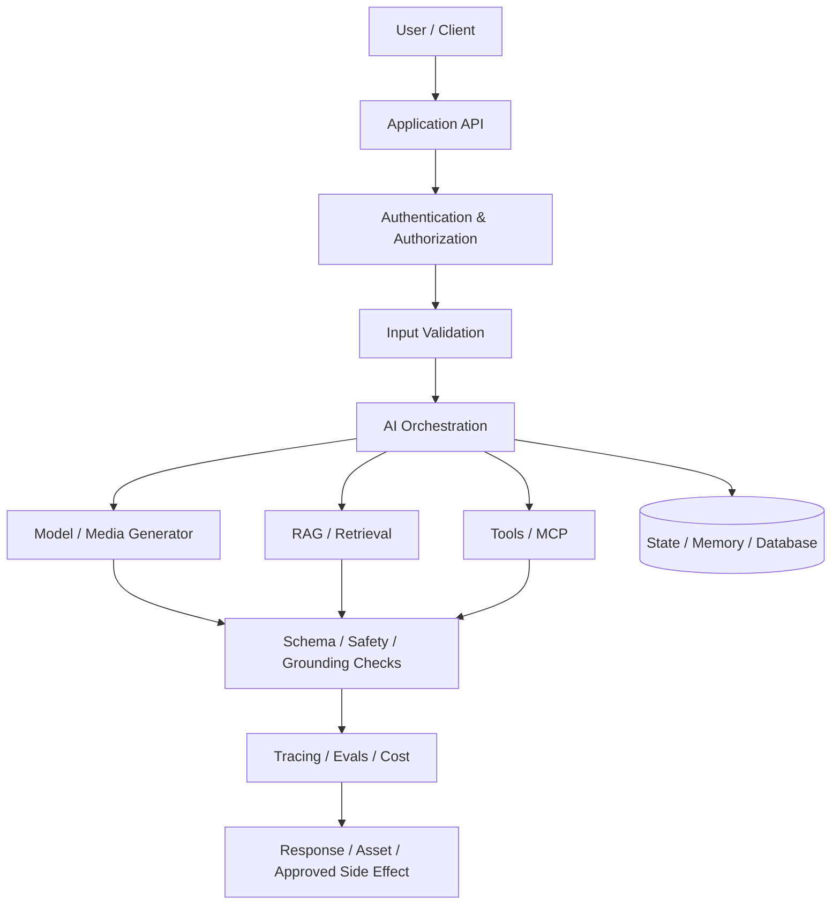
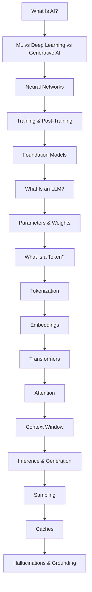
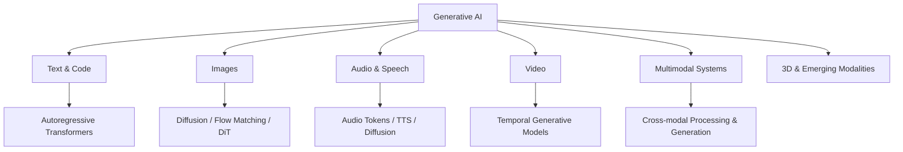
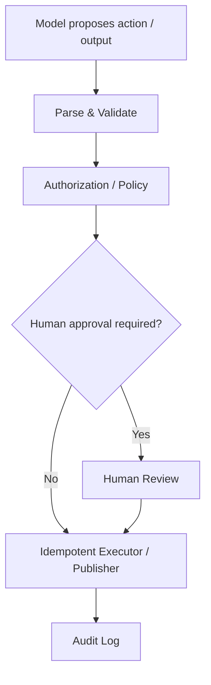
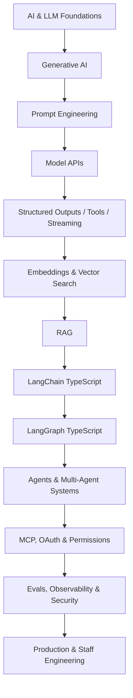

# Start Here

If you are new to AI engineering, do **not** begin with LangChain, agents, RAG, or MCP. First understand what an LLM receives, how it generates tokens, what context and cache mean, and which responsibilities belong to application code.

## The engineering mental model

A generative model is a component inside a software system, not the system itself.



The model produces probabilistic outputs. Everything around it should make uncertainty explicit and enforce deterministic invariants where the product requires them.

## Beginner path: learn these first

Work through these concepts in order before moving into frameworks.



### Foundation checkpoints

After the beginner section, you should be able to answer:

- What is AI, ML, deep learning, and generative AI?
- What is a neural network?
- What is a foundation model?
- What is an LLM?
- What is a parameter?
- What is a token, and why is a token not necessarily a word?
- What does a tokenizer do?
- What is an embedding?
- What is a transformer?
- What are Query, Key, and Value in attention?
- What is a context window?
- What is the difference between prompt, context, conversation history, and memory?
- What happens during inference?
- What are logits, softmax, temperature, top-p, and top-k?
- What is a KV cache?
- What is prompt caching?
- What is response caching?
- Why do hallucinations happen, and what does grounding mean?

If any of those answers are unclear, stay in **AI & LLM Foundations** before moving on.

## Generative AI is bigger than LLM chat



You should understand **what is being generated**, how the model is conditioned, how the output is evaluated, and what deterministic controls surround it.

## Five questions to ask before adding AI

1. **What uncertainty is useful?** Classification, extraction, generation, semantic retrieval, planning, media synthesis, or natural-language interaction?
2. **What must remain deterministic?** Authorization, money movement, database integrity, compliance checks, rate limits, idempotency, destructive writes, and asset ownership are common examples.
3. **What evidence will prove quality?** Define datasets, rubrics, acceptance criteria, and modality-specific evals before relying on demos.
4. **What happens when the model/provider/tool fails?** Timeouts, retries, fallbacks, queues, human escalation, and safe partial completion belong in the design.
5. **What does one successful task cost and how long does it take?** Token usage, retrieval, reranking, tools, model loops, image/video candidates, transcoding, storage, and queue time all contribute.

## Provider-neutral boundary

Keep provider SDK objects out of core domain code.

```ts
export type GenerateRequest = {
  system: string;
  user: string;
  signal?: AbortSignal;
};

export type GenerateResult = {
  text: string;
  inputTokens?: number;
  outputTokens?: number;
};

export interface ModelProvider {
  generate(request: GenerateRequest): Promise<GenerateResult>;
}
```

Use the same principle for media generation:

```ts
export interface MediaGenerator {
  submit(input: {
    modality: 'image' | 'audio' | 'video';
    prompt: string;
    referenceAssetIds?: string[];
  }): Promise<{ jobId: string }>;
}
```

Provider adapters can expose richer capabilities, but application policy should not become inseparable from one vendor unless the product intentionally accepts that dependency.

## Security rule

Never implement:

```text
model decides authorization → execute / publish
```

Implement:



Prompt instructions are not an authorization system.

## Full recommended study order



## How to study each topic

Every new foundation lesson uses the same learning format:

```text
Definition
→ mental model
→ visual diagram
→ code example
→ practical use case
→ common mistakes
→ production implications
→ practice questions
```

Do not only read code. Change it, break it, test edge cases, and explain the concept in your own words.

For RAG, evaluate retrieval separately from generation. For agents, inspect trajectories and stop conditions rather than judging only the final prose. For tools/MCP, treat authentication and authorization as deterministic system boundaries.

The target outcome is not “I know LangChain.” It is: **I can design, implement, evaluate, secure, operate, and explain production AI systems from first principles through agents and MCP, and I know when a simpler non-AI architecture is better.**
