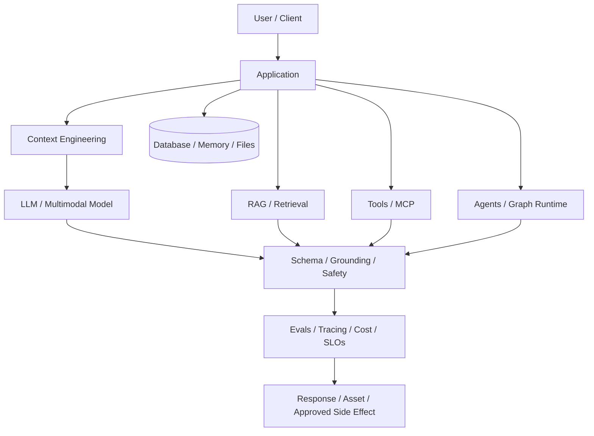
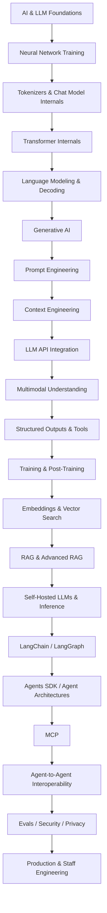
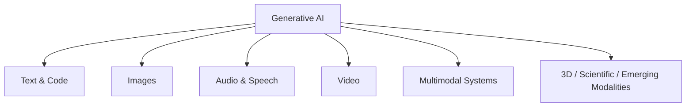
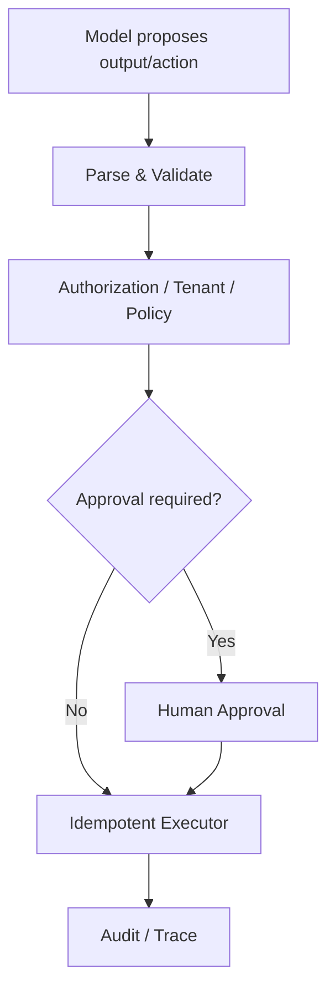

# Start Here

If you are new to AI engineering, do **not** begin with LangChain, agents, RAG, or MCP. Learn the model and application fundamentals first, then move layer-by-layer from model internals to integration, retrieval, agents, protocols, security, and production systems.

## The engineering mental model



The model is probabilistic. Authentication, authorization, tenancy, money movement, destructive writes, data retention, idempotency, rate limits, and other product invariants remain deterministic application responsibilities.

## Zero-to-hero study path



## Foundation checkpoints

Before moving into frameworks, you should be able to explain:

- AI vs machine learning vs deep learning vs generative AI;
- neural networks, forward pass, loss, gradients, backpropagation and optimizer steps;
- train/validation/test splits, overfitting and checkpoints;
- what an LLM is and how base/instruct/chat models differ;
- tokens, token IDs, vocabularies, BPE/WordPiece/Unigram, padding and chat templates;
- embeddings and tensor representations;
- transformer blocks, residuals, normalization, MLPs, RoPE, causal masking, MHA/MQA/GQA and MoE;
- next-token prediction, cross-entropy, perplexity, logits and decoding strategies;
- inference prefill vs decode, KV cache, prompt cache and response cache;
- prompt engineering vs context engineering;
- stateless/stateful API integration, streaming, background work, realtime and multimodal input;
- why evaluation, security, privacy and cost must be designed around the model rather than added later.

## Generative AI is bigger than chat



Learn both **generation** and **understanding**. Image/video/audio generation has different model families, controls, evals, serving and safety concerns from multimodal understanding of existing media.

## Provider-neutral application boundary

```ts
export type GenerateRequest = {
  instructions?: string;
  input: unknown;
  signal?: AbortSignal;
};

export type GenerateResult<T = unknown> = {
  output: T;
  inputTokens?: number;
  outputTokens?: number;
  requestId?: string;
};

export interface ModelProvider {
  generate<T = unknown>(request: GenerateRequest): Promise<GenerateResult<T>>;
}
```

Provider adapters may expose richer capabilities, but product authorization, tenant scope, retention policy and workflow semantics should not be accidental consequences of one SDK.

## Security rule



Prompt instructions are not an authorization system.

## How to study each lesson

Every new zero-to-hero lesson follows this pattern:

```text
concept
→ mental model
→ visual diagram
→ TypeScript / application example
→ production implications
→ failure modes
→ practice questions
```

Run examples, change inputs, inspect traces, measure tokens, deliberately break schemas, test long-context edge cases, replay tool failures, compare retrieval systems, and load-test inference. The goal is not to memorize framework APIs; it is to understand the layers well enough to design, evaluate, secure, operate, and explain production AI systems.
