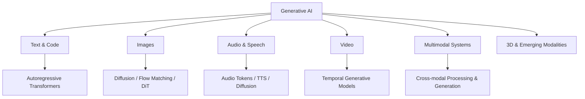

# Start Here

## The engineering mental model

A generative model is a component inside a software system, not the system itself.

```text
request
  ↓
deterministic application code
  ├── authentication / authorization
  ├── input and asset validation
  ├── retrieval
  ├── model or media-generation call
  ├── tool execution
  ├── state / asset persistence
  ├── moderation / policy enforcement
  └── observability / eval hooks
  ↓
response, generated asset, or side effect
```

The model produces probabilistic outputs. Everything around it should make uncertainty explicit and enforce deterministic invariants where the product requires them.

## Generative AI is bigger than LLM chat



You should understand **what is being generated**, how the model is conditioned, how the output is evaluated, and what deterministic controls surround it.

## Five questions to ask before adding AI

1. **What uncertainty is useful?** Classification, extraction, generation, semantic retrieval, planning, media synthesis, or natural-language interaction?
2. **What must remain deterministic?** Authorization, money movement, database integrity, compliance checks, rate limits, idempotency, destructive writes, and asset ownership are common examples.
3. **What evidence will prove quality?** Define datasets, rubrics, acceptance criteria, and modality-specific evals before relying on demos.
4. **What happens when the model/provider/tool fails?** Timeouts, retries, fallbacks, queues, human escalation, and safe partial completion belong in the design.
5. **What does one successful task cost and how long does it take?** Token usage, retrieval, reranking, tools, model loops, image/video candidates, transcoding, storage, and queue time all contribute.

## Provider-neutral boundary

Keep provider SDK objects out of core domain code.

```ts
export type GenerateRequest = {
  system: string
  user: string
  signal?: AbortSignal
}

export type GenerateResult = {
  text: string
  inputTokens?: number
  outputTokens?: number
}

export interface ModelProvider {
  generate(request: GenerateRequest): Promise<GenerateResult>
}
```

Use the same principle for media generation:

```ts
export interface MediaGenerator {
  submit(input: {
    modality: 'image' | 'audio' | 'video'
    prompt: string
    referenceAssetIds?: string[]
  }): Promise<{ jobId: string }>
}
```

Provider adapters can expose richer capabilities, but application policy should not become inseparable from one vendor unless the product intentionally accepts that dependency.

## Security rule

Never implement this:

```text
LLM or media model decides authorization → execute / publish
```

Implement this:

```text
model proposes action or creates output
  ↓
parse + validate + moderate
  ↓
authorization / policy check
  ↓
optional human approval
  ↓
idempotent tool executor or controlled publisher
  ↓
audit log
```

Prompt instructions are not an authorization system.

## Recommended study order

```text
AI & LLM Foundations
  ↓
Generative AI model families
  ↓
Image / audio / video / multimodal generation
  ↓
Fine-tuning / LoRA / synthetic data / serving
  ↓
Prompting + APIs
  ↓
Embeddings + RAG
  ↓
LangChain + LangGraph
  ↓
Agents + MCP
  ↓
Evals + Security
  ↓
Production & Staff Engineering
```

## Study expectations

Run examples, change inputs, deliberately break schemas and tools, inspect traces, create evaluation cases, and calculate cost. For media generation, vary seeds/controls, inspect asset lineage, test async job failures, and compare accepted-output cost. For RAG, evaluate retrieval separately from generation. For agents, inspect trajectories and stop conditions rather than judging only the final prose.

The target outcome is not “I know LangChain” or “I can call an image API.” It is: **I can design, implement, evaluate, secure, operate, and explain production AI systems across text and generative media, and I know when a simpler non-agent or non-generative architecture is better.**