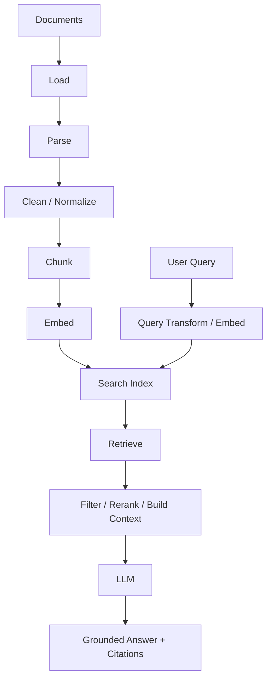

# 081 — Why RAG Exists

Retrieval-Augmented Generation (RAG) supplies external evidence at request time so a model can answer from current/private/domain data without retraining its weights.

```text
knowledge source → ingestion → searchable index
user query → retrieve evidence → model prompt → grounded answer
```

Use RAG when knowledge changes, sources must be cited, or private data cannot be assumed to exist in model weights. Do not use RAG merely because “AI apps need a vector database.”

# 082 — Complete RAG Pipeline



Evaluate each stage independently; a fluent bad answer may originate from ingestion, retrieval, context construction, or generation.

# 083 — Source Connectors & Ingestion

Ingestion reads authoritative data from files, websites, APIs, databases, object storage, SaaS systems, or event streams.

A production connector tracks source identity, version, access scope, fetch time, parser version, checksum, and deletion state. Make ingestion resumable and idempotent. Failed pages should not force reprocessing an entire corpus.

# 084 — Document Parsing

Parsing converts source formats into meaningful content and structure. PDFs may contain reading-order problems, headers/footers, scanned pages, tables, and images; HTML contains navigation/noise; code has syntax and symbol boundaries.

Preserve page/section/table/code metadata so retrieval and citations can map back to the source. “Extracted plain text” is often insufficient for production document intelligence.

# 085 — Cleaning & Normalization

Remove repeated boilerplate and obvious extraction artifacts without destroying semantics. Normalize whitespace/encoding carefully; preserve headings, lists, table relationships, code formatting, dates, and identifiers when relevant.

Keep raw source and normalized representations so parser bugs can be investigated and reprocessed without refetching everything.

# 086 — Fixed-Size Chunking

Fixed character/token windows are simple and fast but can split semantic units at bad boundaries.

**When useful.** Homogeneous text where structure is unreliable and a strong baseline is needed.

**Production lens.** Measure retrieval quality at several sizes. Chunk size is a hyperparameter tied to embedding model, query style, generator context, and document structure.

# 087 — Token-Based Chunking

Token-based chunks align more directly with model/embedding limits than character counts.

Leave margin for metadata and provider overhead. Use the tokenizer appropriate to the target model when exact budgets matter. Do not assume token counts transfer across providers/models.

# 088 — Sentence & Paragraph Chunking

Natural linguistic boundaries improve independent meaning but produce variable chunk sizes. Combine boundary-aware splitting with maximum token limits and optional grouping of short units.

For policy/legal material, a paragraph may still depend on its section heading or previous definition; preserve parent context in metadata.

# 089 — Recursive & Heading-Aware Splitting

Recursive splitting tries large semantic boundaries first—sections, paragraphs, sentences—then smaller boundaries only when needed.

Heading-aware splitting carries hierarchy:

```text
Document: Employee Handbook
Section: Leave
Subsection: Parental Leave
Chunk: eligibility paragraph
```

This improves filtering, citations, and context reconstruction.

# 090 — Semantic, Code & Table-Aware Chunking

Semantic chunking detects topic shifts; code-aware splitting respects modules/classes/functions; table-aware splitting preserves headers and row/column meaning.

Use specialized chunking only when it improves retrieval/evals enough to justify complexity. Semantic segmentation itself can be probabilistic and expensive.

# 091 — Chunk Overlap

Overlap reduces information loss at boundaries but duplicates tokens, storage, retrieval candidates, and context.

```text
chunk A: [---------]
chunk B:       [---------]
```

Prefer structure-preserving chunking before relying on huge overlap. Deduplicate neighboring chunks after retrieval.

# 092 — Chunk Metadata

Useful metadata includes document ID/version, section path, page, timestamps, tenant, ACL labels, language, content type, source URL, parser version, and chunk ordinal.

Separate retrieval metadata from user-visible citations. Never expose internal storage paths or private ACL tags merely because they were attached to a chunk.

# 093 — Indexing & Upsert Design

Derive a stable chunk identity from source/version/position or content identity. Upserts should be idempotent; deletions should remove stale chunks; migrations should be versioned.

```text
source event → parse → chunk → embed → transactional metadata → index upsert
                                            ↘ failure queue
```

Reconciliation jobs detect drift between source truth and index truth.

# 094 — Retrieval Basics

A retriever accepts a query and returns ranked candidates with content, metadata, and scores.

```ts
type RetrievedChunk = {
  id: string;
  text: string;
  score: number;
  sourceId: string;
  metadata: Record<string, unknown>;
};
```

Keep the retriever interface independent from the generator so retrieval can be evaluated and replaced separately.

# 095 — Top-k & Retrieval Budgets

Larger `k` improves candidate recall up to a point but adds noise, reranking cost, and context pressure.

Use two budgets: candidate `k` for high recall and final context `k`/token budget after reranking/deduplication. Tune on labeled queries rather than copying `k=5` from tutorials.

# 096 — Context Construction

Retrieved chunks must be transformed into a prompt/input package with source labels, ordering, deduplication, and token limits.

Do not concatenate arbitrary chunks until the window fills. Prefer coherent evidence and keep related sections together when needed. Tell the model to distinguish evidence from instructions.

# 097 — Grounded Generation

A grounded answer should be supported by supplied evidence and should say when evidence is insufficient.

Prompt contract:

```text
Answer using only the provided sources for factual claims.
Cite source IDs for each material claim.
If sources do not support the answer, say what information is missing.
```

Then evaluate groundedness; prompts alone do not guarantee it.

# 098 — Citations

Citations require traceability from generated claim → retrieved context → original source location.

Prefer deterministic source IDs/URLs/page anchors attached to context. Ask the model to reference provided citation IDs, then validate those IDs exist. Do not let the model invent arbitrary URLs.

# 099 — When Not to Use RAG

Avoid RAG when the task is pure transformation/extraction of supplied input, when a deterministic database query can directly return the answer, or when the data is tiny enough to supply fully and reliably.

For actions, use tools. For stable behavior/style, prompting or fine-tuning may help. For exact analytics, query the database rather than semantically retrieving prose about the data.

# 100 — Basic RAG TypeScript Architecture

```ts
type Retriever = {
  search(query: string, opts: { tenantId: string; k: number }): Promise<RetrievedChunk[]>;
};

async function answerQuestion(query: string, ctx: RequestContext) {
  const chunks = await retriever.search(query, { tenantId: ctx.tenantId, k: 12 });
  const context = buildContext(chunks, { maxTokens: 6_000 });
  return model.generate({
    system: "Answer from supplied evidence and cite source IDs.",
    user: `${query}\n\n${context}`,
  });
}
```

Production code adds ACL filtering, query transformation, reranking, tracing, eval hooks, timeouts, caching, and insufficient-context handling.
