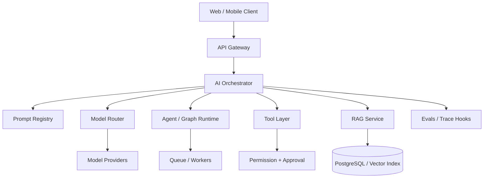

# Production AI Architecture

A mature AI product separates orchestration, models, retrieval, tools, permissions, state, async work, and observability.


```mermaid
flowchart TD
  C[Web / Mobile Client] --> G[API Gateway]
  G --> O[AI Orchestrator]
  O --> P[Prompt Registry]
  O --> MR[Model Router]
  O --> AG[Agent / Graph Runtime]
  O --> TL[Tool Layer]
  O --> RS[RAG Service]
  TL --> AU[Permission + Approval]
  O --> EV[Evals / Trace Hooks]
  RS --> DB[(PostgreSQL / Vector Index)]
  AG --> Q[Queue / Workers]
  MR --> MP[Model Providers]
```

Keep component ownership and failure contracts explicit.

## Production application boundary

A strong AI architecture diagram is incomplete if it starts at the orchestrator. The request must pass normal application-security controls before the model is allowed to influence privileged actions.

```text
client
  ↓
TLS / gateway / request limits
  ↓
authentication
  ↓
runtime validation
  ↓
authorization + tenant/resource ownership
  ↓
rate/quota/budget controls
  ↓
AI orchestration / RAG / model / agent
  ↓
tool proposal
  ↓
re-validation + re-authorization + approval + idempotency
  ↓
side effect
  ↓
validated/redacted response + audit/trace
```

The dedicated [Production Application Security, Validation & Reliability](../zero-to-hero/production/production-application-security-reliability.md) lesson covers the complete boundary: AuthN vs AuthZ vs validation, RBAC/ABAC/scopes, object-level access, CORS/CSRF/session security, file/RAG ingestion, webhook replay protection, SSRF/egress, secrets/encryption, unsafe API consumption, supply-chain controls, backups/RPO/RTO, recovery tests and deployment rollback.

# Async AI Workloads

Long research, ingestion, document processing, and multi-step agents should not hold one HTTP request open indefinitely.

```text
POST /jobs → durable job row → queue → worker → checkpoint/progress → result
```

Return a job ID, support status/event streaming, cancellation, deadlines, retries, idempotency, and dead-letter handling. Persist enough state to resume safely after worker failure.

# Model Routing & Fallbacks

Route by task requirements and measured quality.

```text
extraction → fast inexpensive structured model
hard reasoning → reasoning model
vision → multimodal model
high-volume classification → small model
```

Include provider health, latency budget, data residency, tool/structured-output support, context, and cost. Evaluate each route and fallback; failover that silently changes semantics can be worse than a clear error.

# Caching

Caching can target exact responses, provider prompt prefixes, embeddings, retrieval candidates, reranker results, and deterministic tool results.

Cache keys must include all inputs that affect semantics: model/version, prompt version, tenant/security scope, locale, source/index version, and tool parameters. Never share personalized/private cache entries across tenants. Define TTL and invalidation before enabling a cache.

# Cost Engineering

Total task cost includes model input/output/reasoning tokens, embeddings, reranking, vector/database infrastructure, tools, agent loops, observability/storage, and retries.

```text
cost per successful task = total platform cost / successful task completions
```

Optimize by reducing irrelevant context, routing simpler tasks, batching ingestion, caching safe work, bounding loops, and improving retrieval so expensive models do less recovery work. Track cost by feature/tenant/model/prompt version.

# Latency Engineering

```text
total latency = network + queue + retrieval + reranking
              + prompt/model TTFT + generation
              + tools + agent loops + persistence
```

Measure p50/p95/p99 and time-to-first-useful-output. Parallelize independent reads, stream user-visible progress, prefetch where safe, reuse connections, and move long work async. Never “optimize the model” before identifying which span dominates the trace.

# Failure Handling & Reliability

Classify failures:

```text
error → retryable | recoverable | human-required | fatal
```

Use exponential backoff with jitter, circuit breakers for failing dependencies, bounded fallbacks, idempotent writes, dead-letter queues, and explicit partial-result states. Handle context overflow, empty retrieval, malformed structured output, expired OAuth tokens, provider outage, duplicate tool calls, and user cancellation intentionally.

Recovery planning also includes tested backups, RPO/RTO targets, rebuildable vector indexes, restore runbooks and graceful degradation when dependencies are unavailable.

# Testing AI Applications

Separate ordinary software tests from probabilistic evals.

- unit test parsers, policies, adapters, chunkers, routing, caching, idempotency;
- negative-test authentication/authorization and cross-tenant resource access;
- test API/session/browser controls relevant to the architecture;
- mock model/tool boundaries for deterministic scenarios;
- integration test provider contracts and vector/database queries;
- graph test every route/interrupt/resume/failure;
- adversarially test uploads, URLs, webhooks and high-risk tool boundaries;
- eval datasets measure model/retrieval/agent quality;
- contract tests protect event/schema/API evolution;
- load/failure/recovery tests validate saturation, restart and restore behavior.

A passing eval suite does not replace unit/security tests; unit tests do not prove model quality.

# AI System Design

For any AI system design interview or architecture review, cover requirements, task quality, scale, model selection, context/RAG, state, tools, authentication, authorization, validation, tenant isolation, async processing, retries, evals, observability, cost, latency, security, recovery, deployment and evolution.

Start with the simplest valid architecture and identify why/when you would add retrieval, graph orchestration, multi-agent specialization, fine-tuning, or dedicated infrastructure.

# Staff AI / Agent Platform Engineering

Staff-level work creates paved roads for many teams: provider gateways, prompt/schema registries, model routing, secure tool/MCP platforms, reusable RAG ingestion/retrieval, graph runtime standards, tenant-aware authorization, validation libraries, identity/session standards, eval infrastructure, traces/metrics, cost budgets, backup/recovery patterns, incident controls, and upgrade governance.

```text
product teams
   ↓
AI platform contracts
 ├─ models
 ├─ retrieval
 ├─ tools / MCP
 ├─ state / agents
 ├─ identity / policy
 ├─ validation
 ├─ evals
 └─ observability
   ↓
providers + data + infrastructure
```

The goal is not maximum abstraction. It is safe, measurable leverage: teams can ship AI features quickly while critical reliability/security/evaluation practices are difficult to bypass.

**Staff interview lens.** Explain organizational trade-offs, migration strategy, ownership boundaries, multi-tenancy, incident containment, disaster recovery, vendor portability, and how platform success will be measured.
