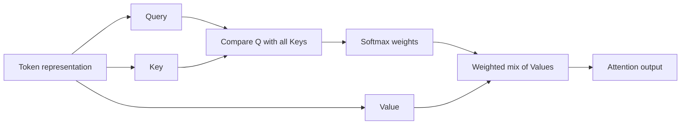
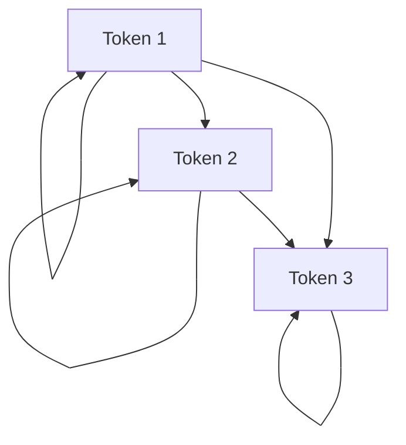
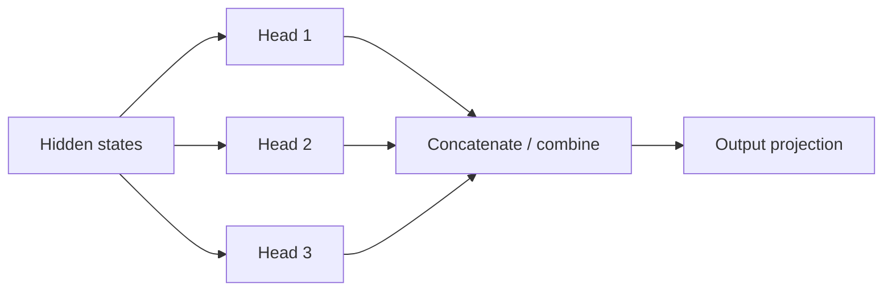

# Attention, Queries, Keys & Values

**Attention** lets a token representation gather information from other token representations in the sequence.

The core scaled dot-product attention equation is:

```text
Attention(Q, K, V) = softmax(QKᵀ / √d) V
```

You do not need to memorize the equation before understanding the data flow.

## Mental model

For every token, the model creates three learned projections:

- **Query (Q)** — what this position is looking for;
- **Key (K)** — what each position offers for matching;
- **Value (V)** — information that can be mixed into the result.



## Tiny numeric example

Suppose one query compares against three keys and produces scores:

```text
[2.0, 0.5, -1.0]
```

Softmax converts those scores into positive weights that sum to 1.

```ts
function softmax(values: number[]): number[] {
  const max = Math.max(...values);
  const exps = values.map(v => Math.exp(v - max));
  const total = exps.reduce((a, b) => a + b, 0);
  return exps.map(v => v / total);
}

console.log(softmax([2.0, 0.5, -1.0]));
```

The highest score gets the largest contribution, but other positions can still contribute.

## Dot product

A dot product measures alignment between vectors.

```ts
function dot(a: number[], b: number[]): number {
  if (a.length !== b.length) throw new Error("dimension mismatch");
  return a.reduce((sum, value, i) => sum + value * b[i], 0);
}
```

Attention uses dot products between queries and keys, scaled by the key dimension before softmax.

## Why scale by √d?

As vector dimensions grow, raw dot products can become large. Dividing by the square root of the key dimension helps keep values in a range where softmax behaves more usefully during training.

## Causal self-attention

For autoregressive generation, a token should not see future tokens.



Equivalent allowed-attention matrix:

```text
      key1 key2 key3 key4
q1      ✓    ✗    ✗    ✗
q2      ✓    ✓    ✗    ✗
q3      ✓    ✓    ✓    ✗
q4      ✓    ✓    ✓    ✓
```

Future positions are masked before softmax.

## Multi-head attention

Instead of one Q/K/V projection, transformers use multiple attention heads. Different heads can learn different interaction patterns.



Do not interpret every head as a clean human-readable feature. Heads are learned internal mechanisms and can be redundant or distributed.

## Attention is not a database lookup

High attention weight does not prove a causal explanation or factual source attribution. It is an internal computation. Product citations should come from explicit retrieval/source tracking rather than trying to read “what the model attended to.”

## Attention cost

Standard full attention compares many token pairs. Long sequences can therefore be expensive in compute and memory.

```text
sequence length grows
→ attention matrix grows roughly with pairs of positions
→ long-context serving becomes expensive
```

Modern architectures use optimizations such as FlashAttention, grouped-query attention, sliding windows, chunked attention, sparse patterns, and cache strategies.

## Why attention explains KV cache

During autoregressive generation, previously generated tokens already have key/value projections. Recomputing them every step is wasteful, so inference runtimes cache those K/V tensors.

```text
attention today
Q(new token) + K/V(previous tokens)
```

The next lesson on KV cache builds directly on this.

## Practice

1. Explain Q, K, and V without using the equation.
2. Implement a weighted sum of three value vectors.
3. Why does causal masking matter for next-token training/generation?
4. Why should attention weights not be treated as user-facing citations?
