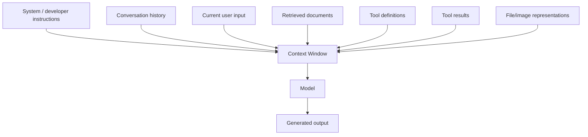
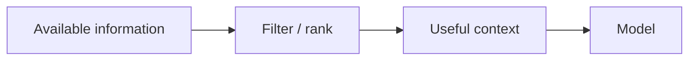
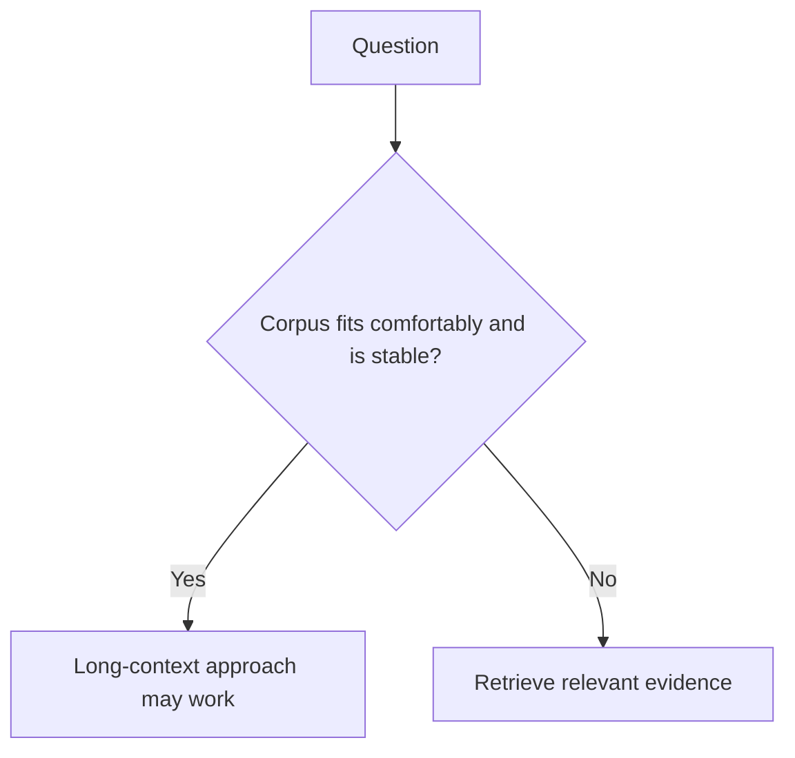

# Context Window & Token Budget

The **context window** is the amount of tokenized information a model can consider within one request/run according to that model/API's limits.

The context may include far more than the user's latest sentence.

## What consumes context?



Depending on the provider/model, output capacity may share a total budget with input context or be exposed through separate limits. Always check the current model contract rather than assuming one universal rule.

## Context window is not memory

A model can process content currently supplied in context, but that does not mean it permanently remembers the information across future requests.

```text
context = information available for this model call / conversation state
memory  = application or provider state deliberately persisted across calls
```

Application memory might live in PostgreSQL, a vector store, a graph checkpoint, or a provider conversation object.

## Context budget example

```ts
type ContextBudget = {
  instructions: number;
  history: number;
  retrieval: number;
  tools: number;
  currentInput: number;
  reservedOutput: number;
};

function usedTokens(budget: ContextBudget): number {
  return Object.values(budget).reduce((sum, n) => sum + n, 0);
}

const budget: ContextBudget = {
  instructions: 2_000,
  history: 8_000,
  retrieval: 20_000,
  tools: 5_000,
  currentInput: 1_500,
  reservedOutput: 4_000,
};

console.log(usedTokens(budget));
```

Use the provider/model's real tokenizer or usage reporting when exact counts matter.

## More context is not automatically better

Large context windows are useful, but dumping everything into the prompt can create:

- higher latency;
- higher cost;
- conflicting evidence;
- repeated instructions;
- irrelevant distraction;
- larger prompt-injection surface;
- harder debugging.



Context engineering is the discipline of deciding **what information the model should receive, in what order, and under what trust boundaries**.

## Truncation

If a request exceeds limits, an API/runtime may reject it, truncate it, or require your application to shorten the input. Silent truncation is dangerous because it can remove:

- the latest user instruction;
- security constraints;
- source citations;
- critical document sections.

Prefer explicit policy.

```ts
type Chunk = {
  id: string;
  text: string;
  estimatedTokens: number;
  score: number;
};

function selectWithinBudget(chunks: Chunk[], maxTokens: number): Chunk[] {
  const sorted = [...chunks].sort((a, b) => b.score - a.score);
  const selected: Chunk[] = [];
  let total = 0;

  for (const chunk of sorted) {
    if (total + chunk.estimatedTokens > maxTokens) continue;
    selected.push(chunk);
    total += chunk.estimatedTokens;
  }

  return selected;
}
```

## Long-context vs RAG

A long context window can sometimes hold an entire bounded dataset. RAG can be better when the corpus is huge, dynamic, private, permissioned, or when citations/source selection matter.



This is not an either/or decision. Production systems can use retrieval to choose high-value evidence and still take advantage of a large context window.

## Lost-in-the-middle and position effects

Models may not use all positions equally well on all tasks. Long-context capacity is not a guarantee that a model will perfectly reason over every token.

Evaluate:

- evidence near the beginning;
- evidence in the middle;
- evidence near the end;
- conflicting evidence;
- repeated evidence;
- distractors.

## Tool descriptions consume context too

An agent with hundreds of verbose tool descriptions can waste context and make tool selection harder.

Give each request only relevant, authorized capabilities whenever possible.

## Prompt caching does not expand context

If a 20,000-token prefix is cached, it may be cheaper/faster to reuse, but those 20,000 tokens still belong to the model's request context semantics.

```text
cached prefix = reusable computation/state
not = free unlimited context
```

## Production checklist

Track:

```text
input tokens
cached input tokens
retrieval tokens
history tokens
tool-schema tokens
output tokens
context-limit errors
truncation events
```

## Practice

1. List six things that can consume context in an agentic application.
2. Explain context window vs long-term memory.
3. Why can a larger context window make a poorly designed RAG prompt worse?
4. Design a policy for dropping old conversation history without losing critical facts.
