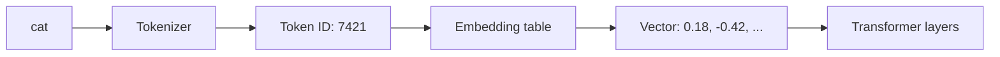
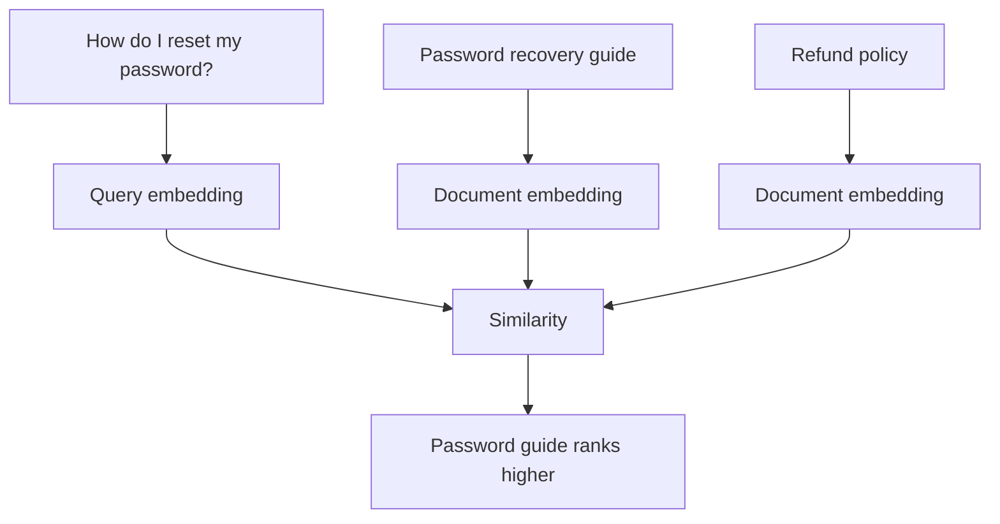
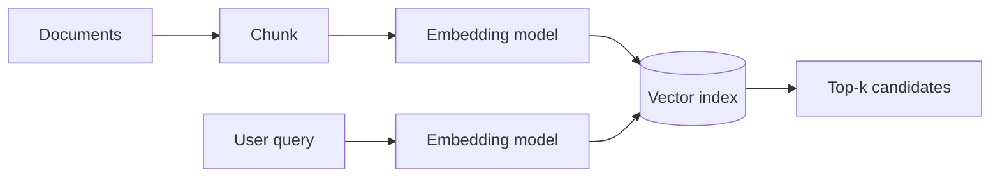

# Embeddings

An **embedding** is a vector of numbers used to represent an item—such as a token, sentence, image, product, or document—in a space where useful relationships can be learned or measured.

For LLMs, token IDs are converted into learned embedding vectors before transformer layers process them.

## Token ID to vector



A token ID is an integer label. An embedding is a dense vector representation.

## Toy embedding lookup

```ts
const embeddingTable: Record<number, number[]> = {
  1: [0.2, -0.1, 0.7],
  2: [0.22, -0.08, 0.68],
  3: [-0.7, 0.6, 0.1],
};

function lookupEmbedding(tokenId: number): number[] {
  const vector = embeddingTable[tokenId];
  if (!vector) throw new Error("unknown token");
  return vector;
}
```

Real embedding vectors may have hundreds or thousands of dimensions.

## Similarity

Standalone embedding models are often used for semantic search. Texts with related meaning should be close according to a similarity metric.



## Cosine similarity

Cosine similarity compares the angle between vectors.

```ts
function cosineSimilarity(a: number[], b: number[]): number {
  if (a.length !== b.length) throw new Error("dimension mismatch");

  let dot = 0;
  let normA = 0;
  let normB = 0;

  for (let i = 0; i < a.length; i++) {
    dot += a[i] * b[i];
    normA += a[i] ** 2;
    normB += b[i] ** 2;
  }

  return dot / (Math.sqrt(normA) * Math.sqrt(normB));
}
```

## Token embeddings vs text embeddings

These are related ideas but different application boundaries.

```text
token embedding
→ internal representation used by a language model

text/document embedding
→ vector intentionally exposed for search, clustering, recommendations, etc.
```

Do not assume the internal token embedding table is the same model/output used by a provider's embeddings API.

## Semantic search flow



This becomes one foundation of Retrieval-Augmented Generation (RAG).

## Embeddings are not truth

A high similarity score means the embedding model considers two representations close under its learned geometry. It does not prove factual correctness, authorization, or exact keyword match.

That is why production retrieval often combines:

- metadata filters;
- lexical/BM25 search;
- vector similarity;
- reranking;
- access control;
- freshness/version checks.

## Dimension

All vectors stored in one vector index configuration generally need compatible dimensions.

```ts
type EmbeddedChunk = {
  id: string;
  vector: number[];
  text: string;
  tenantId: string;
};
```

If you migrate embedding models and their dimensions or semantics differ, plan index migration/re-embedding rather than silently mixing representations.

## Normalization

Some similarity metrics or model outputs expect normalized vectors. Do not apply normalization blindly; follow the embedding model/vector database guidance for the metric being used.

## Production use cases

Embeddings support:

- semantic search;
- RAG retrieval;
- clustering;
- deduplication;
- recommendation;
- anomaly detection;
- near-duplicate detection;
- cross-modal retrieval with multimodal embedding models.

## Practice

1. Explain token ID vs embedding vector.
2. Implement dot-product similarity.
3. Why can vector similarity retrieve semantically related text without matching exact words?
4. Why should tenant/security metadata filtering happen before returning search candidates?
