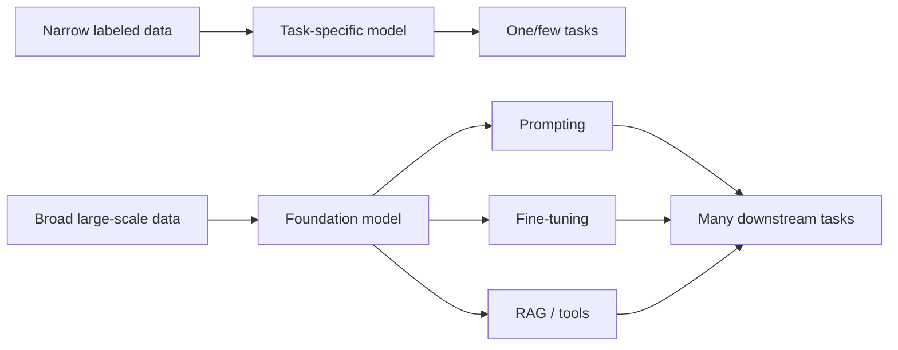
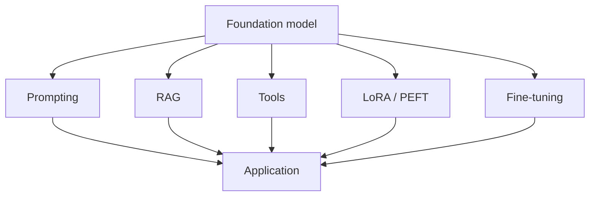

# Foundation Models

A **foundation model** is a broadly trained model that can be adapted or prompted for many downstream tasks instead of being trained only for one narrow prediction problem.

An LLM is one kind of foundation model. Vision, audio, multimodal, and generative-media models can also be foundation models.

## Narrow model vs foundation model



## Why foundation models matter

A single pretrained model can often support:

- summarization;
- classification;
- extraction;
- translation;
- code generation;
- question answering;
- multimodal analysis;
- tool use;
- domain adaptation.

## Adaptation layers



These techniques solve different problems. RAG adds external knowledge; prompting provides runtime instructions; fine-tuning changes learned behavior.

## TypeScript abstraction

```ts
type Capability =
  | "text"
  | "vision"
  | "audio"
  | "tools"
  | "structured_output";

type FoundationModel = {
  id: string;
  capabilities: Capability[];
  provider: string;
};
```

Treat capability and evaluation results as product configuration rather than assuming every foundation model behaves identically.

## Practice

1. Why is a foundation model broader than a task-specific classifier?
2. When should you use RAG instead of fine-tuning?
3. Name three foundation-model modalities besides text.
