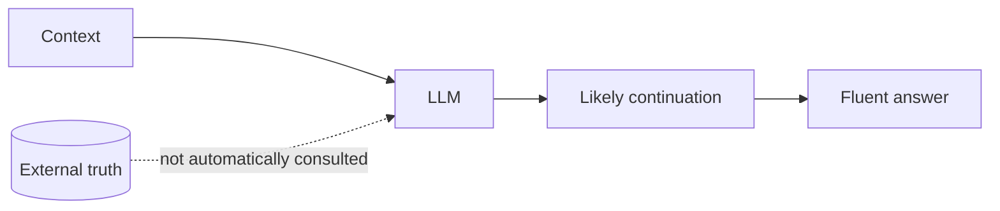
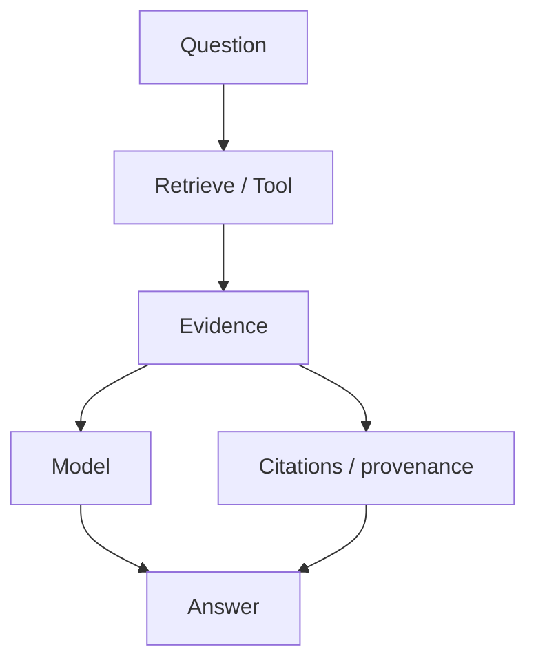

# Hallucinations, Grounding & Uncertainty

A **hallucination** is an output that sounds plausible but is unsupported, incorrect, fabricated, or inconsistent with the required evidence.

Hallucinations are not just “weird answers.” In production they include invented citations, wrong IDs, unsupported legal claims, fabricated database fields, or confident answers when evidence is missing.

## Why they happen

An LLM is optimized to generate useful/probable continuations, not to query a guaranteed truth store for every sentence.



Unless truth is supplied through training, context, retrieval, or tools—and the model uses it correctly—the model can produce unsupported content.

## Grounding

**Grounding** ties an answer to explicit evidence such as retrieved documents, database records, API results, calculations, or tool outputs.



## Example: insufficient evidence

Bad prompt behavior:

```text
Question: What is Acme's 2027 refund deadline?
Context: No 2027 refund policy is provided.
Answer: The deadline is 30 days.
```

A better contract allows uncertainty:

```ts
type GroundedAnswer =
  | {
      status: "answered";
      answer: string;
      sourceIds: string[];
    }
  | {
      status: "insufficient_context";
      missing: string[];
    };
```

Now “I do not have enough evidence” is a valid machine-readable result.

## Grounded-answer pipeline

```ts
type Source = {
  id: string;
  text: string;
};

async function answerWithEvidence(
  question: string,
  sources: Source[],
): Promise<GroundedAnswer> {
  if (sources.length === 0) {
    return {
      status: "insufficient_context",
      missing: ["relevant source evidence"],
    };
  }

  // Real implementation: call model with sources + strict output schema.
  throw new Error("model adapter omitted from teaching example");
}
```

## RAG reduces some hallucinations, not all

Retrieval-Augmented Generation can provide evidence, but failure modes remain:

```text
bad retrieval → wrong context → wrong answer
correct retrieval + poor synthesis → wrong answer
correct answer + wrong citation → evaluation failure
```

Therefore measure retrieval and generation separately.

## Tool grounding

Some facts should come from authoritative systems.

```text
account balance → banking API
tax calculation → deterministic calculator
current order status → order database
latest weather → weather API
```

Do not ask the model to “remember” volatile values that a tool can retrieve.

## Citation integrity

A citation should support the specific claim it is attached to.

```ts
type Claim = {
  text: string;
  sourceIds: string[];
};
```

A model mentioning a source ID does not prove that the source contains the claim. Citation evals should verify entailment/support.

## Uncertainty

Natural-language confidence statements such as “I am 95% sure” are not automatically calibrated probabilities.

Prefer explicit domain states:

```text
answered
insufficient_context
conflicting_sources
blocked
needs_human_review
```

## Deterministic validation

If an output contains fields that can be checked, validate them.

```ts
function validateOrderId(id: string): boolean {
  return /^ord_[a-z0-9]{12}$/i.test(id);
}
```

The best anti-hallucination strategy is often to move objective constraints into code.

## Production metrics

Track:

```text
answer correctness
groundedness
citation precision
citation recall
insufficient-context accuracy
retrieval hit rate
fabricated identifier rate
unsupported claim rate
```

## Practice

1. Give three examples of hallucinations that are not ordinary factual trivia.
2. Why does RAG not guarantee correctness?
3. Design a structured output that supports conflicting sources.
4. Which facts in an e-commerce agent should come from tools instead of model memory?
