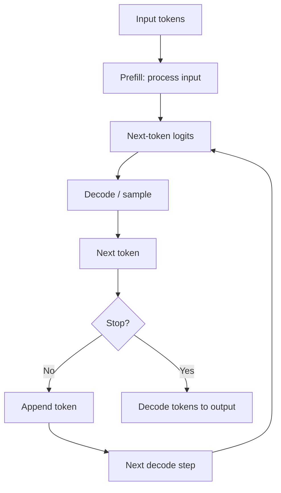
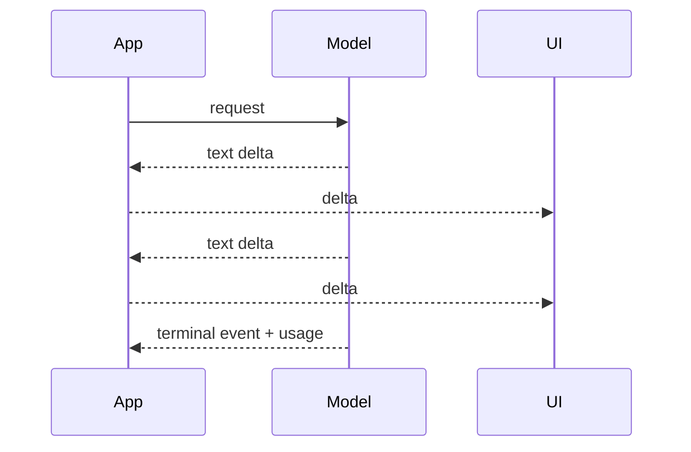

# Inference & Autoregressive Generation

**Inference** means using a trained model to produce predictions or outputs. Training changes model parameters; inference normally uses the already-trained parameters.

For a decoder-style LLM, text generation is usually **autoregressive**: generate one token, append it, then generate the next token.

## Generation loop



## Prefill vs decode

It is useful to split inference latency into two phases.

### Prefill

The model processes the existing prompt/context.

```text
system + history + user + RAG + tools
→ transformer forward pass over prompt
```

### Decode

The model generates new tokens one step at a time.

```text
token 1 → token 2 → token 3 → ...
```

This distinction explains **time to first token** versus **tokens per second after generation starts**.

## Tiny generation simulator

This is educational; it is not an LLM.

```ts
const transitions: Record<string, [string, number][]> = {
  "AI": [["can", 0.7], ["is", 0.3]],
  "can": [["help", 0.6], ["generate", 0.4]],
};

function choose(options: [string, number][]): string {
  const r = Math.random();
  let total = 0;
  for (const [token, p] of options) {
    total += p;
    if (r <= total) return token;
  }
  return options.at(-1)![0];
}

function generate(start: string, maxTokens = 5): string[] {
  const out = [start];
  let current = start;

  for (let i = 0; i < maxTokens; i++) {
    const options = transitions[current];
    if (!options) break;
    current = choose(options);
    out.push(current);
  }

  return out;
}
```

A real LLM calculates the next-token distribution from transformer hidden states rather than a hand-written transition table.

## Stop conditions

Generation can end because of:

- an end-of-sequence token;
- maximum output-token limit;
- provider/model stop behavior;
- application cancellation;
- safety intervention;
- tool-call transition;
- timeout/error.

Your application should treat cancellation and partial streams as explicit states.

```ts
type GenerationState =
  | { status: "running" }
  | { status: "completed"; text: string }
  | { status: "cancelled"; partialText: string }
  | { status: "failed"; error: string };
```

## Streaming

Streaming sends output events while generation is happening instead of waiting for the final text.



Streaming improves perceived latency but does not necessarily reduce total compute.

## Deterministic vs stochastic inference

Some tasks should be as stable as possible; others benefit from diversity. Decoding settings affect how next tokens are selected, but model/provider APIs differ in which controls they expose.

For machine-critical outputs, use schemas and deterministic validators instead of assuming low temperature makes an output correct.

## Batch inference

Independent requests can sometimes be batched for better throughput, especially offline jobs.

```text
request A ─┐
request B ─┼→ batch → accelerator → results
request C ─┘
```

Batching can improve hardware utilization but may increase waiting time if latency-sensitive requests sit in a queue.

## Online vs offline inference

**Online inference** prioritizes interactive latency.

**Offline/batch inference** prioritizes throughput/cost for jobs such as large-scale classification, embedding generation, or dataset processing.

## Production metrics

Measure:

```text
request latency
queue latency
time to first token
tokens per second
input tokens
output tokens
cache hit rate
cancellation rate
provider errors
cost per successful task
```

## Practice

1. Explain training vs inference.
2. Explain prefill vs decode.
3. Why can streaming improve UX without reducing total generation time?
4. What should happen if the user disconnects while a write-capable agent is still running?
