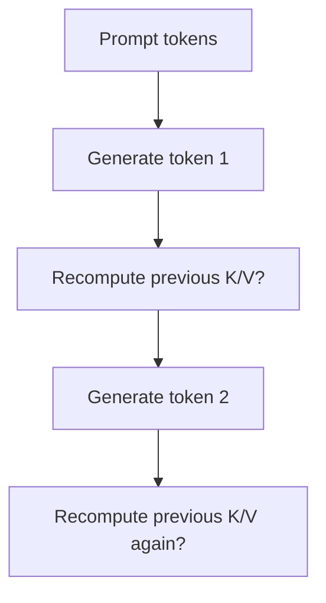
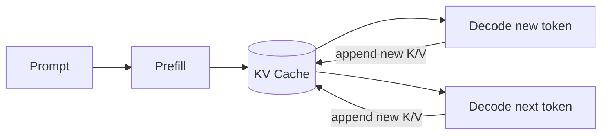
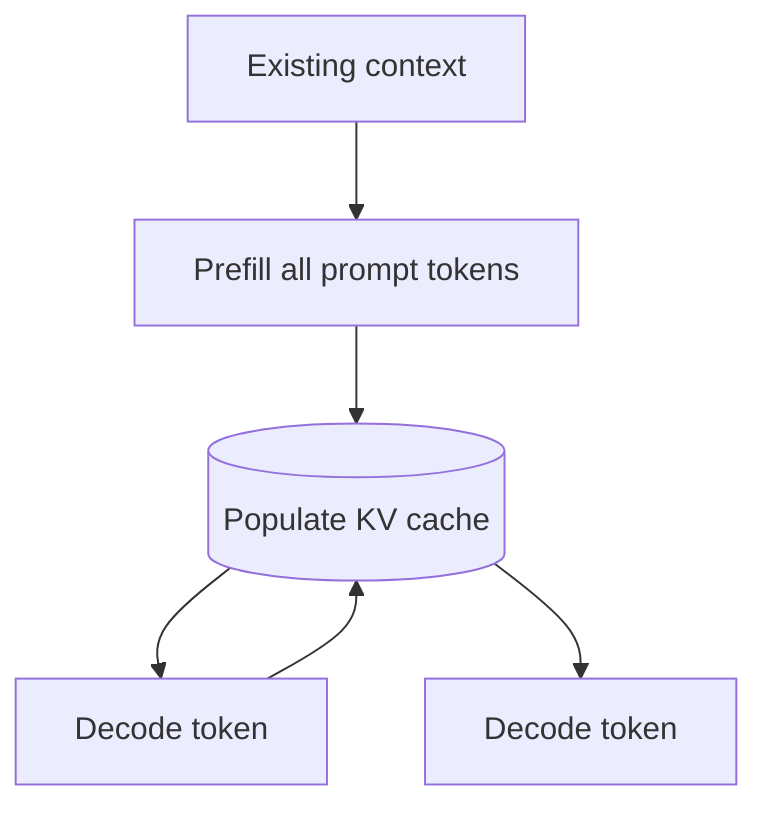
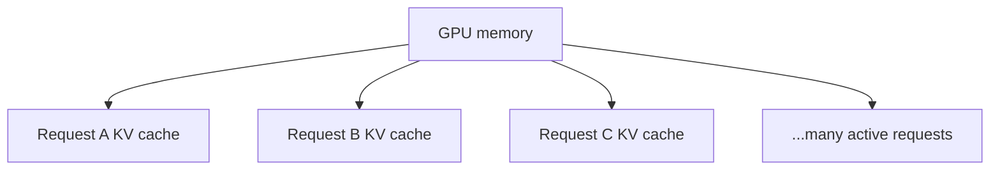

# KV Cache

A **KV cache** is an inference optimization used by autoregressive transformer models. It stores the attention **Key (K)** and **Value (V)** tensors calculated for previously processed tokens so the model does not recompute those tensors from scratch at every generation step.

This is one of the most important kinds of “cache” to understand in LLM systems—and it is different from prompt caching or application response caching.

## Why KV cache exists

Without caching, generating each new token would repeatedly recompute attention state for earlier tokens.



KV cache stores those prior K/V tensors once.



Current Hugging Face Transformers documentation describes this directly: autoregressive generation otherwise repeats calculations for previous context, while KV caching reuses stored key/value states.

## Relation to attention

For a newly generated token, the model needs a new query and new K/V for that token, while prior K/V are reused.

```text
Q(new token)
   ↓
attention against
K/V(previous tokens from cache) + K/V(new token)
```

## Educational cache shape

Real tensors have model-specific dimensions, but a conceptual interface looks like:

```ts
type Tensor = number[][];

type LayerKV = {
  keys: Tensor;
  values: Tensor;
};

type KVCache = LayerKV[];
```

Each transformer layer may maintain its own cached K/V state.

## Conceptual update

```ts
function appendRows(existing: number[][], next: number[][]): number[][] {
  return [...existing, ...next];
}

function updateLayerCache(
  cache: LayerKV,
  newKeys: number[][],
  newValues: number[][],
): LayerKV {
  return {
    keys: appendRows(cache.keys, newKeys),
    values: appendRows(cache.values, newValues),
  };
}
```

Production inference engines store efficient GPU tensors rather than JavaScript arrays.

## Prefill and decode

KV cache makes the prefill/decode distinction clearer.



**Prefill** processes the prompt and creates cache state.

**Decode** reuses that cache while adding one or more newly generated token states.

## Memory trade-off

KV cache reduces repeated compute but consumes memory. The cache generally grows with sequence length until architecture-specific limits such as sliding-window attention apply.

```text
longer sequence
→ more cached K/V state
→ more accelerator memory
```

This can become a major serving constraint for long contexts and high concurrency.

## Why concurrency is expensive

If thousands of users generate simultaneously, the server may need separate KV state for many active sequences.



That is why production inference engines use techniques such as paged memory management, quantized caches, offloading, sliding windows, continuous batching, and cache-aware scheduling.

## KV cache vs prompt cache

```text
KV cache
= runtime attention state used during generation

prompt cache
= reuse of repeated prompt-prefix processing across requests
```

They can be related internally, but they are different concepts and should be taught separately.

## KV cache vs response cache

```text
KV cache → helps compute a new answer faster
response cache → returns a previously stored answer/result
```

A response cache may skip model inference entirely on a hit. KV cache is part of model inference.

## When cache can be disabled

Some frameworks let you disable KV caching. That can be useful for training or specific memory/debugging scenarios, but autoregressive inference usually benefits from caching.

Hugging Face documentation explicitly notes that inference caching should not simply be treated as a training optimization.

## Cache variants

Modern inference libraries can provide variants such as:

- dynamic caches;
- static caches;
- quantized caches;
- offloaded caches;
- sliding-window-aware caches;
- encoder-decoder caches.

The right choice depends on memory, latency, model architecture, compilation strategy, and workload.

## Production metrics

If you self-host or operate inference infrastructure, monitor:

```text
KV cache memory usage
cache allocation failures
active sequence count
sequence length distribution
time to first token
decode tokens/sec
GPU utilization
queue depth
```

## Practice

1. Explain why previous K/V states can be reused during autoregressive generation.
2. Why does KV cache consume more memory for longer conversations?
3. Compare KV cache, prompt cache, and response cache.
4. Why can a long-context model have a concurrency problem even when its weights fit in GPU memory?
