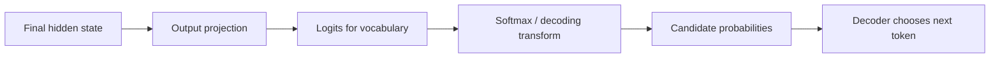
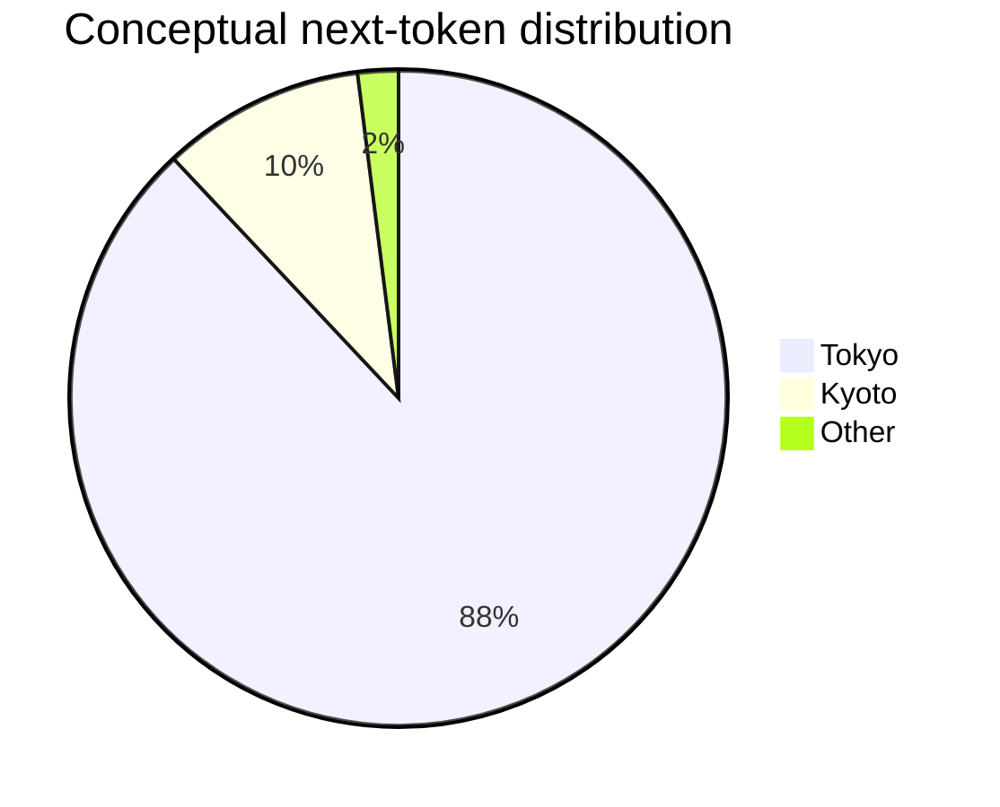

# Logits, Softmax & Token Probabilities

Before an LLM chooses the next token, its final layer produces a score for each candidate token in the vocabulary. These raw scores are commonly called **logits**.

Logits are not probabilities yet.

## From hidden state to token choice



Imagine a tiny vocabulary:

```text
Token     Logit
Tokyo      5.1
Kyoto      2.3
Paris     -0.8
```

The larger logit is favored, but logits themselves do not need to be between 0 and 1.

## Softmax

Softmax converts a list of scores into positive values that sum to 1.

```ts
function softmax(logits: number[]): number[] {
  const max = Math.max(...logits);
  const exps = logits.map(x => Math.exp(x - max));
  const sum = exps.reduce((a, b) => a + b, 0);
  return exps.map(x => x / sum);
}

console.log(softmax([5.1, 2.3, -0.8]));
```

Subtracting the maximum logit before exponentiating improves numerical stability without changing the final softmax distribution.

## Why probabilities matter

The distribution says how strongly the model favors each next-token candidate under the current context.



The exact probability distribution changes after each generated token because the context changes.

## Greedy decoding

Greedy decoding always chooses the highest-probability candidate.

```ts
function argmax(values: number[]): number {
  return values.reduce(
    (best, value, i, arr) => (value > arr[best] ? i : best),
    0,
  );
}
```

Greedy output can be stable but may be repetitive or suboptimal for some open-ended tasks.

## Probability is not factual confidence

A token probability is the model's distribution over token continuations—not a calibrated probability that a statement is true.

```text
P(next token | context) ≠ P(statement is factually correct)
```

An LLM can assign high probability to a fluent but false continuation.

Do not use token probabilities as a substitute for:

- source verification;
- retrieval evidence;
- business validation;
- calibrated domain confidence.

## Vocabulary size

The output head produces logits over the tokenizer vocabulary. With a large vocabulary, the model can distribute probability across many token choices.

```ts
type NextTokenDistribution = {
  tokenId: number;
  probability: number;
}[];
```

Most hosted APIs do not expose the entire vocabulary distribution by default; some models/endpoints may expose log probabilities or selected token information.

## Log probabilities

A log probability is usually:

```text
log(p)
```

Log probabilities are useful because sums of logs replace multiplication of many small probabilities.

```ts
function sequenceLogProbability(tokenProbabilities: number[]): number {
  return tokenProbabilities.reduce(
    (sum, p) => sum + Math.log(Math.max(p, 1e-12)),
    0,
  );
}
```

## Production relevance

Understanding logits helps explain:

- temperature;
- top-p/top-k sampling;
- greedy decoding;
- log probabilities;
- why identical prompts can produce different outputs;
- why “confidence” requires separate evaluation/calibration.

## Practice

1. What is the difference between a logit and a probability?
2. Why does softmax subtract the maximum score in practical implementations?
3. Why is a high next-token probability not the same as factual confidence?
4. Implement argmax without `reduce()`.
