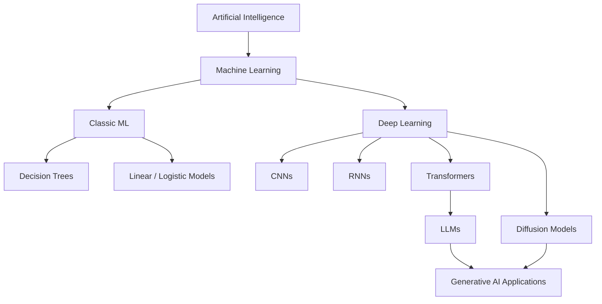
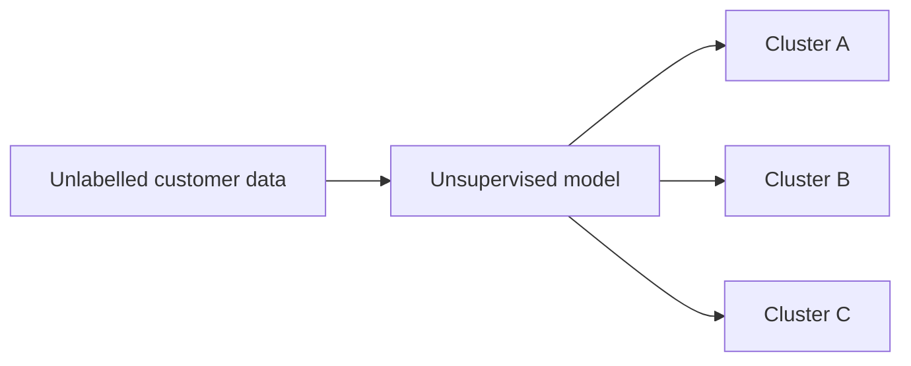
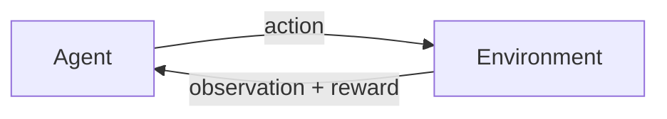
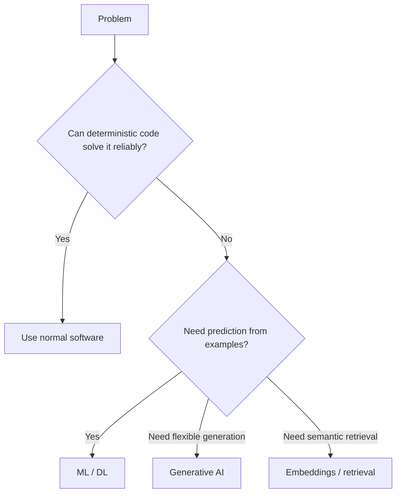

# Machine Learning, Deep Learning & Generative AI

These terms are related but not interchangeable.

- **Machine Learning (ML)** learns patterns from data instead of encoding every rule manually.
- **Deep Learning (DL)** is machine learning built around multi-layer neural networks.
- **Generative AI** uses learned probability distributions to create new content such as text, images, audio, video, code, or structured data.

## Relationship



## Supervised learning

The model learns from examples containing an input and a target label.

```text
email text + "spam"
email text + "not_spam"
        ↓ training
classifier
```

A TypeScript application may treat the trained model as a prediction service:

```ts
type SpamPrediction = {
  label: "spam" | "not_spam";
  confidence: number;
};

async function classifyEmail(text: string): Promise<SpamPrediction> {
  const res = await fetch(process.env.ML_SERVICE_URL!, {
    method: "POST",
    headers: { "content-type": "application/json" },
    body: JSON.stringify({ text }),
  });

  if (!res.ok) throw new Error("classification failed");
  return res.json();
}
```

## Unsupervised learning

The data has no explicit target label. The system may discover clusters, lower-dimensional representations, anomalies, or latent structure.



## Self-supervised learning

Modern foundation models often create training targets from the data itself. A language model can learn by predicting missing or next tokens without a human labeling every sentence.

```text
"The capital of France is" → predict next token
```

## Reinforcement learning

An agent learns behavior from reward signals produced by an environment, human preferences, automated graders, or a combination of signals.



## Generative vs discriminative

A discriminative model often answers:

```text
Which category does this input belong to?
```

A generative model can answer:

```text
What new output should be produced given this context?
```

Examples:

```text
classification → discriminative-style task
text completion → generative task
image synthesis → generative task
speech synthesis → generative task
```

The same modern foundation model can often perform both classification and generation through prompting or structured outputs.

## Practical decision rule



## Common beginner mistakes

**Mistake:** calling every AI feature an LLM.

A fraud detector, recommendation model, image model, embedding model, and speech recognizer can all be AI without being LLMs.

**Mistake:** assuming generative AI is always better than classic ML.

For a stable tabular classification problem, gradient-boosted trees may be cheaper, faster, and easier to evaluate than an LLM.

## Practice

Classify each as deterministic software, classic ML, deep learning, or generative AI:

1. Validate an IBAN checksum.
2. Predict customer churn from historical features.
3. Generate a product description.
4. Detect objects in a photograph.
5. Enforce a user's payment authorization limit.
