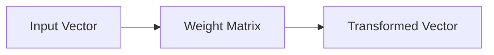
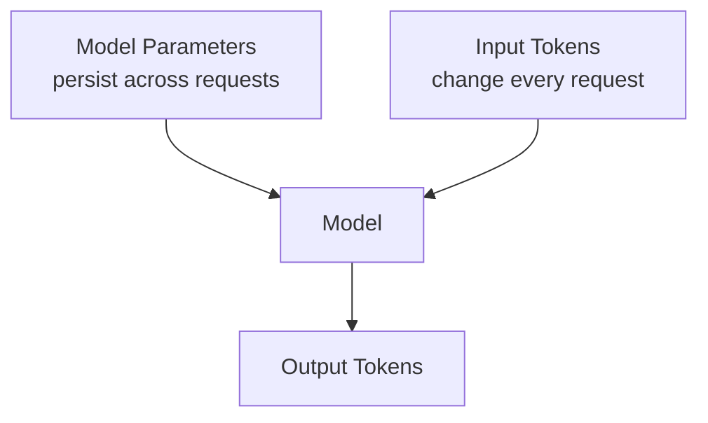

# Model Parameters, Weights & Model Size

A **parameter** is a learned numerical value inside a model. Weights and biases are common parameter types.

Parameters control how inputs are transformed through the neural network. During training, optimization algorithms adjust them to reduce loss.

## Tiny example

For a linear transformation:

```text
y = w*x + b
```

`w` and `b` are parameters.

```ts
function linear(x: number, weight: number, bias: number): number {
  return weight * x + bias;
}

console.log(linear(3, 2.5, -1)); // 6.5
```

A real transformer contains matrices with millions or billions of values rather than one weight.

## Matrix mental model



Conceptually:

```ts
function matVec(matrix: number[][], vector: number[]): number[] {
  return matrix.map(row =>
    row.reduce((sum, value, i) => sum + value * vector[i], 0),
  );
}
```

## Parameter count

A model described as “7B” commonly has roughly seven billion parameters. Parameter count influences memory requirements and can correlate with capacity, but it does **not** by itself tell you:

- model quality;
- reasoning quality;
- latency;
- context length;
- multimodal support;
- tool support;
- safety;
- task suitability.

Architecture, training data, post-training, quantization, inference software, and hardware matter too.

## Parameters vs tokens

Do not confuse these:

```text
parameters = learned numbers stored in the model
input tokens = pieces of the request processed at runtime
output tokens = pieces generated at runtime
```



## Parameters vs context memory

Model parameters contain learned statistical structure from training. They are not a mutable per-user memory database.

If a user tells the model:

```text
My project codename is Atlas.
```

that information exists in the request/context or application memory. The provider does not rewrite billions of parameters just because one prompt arrived.

## Memory cost

A rough memory estimate for storing parameters is:

```text
memory ≈ parameter_count × bytes_per_parameter
```

Example helper:

```ts
function parameterMemoryGB(
  parameters: number,
  bitsPerParameter: number,
): number {
  const bytes = parameters * (bitsPerParameter / 8);
  return bytes / 1024 ** 3;
}

console.log(parameterMemoryGB(7_000_000_000, 16));
```

This is only parameter storage. Real inference also needs memory for activations, KV cache, runtime overhead, buffers, and sometimes multiple replicas.

## Quantization

Quantization stores or computes with lower-precision representations to reduce memory and often improve serving efficiency.

```text
FP16 → 16 bits per value
INT8 → 8 bits per value
4-bit → 4 bits per value
```

Lower precision can reduce memory but may affect quality or hardware compatibility depending on the method/model.

## Production lesson

Do not select a model by parameter count alone. Benchmark real tasks and measure:

```text
quality + latency + cost + context + reliability + tool support + operational fit
```

## Practice

1. What is the difference between a parameter and a token?
2. Why does a 70B model not necessarily outperform a smaller model on every task?
3. Estimate parameter storage for a 13B model at 16-bit and 4-bit precision.
