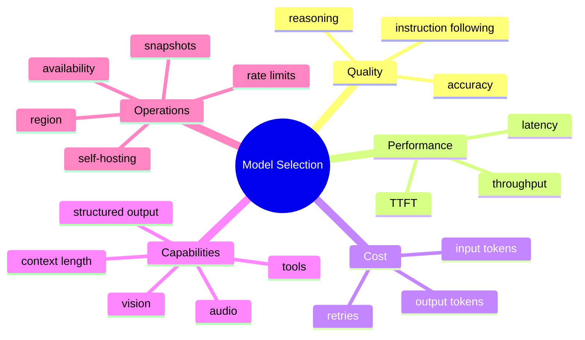
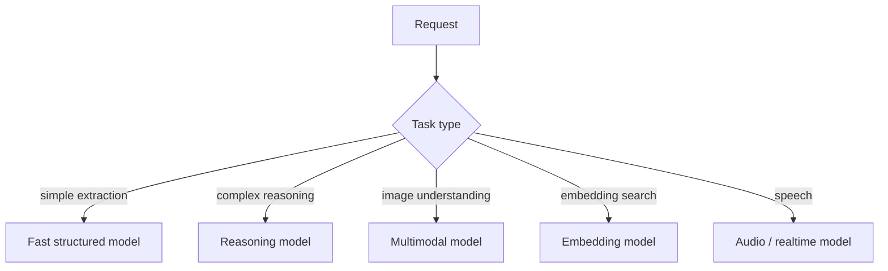
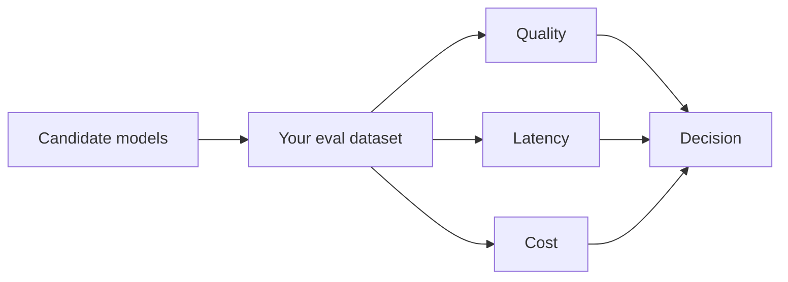
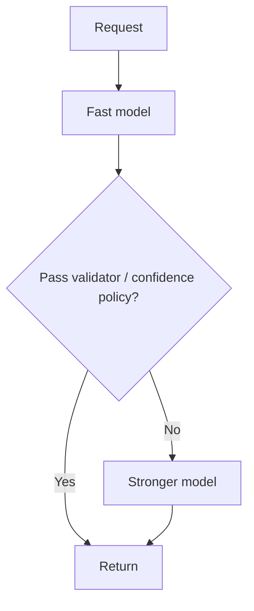

# Model Selection

Model selection means choosing the model and execution configuration that best satisfies a task's **quality, latency, cost, context, modality, tool, privacy, and reliability requirements**.

“The biggest model” is not a model-selection strategy.

## Decision dimensions



## Route by task



## TypeScript policy

```ts
type Capability =
  | "text"
  | "vision"
  | "tools"
  | "structured_output"
  | "long_context";

type ModelProfile = {
  id: string;
  capabilities: Set<Capability>;
  qualityTier: 1 | 2 | 3;
  latencyTier: 1 | 2 | 3;
  costTier: 1 | 2 | 3;
};

function supports(model: ModelProfile, required: Capability[]): boolean {
  return required.every(capability => model.capabilities.has(capability));
}
```

Provider-specific model IDs should live in configuration rather than being spread through product code.

## Capability first

A fallback model is useless if it lacks a required capability.

```text
primary supports strict schema + tools
fallback lacks tool calling
→ not a valid semantic fallback
```

Check:

- context limits;
- input/output modalities;
- structured output;
- tool support;
- reasoning controls;
- streaming;
- rate limits;
- data/region requirements.

## Quality must be measured on your task

Leaderboards are not your application.



Use representative production cases, edge cases, adversarial cases, tool workflows, and long-context scenarios.

## Model routing

A single product can use multiple models.

```ts
type TaskKind = "classification" | "chat" | "deep_analysis" | "vision";

const routes: Record<TaskKind, string> = {
  classification: process.env.CLASSIFIER_MODEL!,
  chat: process.env.CHAT_MODEL!,
  deep_analysis: process.env.REASONING_MODEL!,
  vision: process.env.VISION_MODEL!,
};
```

Routing reduces cost when difficult models are reserved for requests that need them.

## Escalation

You can start cheap and escalate only when confidence/evaluation rules say the result is insufficient.



Be careful: an LLM's self-reported confidence is not necessarily calibrated. Use objective validation when possible.

## Fallbacks

Fallbacks handle provider failures, quotas, or latency issues.

```ts
type ProviderAttempt<T> = () => Promise<T>;

async function firstSuccessful<T>(attempts: ProviderAttempt<T>[]): Promise<T> {
  let lastError: unknown;

  for (const attempt of attempts) {
    try {
      return await attempt();
    } catch (error) {
      lastError = error;
    }
  }

  throw lastError;
}
```

In production, retry/fallback only appropriate error classes and preserve deadlines/idempotency.

## Snapshot vs moving alias

A moving alias can gain capabilities over time but behavior may change. A versioned snapshot can improve reproducibility when a provider offers one.

Use evals before upgrades and canary risky changes.

## Hosted vs self-hosted

Selection can also mean where the model runs.

Hosted APIs reduce infrastructure burden. Self-hosting may offer more control over models, data paths, hardware, or unit economics at scale—but adds GPU capacity planning, inference optimization, upgrades, monitoring, and incident ownership.

## Model card for your application

Maintain an internal record:

```ts
type ApprovedModel = {
  id: string;
  provider: string;
  approvedTasks: string[];
  promptVersion: string;
  evalSuiteVersion: string;
  lastEvaluatedAt: string;
  knownLimitations: string[];
};
```

## Practice

1. Define required capabilities for a customer-support agent that can inspect screenshots and issue refunds.
2. Why can a model with lower per-token pricing have higher task cost?
3. Design a simple escalation policy for document extraction.
4. What should be re-evaluated when changing model snapshots?
