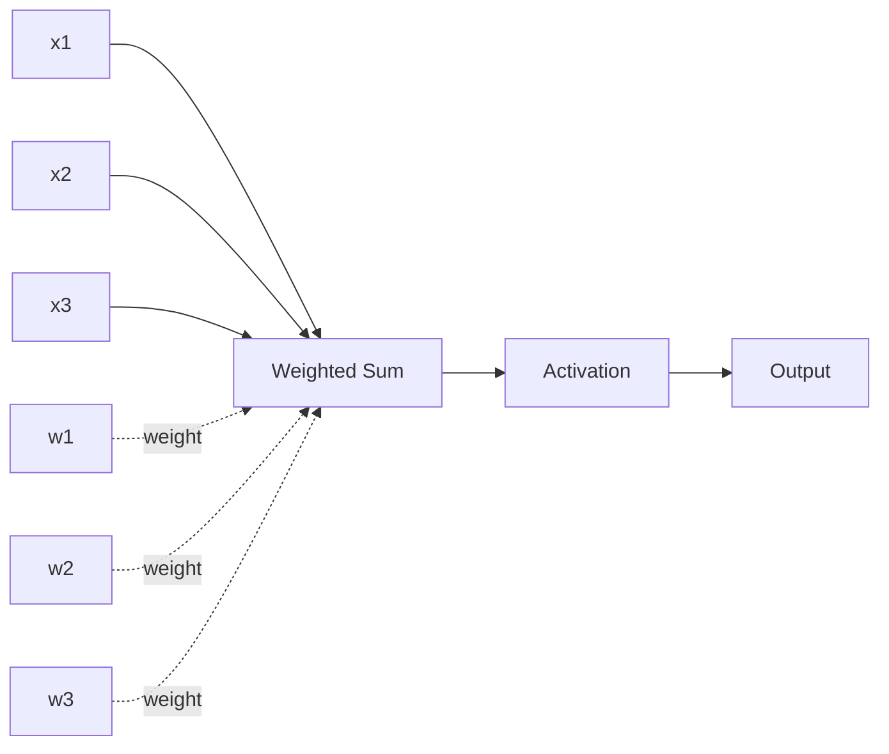
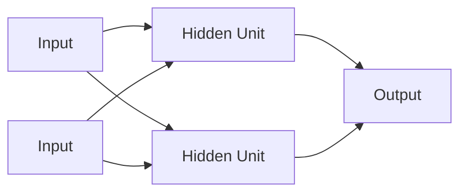
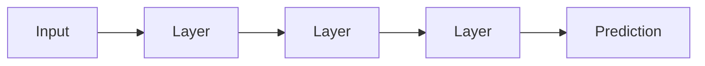
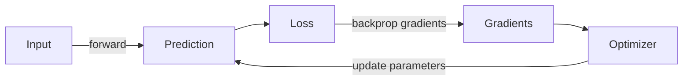

# Neural Networks

A neural network is a parameterized mathematical function that learns how to transform inputs into useful outputs. Modern deep-learning systems are built by stacking many layers of such transformations.

The word **neural** is historical inspiration, not a claim that the model works like a human brain.

## Smallest useful mental model

A neuron-like unit computes a weighted sum and then applies an activation function.

```text
output = activation(w1*x1 + w2*x2 + ... + bias)
```



## TypeScript implementation of one neuron

```ts
function sigmoid(x: number): number {
  return 1 / (1 + Math.exp(-x));
}

function neuron(
  inputs: number[],
  weights: number[],
  bias: number,
): number {
  if (inputs.length !== weights.length) {
    throw new Error("inputs and weights must have the same length");
  }

  const weightedSum = inputs.reduce(
    (sum, value, i) => sum + value * weights[i],
    bias,
  );

  return sigmoid(weightedSum);
}

console.log(neuron([0.8, 0.2], [1.5, -0.7], 0.1));
```

Real neural networks perform these operations over vectors and matrices on GPUs rather than loops over individual JavaScript numbers.

## Layers

A deep neural network connects many units into layers.



Common layer types include:

- fully connected / linear layers;
- convolutional layers;
- recurrent layers;
- attention layers;
- normalization layers;
- embedding layers.

Transformers are neural networks dominated by attention, feed-forward layers, normalization, residual connections, and embeddings.

## Parameters

The learnable numbers inside a model are called **parameters**. Weights and biases are parameters.

```ts
type LinearLayer = {
  weights: number[][];
  bias: number[];
};
```

A model with billions of parameters has billions of learned numerical values—not billions of hard-coded facts or rules.

## Forward pass

The forward pass computes an output from an input using the current parameter values.



For an LLM, the input is token IDs and the output eventually becomes probabilities over possible next tokens.

## Loss

Training needs a numerical measure of error called a **loss**.

```text
prediction + expected target → loss
```

For next-token language modeling, the model is rewarded for assigning high probability to the actual next token in training text.

## Backpropagation

Backpropagation calculates how much each parameter contributed to the loss. An optimizer then updates parameters in a direction expected to reduce future loss.



## Training loop pseudocode

```ts
for (const batch of trainingData) {
  const prediction = model.forward(batch.input);
  const loss = computeLoss(prediction, batch.target);
  const gradients = backward(loss);
  optimizer.step(gradients);
}
```

This code is conceptual. Production training uses frameworks such as PyTorch or JAX because automatic differentiation and GPU tensor operations are required at scale.

## Why deep networks work well

Multiple layers can build hierarchical representations. A language model may learn lower-level patterns such as characters and syntax while deeper representations capture entities, relationships, structure, style, and task-relevant abstractions.

## What a neural network does not guarantee

A neural network does not automatically provide:

- truth;
- reasoning correctness;
- authorization;
- causal understanding;
- database consistency;
- safety.

Those properties require data, training, evaluation, system design, and deterministic controls.

## Practice

1. What is the difference between a parameter and an input?
2. Explain forward pass, loss, backpropagation, and optimizer in order.
3. Modify the neuron example to use ReLU instead of sigmoid.
