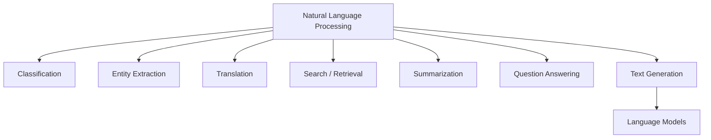
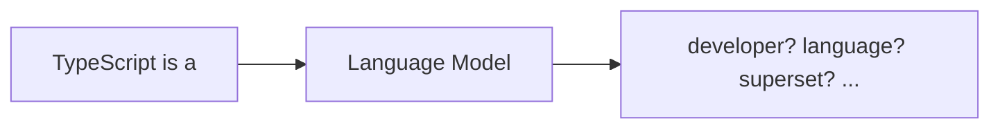
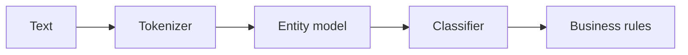

# NLP & Language Modeling

**Natural Language Processing (NLP)** is the field of building systems that work with human language. It includes tasks such as classification, search, translation, extraction, summarization, question answering, speech-language interfaces, and generation.

An **LLM** is one modern way to solve many NLP tasks, but NLP existed long before LLMs and still includes deterministic and specialized techniques.

## NLP landscape



## What is a language model?

A language model assigns probabilities to sequences or predicts parts of a sequence from context.

For a causal language model:

```text
P(token₁, token₂, ..., tokenₙ)
= P(token₁) × P(token₂ | token₁) × ... × P(tokenₙ | previous tokens)
```

You do not need to calculate this by hand to build applications. The important mental model is that generation proceeds conditionally from context.

## Next-token task



During causal pretraining, the training target is repeatedly shifted by one token.

```text
input:  [The, sky, is]
target: [sky, is, blue]
```

## A tiny n-gram language model

Before neural LMs, n-gram models estimated next-word probabilities from counts.

```ts
const counts = new Map<string, Map<string, number>>();

function observe(previous: string, next: string) {
  const nextCounts = counts.get(previous) ?? new Map<string, number>();
  nextCounts.set(next, (nextCounts.get(next) ?? 0) + 1);
  counts.set(previous, nextCounts);
}

observe("hello", "world");
observe("hello", "there");
observe("hello", "world");

console.log(counts.get("hello"));
```

Transformers replace this short fixed context with learned representations and attention over much larger contexts.

## Masked vs causal language modeling

Two useful learning objectives:

```text
masked LM:
"Paris is the [MASK] of France" → predict "capital"

causal LM:
"Paris is the" → predict the next token
```

Decoder-only chat LLMs are commonly built around causal/autoregressive generation.

## NLP pipeline vs LLM prompt

A traditional NLP pipeline may have separate components:



An LLM can perform several tasks through one model interface, but specialized pipelines can still be better for latency, cost, determinism, or domain accuracy.

## When to use an LLM

An LLM is useful when language variation is broad, tasks are flexible, or one model needs to perform many related language operations.

A specialized NLP model or deterministic parser may be better when:

- the task is narrow and stable;
- latency must be extremely low;
- output labels are fixed;
- training data is abundant;
- explainability or reproducibility requirements are strict.

## Practice

1. Name five NLP tasks that are not “chat.”
2. Explain causal language modeling in one sentence.
3. Why can a specialized classifier outperform an LLM for a narrow production task?
4. What changed when transformers replaced short-context n-gram models?
