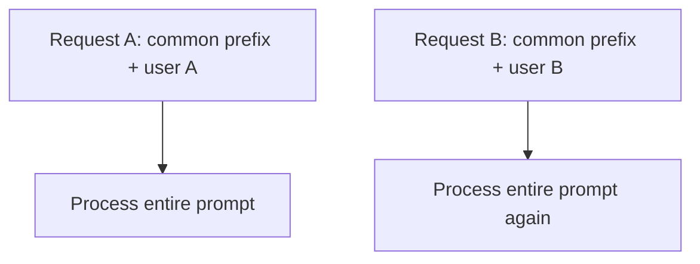
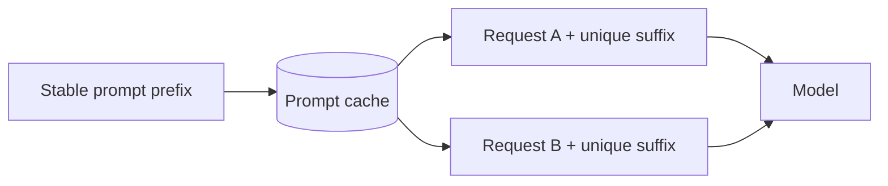
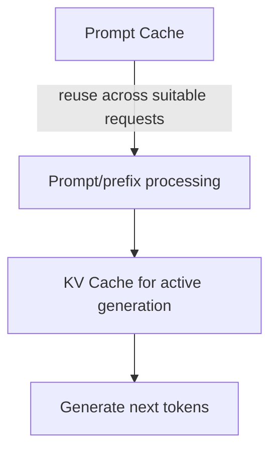

# Prompt Caching

**Prompt caching** reuses work for a prompt prefix that appears repeatedly across requests. It is useful when many calls share a large stable prefix such as system instructions, tool definitions, schemas, policy text, or repeated reference context.

Prompt caching is **not the same as response caching** and **not the same as the per-request KV cache used while generating tokens**.

## Mental model

Without prefix reuse:



With prompt caching:



The exact implementation is provider-specific. Some systems cache internal prefix states automatically; others support explicit breakpoints, TTLs, or cache-control settings.

## What belongs in a reusable prefix?

Good candidates are content that is both **stable** and **shared**:

```text
system/developer instructions
+ stable tool schemas
+ stable output schema
+ shared reference context
---------------------------
+ user-specific request last
```

The more the early prefix changes, the less reuse is possible.

## Cache-friendly prompt construction

```ts
type PromptParts = {
  stableInstructions: string;
  stableToolGuide: string;
  userInput: string;
};

function buildPrompt(parts: PromptParts): string {
  return [
    parts.stableInstructions,
    parts.stableToolGuide,
    "--- USER REQUEST ---",
    parts.userInput,
  ].join("\n\n");
}
```

Keep highly variable fields—timestamps, request IDs, user names, random values—out of the reusable prefix unless they are truly required there.

## Current OpenAI model guidance

Current GPT-5.6 guidance distinguishes **implicit prompt caching** from **explicit prompt caching**. It recommends monitoring cached-token/write usage and using explicit cache breakpoints/TTL controls when the workload benefits from deliberate reuse.

The important architecture lesson is stable even if API fields change:

```text
stable prefix → reusable cache state
variable suffix → request-specific computation
```

Check the current provider documentation before copying version-sensitive cache fields.

## Prompt cache vs KV cache



**Prompt cache** optimizes repeated prefix work across requests.

**KV cache** stores attention K/V state used by an active autoregressive generation sequence.

## Prompt cache vs response cache

A prompt-cache hit still asks the model to compute a new response for the unique suffix/context.

A response-cache hit may skip the model call entirely.

```text
Prompt cache:
shared prefix + new question → new model answer

Response cache:
same semantic cache key → return stored answer
```

## Security boundaries

Caching must preserve tenant and data-isolation rules.

Never design an application cache key that accidentally allows one user's confidential prompt state or output to be reused for another user without provider/application guarantees that such reuse is safe and isolated.

Application-level cache keys should include security scope whenever user/private data affects semantics.

```ts
type CacheScope = {
  tenantId: string;
  model: string;
  promptVersion: string;
  policyVersion: string;
};
```

## Cache invalidation

Stable prefixes change over time. Examples:

- system prompt v12 → v13;
- tool schema changed;
- company policy updated;
- output JSON schema updated.

Cache design needs versioning so old behavior is not accidentally reused.

```ts
function prefixVersionKey(input: {
  promptVersion: string;
  toolSchemaVersion: string;
  policyVersion: string;
}) {
  return `${input.promptVersion}:${input.toolSchemaVersion}:${input.policyVersion}`;
}
```

## When prompt caching helps

It is most valuable when:

- prefixes are long;
- prefixes repeat frequently;
- traffic is high enough to create reuse;
- the model/provider supports effective prefix caching;
- the shared prefix is stable across requests.

It helps less when every request is almost completely unique.

## Metrics

Track provider-supported metrics such as:

```text
cached input tokens
cache-write tokens/work
cache-read tokens/work
hit rate
latency on hit vs miss
cost on hit vs miss
prefix version
```

Do not optimize for cache-hit rate if product quality becomes worse because you are forcing unrelated requests into the same stale context design.

## Practice

1. Give three examples of stable prompt-prefix content.
2. Why should request IDs usually appear after the cacheable prefix?
3. Compare prompt cache, KV cache, and response cache.
4. What cache key/version fields would you use for a multi-tenant support agent?
