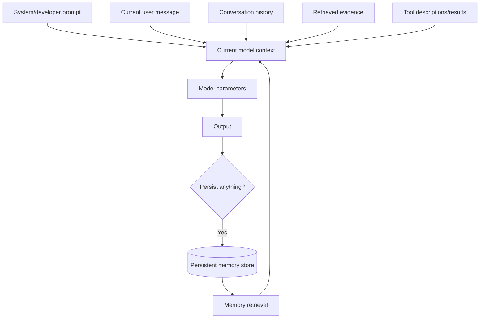
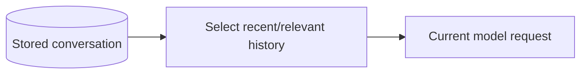
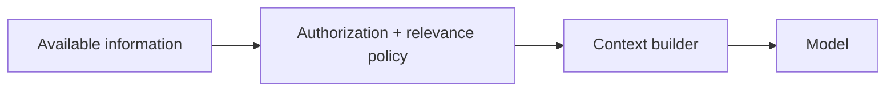

# Prompt, Context, Conversation & Memory

Beginners often use **prompt**, **context**, **conversation**, and **memory** as if they mean the same thing. They do not.

## Quick definitions

- **Prompt** — instructions/input intentionally sent to a model for a task.
- **Context** — all information the model can use in the current call/run.
- **Conversation history** — previous messages or output items supplied to continue an interaction.
- **Memory** — information deliberately persisted so it can be used later.
- **Model parameters** — learned weights from training; not the same as conversation memory.

## Data flow



## Prompt

A prompt describes the task and desired behavior.

```ts
const systemPrompt = `
You classify support tickets.
Return only the allowed category and short rationale.
`;
```

Prompt engineering controls task instructions. It does not create permanent memory.

## Context

Context includes the prompt plus runtime evidence.

```ts
type ModelContext = {
  system: string;
  history: { role: "user" | "assistant"; content: string }[];
  currentUserInput: string;
  retrievedDocuments: string[];
  toolDescriptions: string[];
};
```

If something is not in the model's learned parameters or current context, it is not automatically available to the model.

## Conversation history

A chat UI may display months of history, but the application still decides what to send to the model.



Strategies include:

- send recent messages;
- summarize older turns;
- retrieve relevant past turns;
- persist structured facts separately.

## Memory

Memory is a product/system design decision.

### Short-term memory

State needed during one active conversation or workflow.

```ts
type RunState = {
  orderId?: string;
  issueType?: string;
  approvalPending?: boolean;
};
```

### Long-term memory

Information reused across sessions.

```ts
type UserMemory = {
  userId: string;
  key: string;
  value: string;
  source: string;
  createdAt: string;
  expiresAt?: string;
};
```

Long-term memory needs privacy, consent, deletion, provenance, conflict, and retention rules.

## Memory is not “save every message”

A robust memory system decides:

```text
what to remember
who owns it
how long it lives
where it came from
how it is updated
how the user deletes/corrects it
```

Saving everything creates cost, privacy risk, stale facts, and retrieval noise.

## Parameters are not per-user memory

```text
model parameters
= learned during training/fine-tuning

conversation memory
= state stored/retrieved by application/provider workflow
```

A user saying “I prefer dark mode” does not rewrite the base model weights in that request.

## Context engineering

Context engineering is broader than prompt wording. It includes:

- which instructions are present;
- retrieved evidence;
- tool availability;
- conversation history;
- memory retrieval;
- ordering;
- token budgets;
- trust labels;
- redaction.



## Security

Never let the model decide what confidential memory it is authorized to load.

```ts
async function loadAuthorizedMemory(
  userId: string,
  tenantId: string,
) {
  // authorization must happen in application code
  return memoryStore.find({ userId, tenantId });
}
```

## Practice

1. Explain prompt vs context in one sentence each.
2. Explain context vs memory.
3. Why is conversation history not automatically permanent model memory?
4. Design a memory record with provenance and deletion support.
