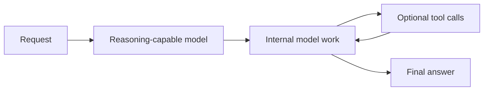
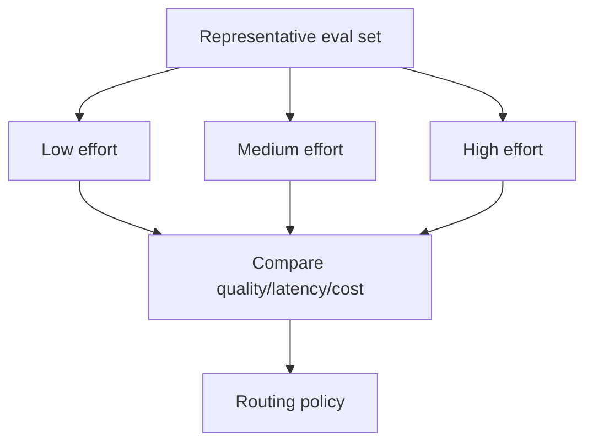
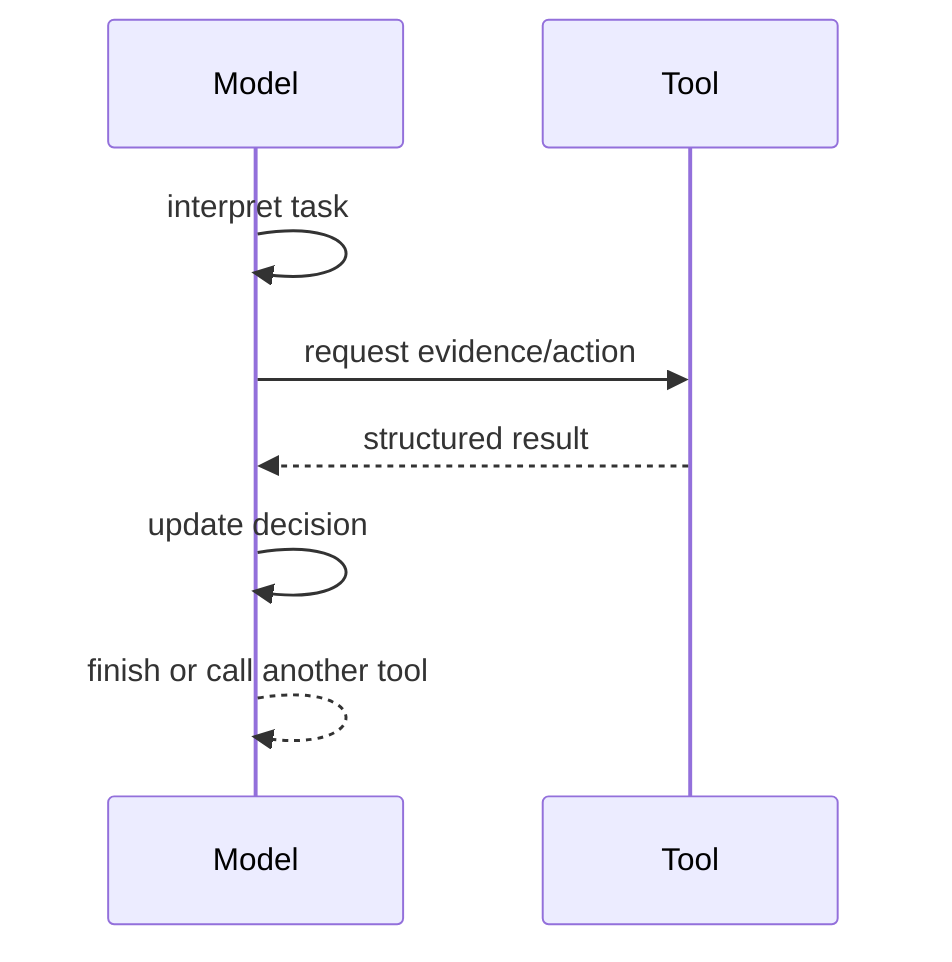

# Reasoning Models & Reasoning Effort

A **reasoning model** is optimized to spend more internal computation on difficult tasks before producing a final answer. Providers may expose controls such as reasoning effort, reasoning mode, or other execution settings.

The important distinction is not “normal model vs magical thinker.” It is a trade-off between **quality, latency, token/computation usage, and task difficulty**.

## Mental model



The internal work is not the same thing as a user-visible chain-of-thought transcript and should not be treated as an audit log.

## When more reasoning can help

Typical candidates:

- difficult coding/debugging;
- planning with many constraints;
- mathematical or logical reasoning;
- deep document analysis;
- complex tool orchestration;
- high-value review tasks.

Routine extraction or classification may not need maximum reasoning effort.

## Routing by task difficulty

```ts
type ReasoningLevel = "none" | "low" | "medium" | "high";

type TaskProfile = {
  complexity: "simple" | "moderate" | "hard";
  latencySensitive: boolean;
};

function chooseReasoning(profile: TaskProfile): ReasoningLevel {
  if (profile.latencySensitive && profile.complexity === "simple") return "none";
  if (profile.complexity === "hard") return "high";
  if (profile.complexity === "moderate") return "medium";
  return "low";
}
```

The exact provider enum may differ; treat this as an application policy example.

## Reasoning effort is not guaranteed correctness

```text
more reasoning compute
≠ guaranteed truth
≠ permission to act
≠ source verification
```

A high-effort model can still misunderstand bad context, use an unsafe tool, or reason from false evidence.

## Evaluate effort levels



Do not assume the highest effort is always best. The production goal is the cheapest/fastest configuration that meets the quality and reliability bar.

## Reasoning + tools

Hard tasks often alternate model judgment and external evidence/tool use.



Tools need authorization, input validation, timeouts, idempotency, and audit logging regardless of reasoning capability.

## Hidden reasoning vs observable trajectory

For agent observability, log:

```text
model request ID
model/config version
tool selected
tool arguments after validation
tool result status
graph state transition
final result
latency/token/cost metrics
```

Do not depend on private internal reasoning text as the operational audit trail.

## Production routing example

```ts
type ModelRoute = {
  model: string;
  reasoning: ReasoningLevel;
  maxLatencyMs: number;
};

function routeTask(kind: "extract" | "chat" | "deep_review"): ModelRoute {
  switch (kind) {
    case "extract":
      return { model: "fast-model", reasoning: "none", maxLatencyMs: 3000 };
    case "chat":
      return { model: "balanced-model", reasoning: "low", maxLatencyMs: 8000 };
    case "deep_review":
      return { model: "reasoning-model", reasoning: "high", maxLatencyMs: 60000 };
  }
}
```

Use actual model IDs from environment/configuration rather than hard-coding illustrative names.

## Practice

1. Give two tasks where higher reasoning effort may help and two where it may be wasteful.
2. Why is internal reasoning not the same as an agent audit log?
3. Design an eval comparing low vs high reasoning on code review.
4. Why must tool authorization remain deterministic even with a stronger reasoning model?
