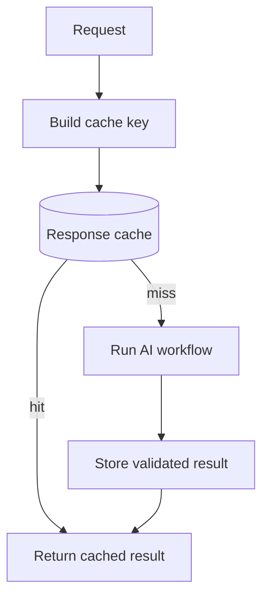
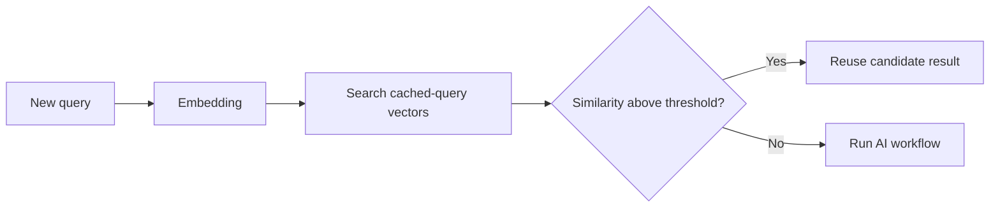
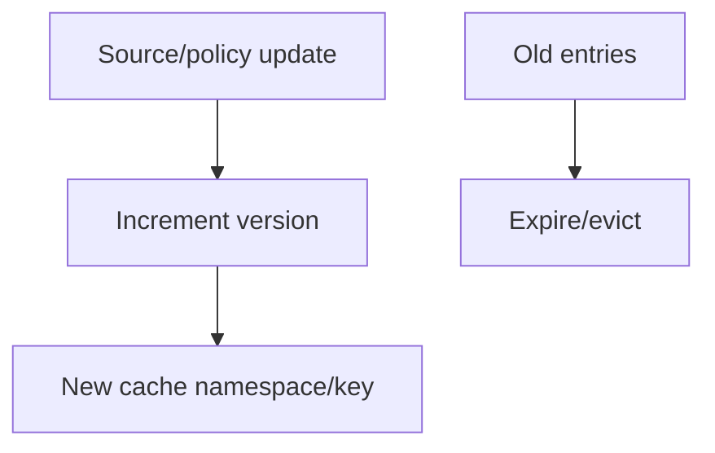
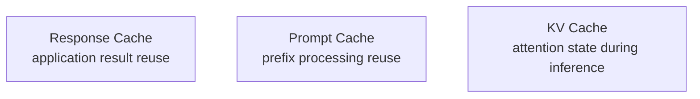

# Response Caching

A **response cache** stores a previously computed application result so a later equivalent request can return that result without running the full model/retrieval/tool workflow again.

This is an **application-level cache**. It is different from model KV cache and provider prompt-prefix caching.

## Basic flow



## Exact caching

Exact caching works when identical normalized inputs should produce equivalent outputs.

```ts
import { createHash } from "node:crypto";

function cacheKey(input: unknown): string {
  return createHash("sha256")
    .update(JSON.stringify(input))
    .digest("hex");
}
```

Do not hash raw objects without deterministic normalization if property order or irrelevant fields can vary.

## Semantic caching

A semantic cache tries to reuse answers for requests with similar meaning rather than identical bytes.



Semantic caching is powerful but much riskier because “similar” does not always mean “same required answer.”

Never use a loose semantic cache for tasks where small wording changes alter authorization, dates, amounts, user identity, or business meaning.

## Cache key must include semantics

A safe cache key often needs more than prompt text.

```ts
type AnswerCacheKey = {
  tenantId: string;
  userScope: string;
  model: string;
  modelSnapshot?: string;
  promptVersion: string;
  retrievalIndexVersion?: string;
  locale: string;
  normalizedInput: string;
};
```

If any field changes the correct answer, omitting it can create a stale or cross-tenant result.

## Dangerous cache bug

```text
cache key = "refund policy"
```

If tenant A and tenant B have different policies, this key can return the wrong tenant's answer.

Better:

```text
tenant:A | policyVersion:17 | queryHash:...
```

## TTL

A **time-to-live (TTL)** controls how long a cache entry remains reusable.

```ts
type CacheEntry<T> = {
  value: T;
  createdAt: number;
  expiresAt: number;
};

function isExpired<T>(entry: CacheEntry<T>, now = Date.now()): boolean {
  return now >= entry.expiresAt;
}
```

TTL is not a substitute for correct invalidation when source data changes immediately.

## Invalidation

Invalidate or version cache entries when dependencies change:

```text
prompt version
model version
source document version
permissions
pricing data
business rules
tool result freshness
```



## Cache only validated outputs

Do not store malformed or unsafe outputs as “successful” results.

```ts
async function cachedRun<T>(
  key: string,
  get: (key: string) => Promise<T | null>,
  set: (key: string, value: T) => Promise<void>,
  compute: () => Promise<T>,
  validate: (value: T) => void,
): Promise<T> {
  const hit = await get(key);
  if (hit !== null) return hit;

  const value = await compute();
  validate(value);
  await set(key, value);
  return value;
}
```

## Do not cache side effects as ordinary answers

A request such as:

```text
Refund order 123
```

is not safely handled by returning a cached “done” response. Write operations need idempotency and authoritative state checks.

```text
read response cache ≠ write idempotency store
```

## Cache stampede

If one popular cache entry expires, thousands of requests may all recompute it simultaneously.

Mitigations include:

- request coalescing/single flight;
- stale-while-revalidate;
- randomized TTL jitter;
- background refresh.

```ts
const inflight = new Map<string, Promise<unknown>>();
```

## Metrics

Monitor:

```text
hit rate
miss rate
stale-hit incidents
cache latency
AI calls avoided
cost saved
entries by tenant
invalidation frequency
stampede events
```

## Three caches to remember



They solve different problems.

## Practice

1. Build a cache key for a tenant-aware FAQ assistant.
2. When is semantic caching unsafe?
3. Explain TTL vs invalidation.
4. Why should a refund action use idempotency rather than an answer cache?
