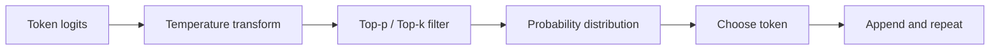
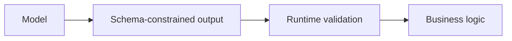

# Sampling, Temperature, Top-p & Top-k

After a model produces next-token scores, a **decoding strategy** decides which token to emit. Sampling controls can make generation more deterministic or more diverse.

The exact controls available depend on the model/API. Some modern reasoning APIs intentionally expose fewer sampling knobs.

## Decoding pipeline



## Greedy decoding

Choose the highest-scoring token every time.

```text
[0.60, 0.25, 0.10, 0.05] → choose first token
```

This is simple but can produce repetitive or locally optimal sequences.

## Temperature

Temperature changes the sharpness of the distribution before sampling.

Conceptually:

```text
adjusted_logit = logit / temperature
```

Lower temperature makes high-scoring tokens dominate more strongly. Higher temperature flattens the distribution and increases diversity.

```ts
function applyTemperature(logits: number[], temperature: number): number[] {
  if (temperature <= 0) throw new Error("temperature must be > 0");
  return logits.map(logit => logit / temperature);
}
```

### Intuition

```text
low temperature  → focused / less diverse
high temperature → broader / more diverse
```

Temperature does **not** guarantee correctness. A low-temperature hallucination is still a hallucination.

## Top-k

Top-k keeps only the `k` highest-scoring candidate tokens and removes the rest before sampling.

```ts
function topK<T>(items: T[], scores: number[], k: number): T[] {
  return items
    .map((item, i) => ({ item, score: scores[i] }))
    .sort((a, b) => b.score - a.score)
    .slice(0, k)
    .map(x => x.item);
}
```

If `k = 5`, only five candidates remain eligible at that step.

## Top-p / nucleus sampling

Top-p keeps the smallest set of high-probability candidates whose cumulative probability reaches a threshold `p`.

Example:

```text
Token A: 0.52   cumulative 0.52
Token B: 0.24   cumulative 0.76
Token C: 0.15   cumulative 0.91 ← enough for p = 0.9
Token D: 0.09   removed
```

Unlike top-k, the number of eligible tokens changes depending on how concentrated the model distribution is.

## Conceptual top-p implementation

```ts
type Candidate = {
  token: string;
  probability: number;
};

function nucleus(candidates: Candidate[], p: number): Candidate[] {
  const sorted = [...candidates].sort(
    (a, b) => b.probability - a.probability,
  );

  const kept: Candidate[] = [];
  let cumulative = 0;

  for (const candidate of sorted) {
    kept.push(candidate);
    cumulative += candidate.probability;
    if (cumulative >= p) break;
  }

  return kept;
}
```

## Repetition penalties and constraints

Some inference systems expose repetition penalties, frequency penalties, presence penalties, stop sequences, grammar constraints, or structured-output decoding.

Do not assume every model supports the same parameters or interprets them identically.

## Structured output beats sampling tricks for contracts

If your application needs exactly:

```json
{
  "status": "approved",
  "risk": "low"
}
```

use a schema/structured-output mechanism and runtime validation. Lower temperature is not a schema.



## Creativity vs reliability

A common product split:

```text
creative copy generation → allow diversity
classification/extraction → constrain structure and evaluate accuracy
high-risk action planning → deterministic guardrails + approval
```

## Reproducibility

Even with low randomness settings, hosted model output may not be perfectly reproducible across:

- model revisions;
- serving infrastructure;
- tool results;
- context changes;
- hidden provider changes.

Use model snapshots/version pinning when available and regression evals for product stability.

## Practice

1. Explain temperature without saying “creativity slider.”
2. Compare top-k and top-p.
3. Why should a JSON contract use structured output rather than temperature `0`?
4. For a brainstorming feature, which risks should you still validate even if diversity is desired?
