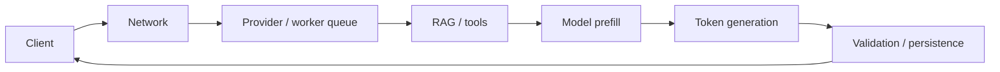
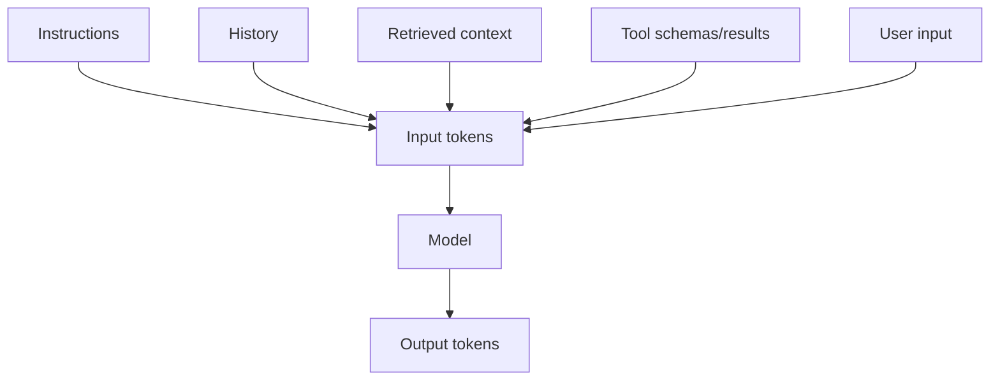
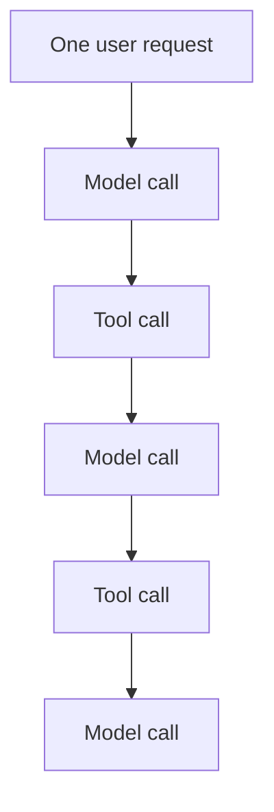

# Tokens, Cost, Latency & Throughput

AI application performance is not one number. You need to distinguish request latency, time to first token, decode speed, token usage, provider cost, queueing, and end-to-end task success.

## End-to-end latency



A slow response does not automatically mean the model itself is slow.

## Important metrics

### Time to first token (TTFT)

Time from request start until the first useful streamed output appears.

TTFT is affected by:

- network latency;
- queueing;
- input length;
- prompt-cache reuse;
- model size/architecture;
- provider load;
- pre-generation reasoning/tool work.

### Tokens per second

Measures decode throughput after generation begins.

```ts
function tokensPerSecond(tokens: number, milliseconds: number): number {
  return tokens / (milliseconds / 1000);
}
```

### End-to-end latency

The user cares about the complete task.

```ts
type Span = {
  name: string;
  durationMs: number;
};

function totalLatency(spans: Span[]): number {
  return spans.reduce((sum, span) => sum + span.durationMs, 0);
}
```

Parallel spans mean real trace critical-path calculation can be more complex than simply summing durations.

## Token usage

A request can consume tokens from multiple sources:



Provider usage reporting may additionally expose cached-token or reasoning-related categories.

## Cost model

A simple cost estimate:

```ts
type TokenRates = {
  inputPerMillion: number;
  cachedInputPerMillion?: number;
  outputPerMillion: number;
};

function estimateCost(input: {
  inputTokens: number;
  cachedInputTokens?: number;
  outputTokens: number;
  rates: TokenRates;
}): number {
  const cached = input.cachedInputTokens ?? 0;
  const uncached = Math.max(0, input.inputTokens - cached);

  const inputCost = (uncached / 1_000_000) * input.rates.inputPerMillion;
  const cachedCost = input.rates.cachedInputPerMillion
    ? (cached / 1_000_000) * input.rates.cachedInputPerMillion
    : 0;
  const outputCost = (input.outputTokens / 1_000_000) * input.rates.outputPerMillion;

  return inputCost + cachedCost + outputCost;
}
```

Do not hard-code pricing into business logic. Provider/model prices change. Keep rates in configuration and version them.

## Cost per successful task

Raw token cost can mislead. A cheaper model that fails often may cost more overall.

```text
cost per successful task
= total system cost / successful completed tasks
```

Include:

- model calls;
- embeddings;
- reranking;
- search/database costs;
- tool/API costs;
- retries;
- agent loops;
- storage/observability;
- human review where relevant.

## Long prompts

Large prompts increase prefill work and may increase cost.

```text
more input context
→ more tokens to process
→ more prefill compute
→ often higher latency/cost
```

That is why retrieval filtering, concise tool schemas, history compression, and prompt caching matter.

## Agent-loop amplification

A single user request can trigger many model/tool calls.



Without budgets, one “chat message” can become an expensive workflow.

## Budget guardrail

```ts
type RunBudget = {
  maxModelCalls: number;
  maxToolCalls: number;
  maxInputTokens: number;
  maxOutputTokens: number;
  maxCostUsd: number;
  deadlineMs: number;
};
```

Enforce limits in application code rather than only telling the model to “be efficient.”

## Percentiles

Track p50, p95, and p99—not only averages.

```text
p50 → typical experience
p95 → slower tail users
p99 → extreme latency / incident signal
```

## Throughput

Throughput asks how much work the system can complete per unit time.

High throughput may require batching, continuous batching, queueing, concurrency controls, model routing, and accelerator-aware scheduling.

## Production dashboard

A useful dashboard includes:

```text
request count
success rate
p50/p95/p99 latency
TTFT
tokens/sec
input/output/cached tokens
cost per request
cost per successful task
provider errors
cache hit rate
queue depth
agent step count
```

## Practice

1. Explain TTFT vs tokens/sec vs total latency.
2. Why is average latency insufficient?
3. Design a budget for an agent that may call search and a database.
4. Why can a smaller model have a better cost per successful task than a cheaper-per-token model?
