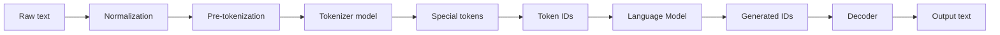
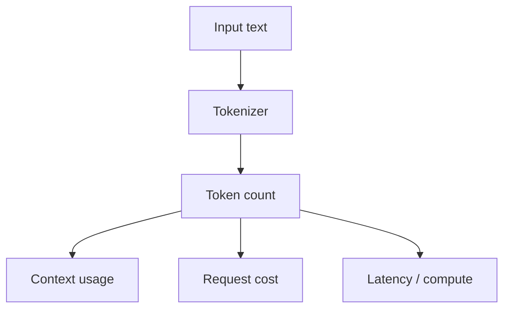

# Tokenization

**Tokenization** is the process that converts raw input into model-understandable token IDs and later decodes generated IDs back into text.

A tokenizer normally performs more than `split(" ")`.

## The tokenization pipeline



Current Hugging Face tokenizer documentation describes the tokenizer as converting text to the tensor/ID representation consumed by a model, including normalization, splitting, special-token handling, and decoding.

## Why not word splitting?

A fixed word vocabulary would struggle with:

- rare words;
- names;
- new technical terms;
- spelling variants;
- code identifiers;
- multiple languages;
- URLs and numbers.

Subword tokenization can compose unfamiliar words from known pieces.

```text
"microservices"
→ "micro" + "services"
```

The exact split depends on the tokenizer vocabulary.

## Common tokenizer families

### Byte Pair Encoding (BPE)

BPE starts with small units and repeatedly merges frequently co-occurring pairs.

```text
initial: l o w e r
merges:  lo  w  er
later:   low  er
```

### WordPiece

WordPiece also uses subword units but its vocabulary-building/segmentation objective differs from classic BPE.

### Unigram

Unigram starts with a larger set of possible pieces and finds likely segmentations using a probabilistic model.

### Byte-level approaches

Byte-level tokenization starts from bytes, making it possible to represent arbitrary Unicode input without an unknown-token problem, while learned merges can still produce larger pieces.

## Special tokens

Models may use special markers for boundaries, padding, roles, or other control behavior.

```ts
type SpecialTokens = {
  bos?: number; // beginning of sequence
  eos?: number; // end of sequence
  pad?: number;
};
```

Never invent special-token IDs. They are tokenizer/model-specific.

## Encoding and decoding

Conceptually:

```ts
interface Tokenizer {
  encode(text: string): number[];
  decode(ids: number[]): string;
}
```

Do not assume `decode(encode(text))` preserves every byte exactly for every tokenizer/configuration; normalization and special-token handling can affect round trips.

## Tokenization affects cost and context

Two strings with the same character length can produce very different token counts.



Code, tables, JSON, repeated whitespace, and long identifiers may tokenize differently from ordinary prose.

## Educational BPE-like toy example

This example only demonstrates repeated pair merging; it is **not** a production tokenizer.

```ts
function pairCounts(words: string[][]): Map<string, number> {
  const counts = new Map<string, number>();

  for (const word of words) {
    for (let i = 0; i < word.length - 1; i++) {
      const pair = `${word[i]} ${word[i + 1]}`;
      counts.set(pair, (counts.get(pair) ?? 0) + 1);
    }
  }

  return counts;
}

console.log(pairCounts([
  ["l", "o", "w"],
  ["l", "o", "w", "e", "r"],
]));
```

## Tokenizer/model compatibility

The tokenizer and model must agree on vocabulary IDs. Using a tokenizer from a different model family can turn valid text into meaningless IDs for the target model.

```text
text → tokenizer A → IDs for vocabulary A
                   X
                 model B expecting vocabulary B
```

## Truncation and padding

Batch processing often requires sequences of compatible shapes.

```text
short input → padding
long input  → truncation / chunking / rejection
```

Truncation must be intentional. Silently cutting the most important part of a legal contract or user instruction can create serious product errors.

## Production checklist

- Use the tokenizer appropriate for the selected model.
- Measure token count before expensive long-context operations when useful.
- Define truncation policy explicitly.
- Keep enough output budget for the model to finish.
- Test multilingual, code, JSON, tables, URLs, and unusual Unicode.
- Do not use character count as a precise token-count proxy.

## Practice

1. Why is whitespace splitting insufficient for LLM tokenization?
2. What is the difference between a token string and a token ID?
3. Why must a tokenizer match its model?
4. Describe one bug caused by silent truncation.
