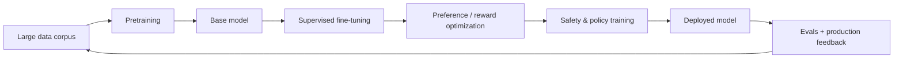
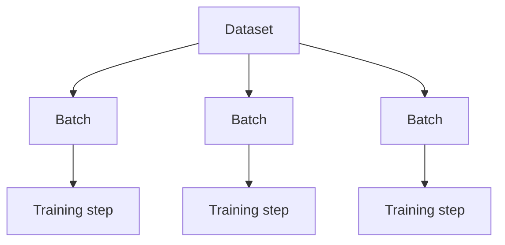
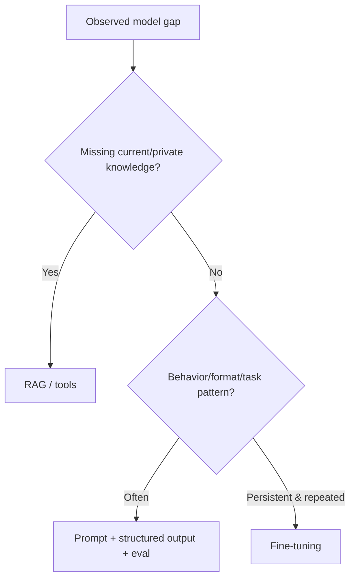

# Training, Pretraining & Post-Training

A model is not manually programmed with every answer. During training, its parameters are repeatedly adjusted so that its predictions become better on examples drawn from training data.

For modern LLMs, it is useful to separate **pretraining** from **post-training**.

## End-to-end lifecycle



## Pretraining

Pretraining teaches broad statistical structure from a large corpus. For a causal language model, a common objective is next-token prediction.

```text
Input:  "JavaScript runs in the"
Target: "browser"
```

The model is not given a hand-written rule saying “browser follows this phrase.” It sees many token sequences and updates parameters to reduce prediction error.

## Simplified next-token training example

```ts
type TrainingExample = {
  inputTokens: number[];
  targetToken: number;
};

function crossEntropyLoss(
  probabilities: number[],
  targetToken: number,
): number {
  const p = Math.max(probabilities[targetToken] ?? 0, 1e-12);
  return -Math.log(p);
}
```

A real training framework computes gradients through millions or billions of tensor operations and updates all learnable parameters with an optimizer.

## Epochs, batches, and steps

A dataset is normally processed in batches.



Useful terms:

- **batch** — a group of training examples processed together;
- **step** — one parameter update;
- **epoch** — one pass over a dataset;
- **learning rate** — controls update size;
- **optimizer** — algorithm that applies parameter updates;
- **checkpoint** — saved model/training state.

## Base model vs instruction model

A pretrained base model learns broad sequence prediction. Post-training teaches it to follow user instructions, use tools, produce safer outputs, and behave more consistently in conversational/product settings.

```text
base model: continue text patterns
instruction model: interpret task + follow conversational conventions
```

## Supervised fine-tuning

Supervised fine-tuning (SFT) trains on examples of desired behavior.

```ts
type InstructionExample = {
  user: string;
  idealAssistant: string;
};
```

Examples should represent the behavior you want the model to generalize—not just memorize a tiny set of answers.

## Preference optimization

Instead of a single target answer, training data may say that output A is preferred over output B.

```text
prompt
 ├─ answer A  ← preferred
 └─ answer B
```

Preference signals can come from humans, rubrics, automated graders, or mixtures of sources. They are useful for aligning style, helpfulness, safety, and task behavior, but they can introduce bias if the preference data or grader is weak.

## Fine-tuning vs prompting vs RAG

Do not fine-tune just because an answer is wrong.



Fine-tuning changes behavior. RAG supplies external knowledge. Prompting supplies per-request instructions/context.

## Overfitting

A model overfits when it learns training examples too specifically and performs worse on new data.

Always separate development/training examples from held-out evaluation cases where possible.

## Data quality and provenance

Training data should have:

- clear source/provenance;
- license/usage rights;
- privacy controls;
- deduplication;
- contamination checks;
- quality labels;
- versioning.

## Production lesson

Most application engineers do **not** train frontier LLMs from scratch. They integrate existing foundation models, build evals, add retrieval/tools, and sometimes fine-tune smaller or provider-hosted models for specific product behavior.

## Practice

1. Explain pretraining vs post-training in your own words.
2. When would RAG solve a problem that fine-tuning would not?
3. Why should evaluation data be separated from training/development examples?
