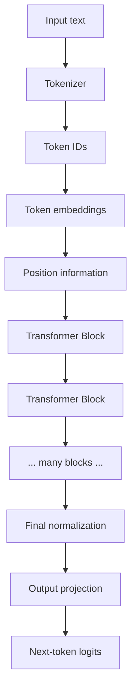
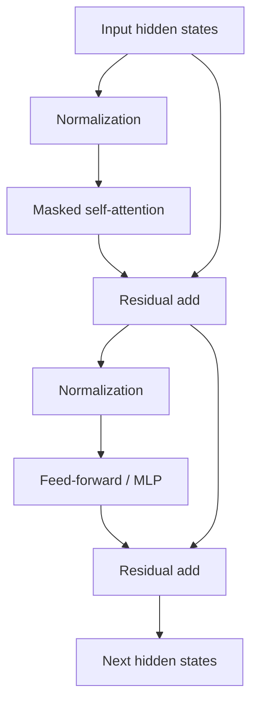
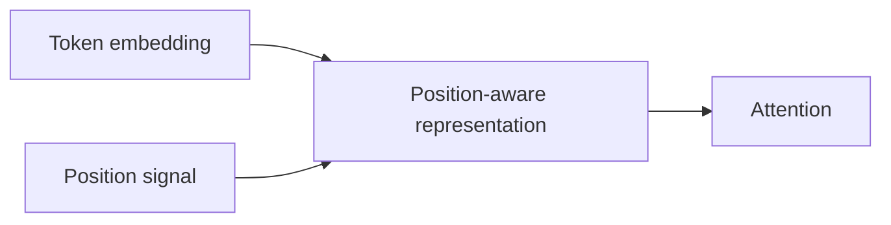
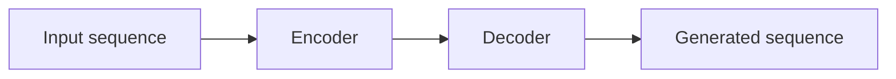

# Transformers

The **Transformer** is a neural-network architecture introduced in the 2017 paper *Attention Is All You Need*. Its central idea is to process sequence elements using attention rather than relying on recurrent processing as the main mechanism.

Modern LLMs are usually transformer-based or closely related architectures.

## High-level decoder-only LLM



## What is inside a transformer block?

A simplified decoder block contains:



Exact ordering differs across model architectures.

## Self-attention

Self-attention lets each token representation combine information from other permitted positions in the sequence.

```text
"The animal didn't cross the street because it was tired"
                                            ↑
                              attention can connect "it" to context
```

For causal generation, a token cannot attend to future tokens that have not been generated yet.

## Feed-forward network

Attention mixes information across sequence positions. The feed-forward/MLP component then transforms each position's representation through learned nonlinear layers.

```ts
function relu(x: number): number {
  return Math.max(0, x);
}

function tinyFeedForward(x: number[]): number[] {
  // Educational only, not a real transformer layer.
  return x.map(value => relu(value * 1.2 - 0.1));
}
```

Modern models commonly use activations such as GELU or gated variants such as SwiGLU rather than this toy ReLU example.

## Residual connections

Residual connections add the original representation back after a sub-layer.

```text
output = input + subLayer(input)
```

They help deep networks preserve information and train more effectively.

```ts
function residual(input: number[], update: number[]): number[] {
  return input.map((value, i) => value + update[i]);
}
```

## Normalization

Normalization keeps activation scales controlled and supports stable optimization. Architectures vary in their use of LayerNorm, RMSNorm, and pre-norm/post-norm placement.

## Position information

Attention alone does not inherently know token order. Transformers therefore add position information using techniques such as learned positional embeddings or rotary position embeddings (RoPE).



## Encoder, decoder, encoder-decoder

### Encoder-only

Useful for representation/classification-style tasks.

```text
all input tokens can generally attend to each other
```

### Decoder-only

Common for autoregressive LLMs.

```text
predict next token while masking future positions
```

### Encoder-decoder

Useful when one sequence is encoded and a separate decoder generates another sequence, historically common in translation and still useful for many sequence-to-sequence models.



## Why transformers scaled well

Compared with sequential recurrent processing, transformers allow much more parallel computation during training. Attention also gives direct paths between distant sequence positions.

The original paper emphasized parallelizability and sequence modeling without recurrence as the central architecture contribution.

## Transformer ≠ LLM

A transformer is an architecture. An LLM is a language model trained at scale.

```text
Transformer architecture + language-model objective + data + compute + post-training
→ LLM
```

Transformers can also power vision, audio, multimodal, protein, and other models.

## Production relevance for application engineers

You usually do not implement transformer kernels yourself, but the architecture explains:

- why tokens matter;
- why context length matters;
- why attention can become expensive on long sequences;
- what KV cache stores;
- why prompt prefixes can be reused;
- why autoregressive output has time-to-first-token and per-token generation latency.

## Practice

1. Draw a transformer block from memory.
2. What jobs do attention and the feed-forward network perform?
3. Why does a decoder-only model need a causal mask?
4. Explain why “Transformer” and “LLM” are not synonyms.
