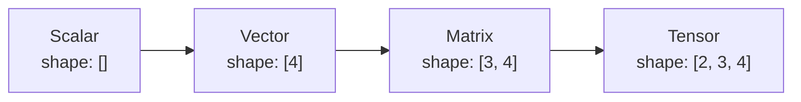
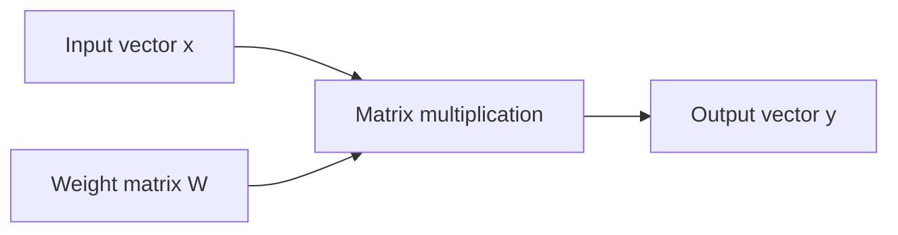

# Vectors, Matrices & Tensors

Before transformers, embeddings, and attention make sense, you need a small amount of numerical vocabulary.

A **scalar** is one number. A **vector** is an ordered list of numbers. A **matrix** is a two-dimensional grid. A **tensor** is the general term for an n-dimensional array used by deep-learning frameworks.

## Shapes



Examples:

```text
scalar:  4.2
vector:  [0.1, 0.8, -0.2]
matrix:  [[1,2], [3,4]]
tensor:  batch × sequence × hidden_dimension
```

## Why AI uses tensors

Neural networks process many examples and many values at once. A language model might represent a batch as:

```text
[batch_size, sequence_length, hidden_size]
```

For example:

```text
[8, 1024, 4096]
```

means eight sequences, each with 1024 token positions, each represented by a 4096-dimensional hidden vector.

## TypeScript shape example

JavaScript arrays can illustrate the concept, although real training/inference uses optimized tensor libraries.

```ts
const vector: number[] = [0.2, -0.1, 0.7];

const matrix: number[][] = [
  [1, 2, 3],
  [4, 5, 6],
];

console.log(matrix.length);       // rows
console.log(matrix[0].length);    // columns
```

## Dot product

The dot product is used throughout ML, embeddings, and attention.

```ts
function dot(a: number[], b: number[]): number {
  if (a.length !== b.length) throw new Error("shape mismatch");
  return a.reduce((sum, value, i) => sum + value * b[i], 0);
}

console.log(dot([1, 2, 3], [4, 5, 6])); // 32
```

## Matrix-vector multiplication

A neural-network layer often multiplies an input vector by a learned weight matrix.



Conceptually:

```ts
function matVec(matrix: number[][], vector: number[]): number[] {
  return matrix.map(row => dot(row, vector));
}
```

## Batch dimension

Instead of processing one example at a time, frameworks often add a batch dimension.

```text
one embedding:        [hidden]
sequence embeddings: [sequence, hidden]
batch of sequences:  [batch, sequence, hidden]
```

This is why shape errors are among the most common low-level ML programming bugs.

## Broadcasting

Tensor libraries can automatically expand compatible dimensions during operations. Broadcasting is convenient but can hide bugs if you misunderstand shapes.

At application-engineering level, you rarely manipulate model tensors directly when using hosted APIs, but shape intuition helps you understand:

- embeddings;
- attention;
- batches;
- model parameter matrices;
- multimodal inputs;
- GPU memory usage.

## Practice

1. What is the shape of a batch containing 16 sequences, 512 positions each, hidden size 2048?
2. Implement vector addition in TypeScript.
3. What does a matrix multiply represent in a neural-network layer?
4. Why are shape mismatches important when switching embedding models?
