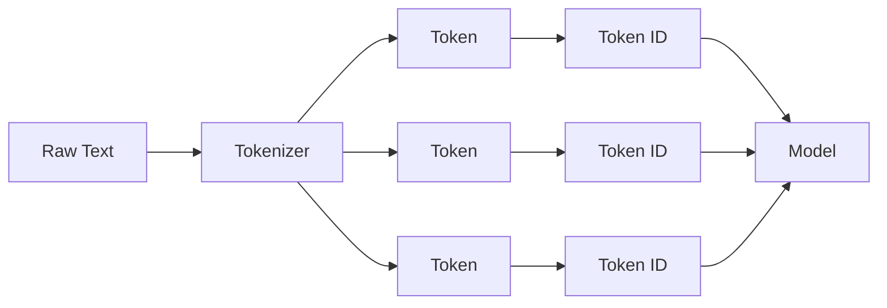
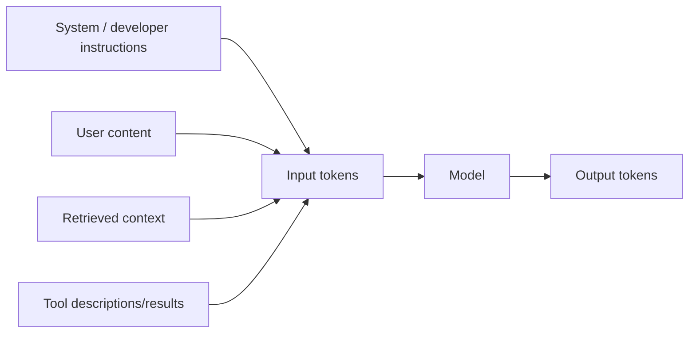

# What Is a Token?

A **token** is a unit that a language model processes. It is not necessarily a whole word, character, or sentence.

Depending on the tokenizer and vocabulary, a token may represent:

- a complete word;
- part of a word;
- punctuation;
- whitespace combined with text;
- a symbol;
- a byte or byte-derived unit;
- a special control marker.

## Text does not go directly into the model



For example, the string:

```text
unbelievable!
```

might conceptually become pieces similar to:

```text
"un" + "believ" + "able" + "!"
```

That split is only an illustration. The exact tokens depend on the model's tokenizer.

## Token IDs

Each token maps to an integer in the tokenizer vocabulary.

```ts
type EncodedText = {
  tokens: string[];
  ids: number[];
};

const example: EncodedText = {
  tokens: ["Hello", ",", " world"],
  ids: [1204, 11, 1917], // conceptual values only
};
```

The model receives IDs that are converted into embedding vectors.

## Input, output, and reasoning tokens

At application level you will usually care about several token categories.



Depending on the model/provider, usage reporting may also expose cached input tokens, reasoning-related usage, audio tokens, or other modality-specific units.

## Why tokens matter

Tokens affect:

- context-window capacity;
- latency;
- model cost;
- truncation risk;
- caching behavior;
- output limits;
- how text is represented internally.

If your prompt contains 80,000 tokens, the model must account for those tokens within its context limits even if the source text was only a few hundred pages or lines.

## Words are not tokens

Never assume:

```text
1 word = 1 token
```

Different languages, code, numbers, URLs, whitespace patterns, and uncommon words can tokenize differently.

## A simple educational tokenizer

This is **not** how modern production tokenizers work, but it demonstrates the idea of turning text into units.

```ts
function toyTokenizer(text: string): string[] {
  return text.match(/\w+|[^\w\s]/g) ?? [];
}

console.log(toyTokenizer("Tokens are useful!"));
// ["Tokens", "are", "useful", "!"]
```

A real tokenizer uses a trained/fixed vocabulary and an algorithm such as BPE, WordPiece, Unigram, or byte-level variants.

## Token budgets

Suppose a model allows a total context budget. Your application might reserve capacity like this:

```ts
type TokenBudget = {
  system: number;
  user: number;
  retrieval: number;
  toolDefinitions: number;
  reservedOutput: number;
};

function totalBudget(b: TokenBudget) {
  return Object.values(b).reduce((sum, value) => sum + value, 0);
}
```

The exact tokenizer should be used when precise accounting matters; word-count heuristics are only rough estimates.

## Cached tokens are still tokens

Prompt caching can reduce repeated computation/cost for matching prompt prefixes, but cached input still belongs to the request context. Caching does not create an unlimited context window.

## Beginner mistakes

**Mistake:** “My prompt is 2,000 words, so it is 2,000 tokens.”

Not guaranteed.

**Mistake:** “A token is always a word.”

False.

**Mistake:** “The model sees strings exactly as I typed them.”

The model processes tokenized representations after tokenizer-specific transformations.

## Practice

1. Explain why tokens and words are different.
2. List four things that contribute input tokens in an agentic RAG request.
3. Why can code or long URLs produce surprising token counts?
4. Why does prompt caching not increase the model's context-window size?
