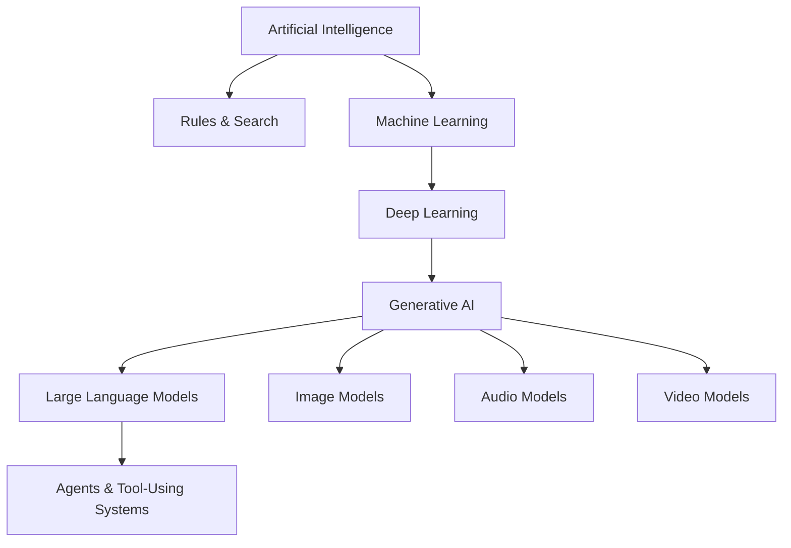
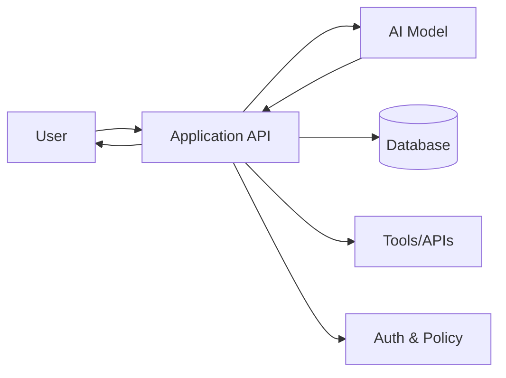

# What Is Artificial Intelligence?

Artificial Intelligence (AI) is the broad field of building computer systems that perform tasks that normally require forms of human intelligence: understanding language, recognizing patterns, making predictions, planning, generating content, controlling tools, or making decisions from incomplete information.

AI is **not one algorithm**. It is an umbrella that contains rule-based systems, search, machine learning, deep learning, reinforcement learning, generative models, and agentic systems.

## Mental model



A useful hierarchy is:

```text
AI
└── Machine Learning
    └── Deep Learning
        └── Generative AI
            ├── LLMs
            ├── image models
            ├── audio models
            └── video models
```

This hierarchy is simplified but useful for learning. An AI product can also combine deterministic code, databases, search engines, ML models, LLMs, and human review.

## AI system vs AI model

An **AI model** is one learned component. An **AI system** is the product around it.



A production AI application therefore needs ordinary software engineering: authentication, validation, databases, queues, testing, observability, cost controls, and security.

## Simple TypeScript example

A traditional deterministic program can classify a temperature with explicit rules:

```ts
function classifyTemperature(celsius: number) {
  if (celsius < 10) return "cold";
  if (celsius < 25) return "mild";
  return "hot";
}
```

An AI model becomes useful when the mapping is too complex to hand-code reliably—for example, classifying an arbitrary customer message by intent.

```ts
type TicketIntent = "billing" | "bug" | "account" | "other";

type Classifier = {
  classify(text: string): Promise<TicketIntent>;
};
```

The AI model implements the fuzzy mapping, while TypeScript still defines the application contract.

## When AI is appropriate

Use AI when the task involves fuzzy language, perception, prediction, generation, semantic similarity, or variable reasoning that is hard to encode as fixed rules.

Do **not** use AI for invariants that ordinary code can enforce exactly. Password checks, money limits, authorization, tax formulas, and database uniqueness should remain deterministic.

## Beginner checklist

Before moving on, make sure you can explain:

- AI is broader than LLMs.
- An LLM is a model, not a complete application.
- Generative AI creates new outputs from learned patterns.
- Deterministic code and AI should be combined rather than treated as competitors.
- Security and business rules should not be delegated to probabilistic model behavior.

## Practice

1. Name three product features that need AI and three that should remain deterministic.
2. Draw the boundary between model logic and application logic for a support chatbot.
3. Explain why an LLM does not replace a database.
