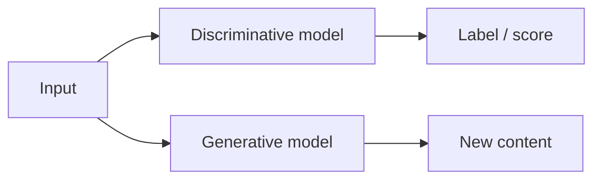
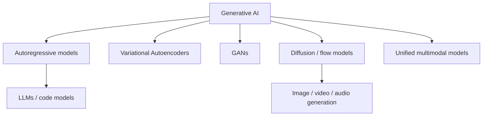
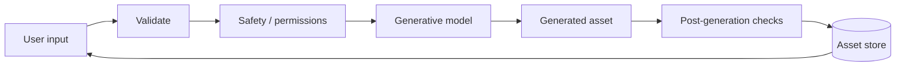

# What Is Generative AI?

**Generative AI** is the part of AI focused on creating new outputs from learned patterns. Those outputs can be text, code, images, speech, music, video, 3D assets, structured data, or combinations of modalities.

## Discriminative vs generative



Examples:

```text
"Is this fraud?" → classification
"Write a fraud-investigation summary" → generation
```

Modern foundation models can often perform both styles of task.

## Major model families



## Application boundary

```ts
type GenerationRequest =
  | { kind: "text"; prompt: string }
  | { kind: "image"; prompt: string }
  | { kind: "speech"; text: string }
  | { kind: "video"; prompt: string };
```

Different modalities need different providers/models, validation, storage, safety checks, and cost controls.

## Generative AI is more than chat

A complete learning path includes:

- LLMs and text generation;
- image generation/editing;
- audio and speech;
- realtime voice;
- video generation;
- multimodal models;
- fine-tuning and adapters;
- synthetic data;
- distillation;
- serving and optimization;
- provenance and safety.

## Production flow



## Practice

1. Give two discriminative and two generative AI examples.
2. Why is an image model generative AI but not an LLM?
3. What extra infrastructure does generated video need compared with short text output?
