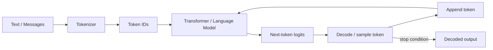
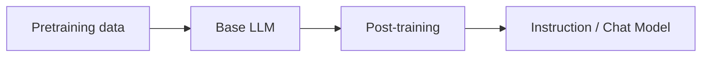
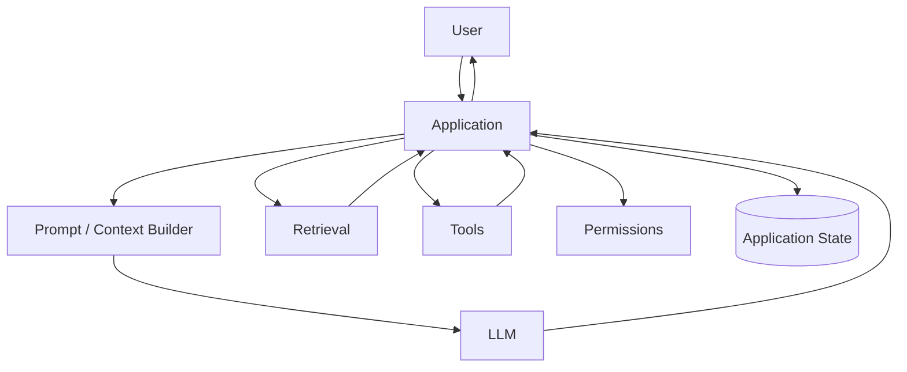

# What Is a Large Language Model?

A **Large Language Model (LLM)** is a neural network trained on large amounts of sequence data—primarily text and code—to model relationships between tokens and predict useful continuations or outputs.

For most modern chat-style LLMs, the core generation process is still fundamentally:

```text
context tokens → model → probability distribution for next token
```

That next token is appended to the context, then the process repeats.

## Why “large”?

“Large” usually refers to some combination of:

- many learned parameters;
- large training datasets;
- substantial training compute;
- large context windows;
- broad task coverage.

There is no single parameter count at which a model officially becomes an LLM.

## LLM generation loop



## An LLM does not read words directly

The model receives token IDs, not raw JavaScript strings.

```ts
const text = "Large language models are useful";

// Conceptual only: a real tokenizer owns the vocabulary.
const tokenIds = [18421, 5321, 8734, 527, 7851];
```

Those IDs are converted to learned vectors called embeddings before transformer layers process them.

## Next-token prediction example

Suppose a model sees:

```text
The capital of Japan is
```

It may assign probabilities such as:

```text
Tokyo   0.93
Kyoto   0.03
Osaka   0.01
...     ...
```

Generation chooses a token according to a decoding strategy and continues.

A tiny TypeScript sampler:

```ts
function sampleIndex(probabilities: number[]): number {
  const r = Math.random();
  let cumulative = 0;

  for (let i = 0; i < probabilities.length; i++) {
    cumulative += probabilities[i];
    if (r <= cumulative) return i;
  }

  return probabilities.length - 1;
}
```

Real APIs expose higher-level controls such as temperature, top-p, reasoning effort, tools, and structured output rather than raw next-token probabilities in normal application use.

## Base model vs chat/instruction model

A **base model** is primarily trained to continue sequences.

A **post-trained instruction/chat model** is further trained to respond to user requests, follow roles/instructions, format outputs, use tools, and behave according to product/safety objectives.



## What capabilities emerge from this training?

Depending on training and architecture, an LLM can often:

- summarize;
- translate;
- classify;
- extract structured data;
- generate code;
- answer questions;
- reason over supplied context;
- call tools;
- interpret images when multimodal components are present.

These are learned behaviors—not guarantees of correctness.

## What an LLM is not

An LLM is not automatically:

- a database;
- a search engine;
- a calculator;
- an authorization system;
- a source of current truth;
- an agent;
- an MCP server;
- a workflow engine.

You can connect an LLM to those systems, but the boundaries matter.

## LLM application architecture



## TypeScript API boundary

Keep the rest of your application independent of one model provider.

```ts
export interface LanguageModel {
  generate(input: {
    system?: string;
    user: string;
  }): Promise<{
    text: string;
    inputTokens?: number;
    outputTokens?: number;
  }>;
}
```

A provider adapter can implement this interface using OpenAI, Anthropic, Gemini, a local inference server, or another backend.

## Why LLM answers can be wrong

The model generates probable/useful continuations based on learned patterns and supplied context. It is not executing a truth database lookup for every sentence.

That is why production systems add:

- retrieval;
- tools;
- structured outputs;
- citations;
- deterministic validation;
- evals;
- authorization;
- human review for high-risk actions.

## Practice

1. Explain an LLM without using the phrase “AI chatbot.”
2. Why is next-token prediction enough to produce full paragraphs?
3. Name three responsibilities that belong to the application, not the LLM.
