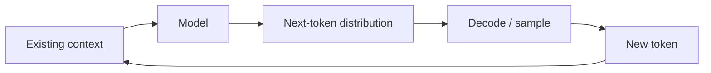
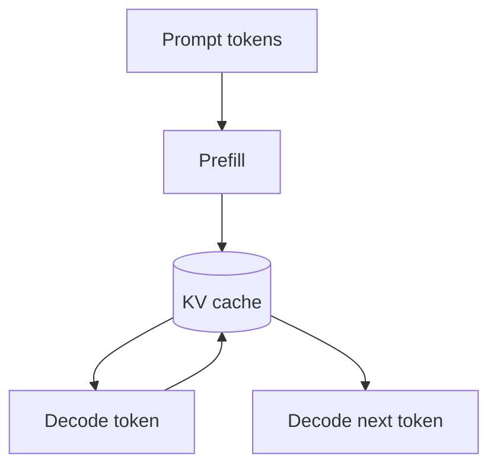

# Autoregressive Generation

Autoregressive generation creates an output one unit at a time, conditioning every new prediction on the units that came before it. Decoder-style LLMs are the most familiar example: predict a token, append it to the context, then predict the next token.

## Core idea



For a sequence `x1, x2, ... xn`, the model factorizes generation conceptually as:

```text
P(x1...xn) = P(x1) × P(x2|x1) × ... × P(xn|x1...x(n-1))
```

You do not compute this product in application code, but it explains why every generated token depends on earlier context.

## Educational TypeScript sampler

```ts
type Candidate = { token: string; probability: number };

function sample(candidates: Candidate[]): string {
  const r = Math.random();
  let cumulative = 0;

  for (const candidate of candidates) {
    cumulative += candidate.probability;
    if (r <= cumulative) return candidate.token;
  }

  return candidates.at(-1)!.token;
}
```

A real model calculates a new vocabulary distribution at every step using transformer hidden states.

## Prefill and decode

Serving usually has two phases:



**Prefill** processes existing context. **Decode** generates new tokens incrementally. This distinction matters for time-to-first-token, throughput, long-context cost, and cache memory.

## Why output is sequential

Even when training is highly parallelized, inference for a causal model cannot know token 50 until tokens before it have been selected. Inference engines improve utilization through batching and cache management, but logical token dependency remains.

## Stop conditions

Generation should have explicit terminal conditions:

```ts
type StopPolicy = {
  maxOutputTokens: number;
  deadlineMs: number;
  stopSequences?: string[];
};
```

Applications also need cancellation, timeout, safety, and tool-call transitions.

## Common failure modes

- runaway verbose output because no useful limit exists;
- repetitive loops under poor decoding/model conditions;
- high latency from long generated outputs;
- stale or oversized KV-cache state;
- treating partial streamed text as a completed business result.

## Production use

Autoregressive generation is excellent for text/code and can also appear in audio/image/video systems that discretize outputs into token-like sequences. It is only one generative family; diffusion and flow-based approaches generate differently.

## Practice

1. Why can training be parallel even though causal generation is sequential?
2. Explain prefill vs decode.
3. Add a deadline and maximum-token guard to a generation loop.
4. Why should a streamed partial answer not authorize a side effect?
