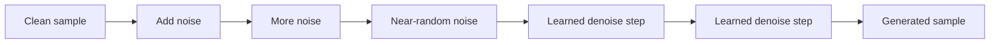
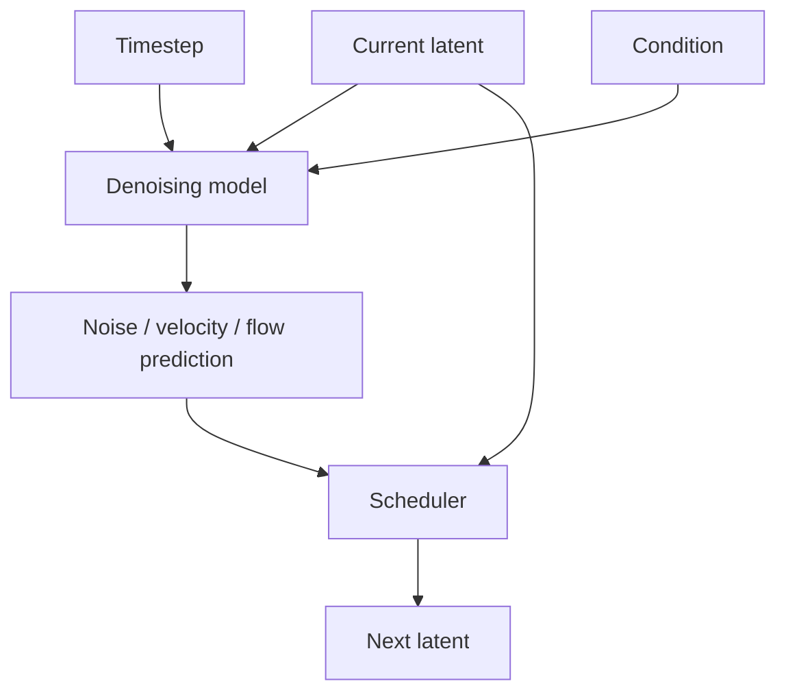

# Diffusion Models

A **diffusion model** learns to reverse a process that gradually corrupts data with noise. At generation time it starts from noise (or a noisy conditioned input) and iteratively transforms it into a sample.

## Forward and reverse intuition



The forward corruption process provides a training construction. The learned model predicts information needed to move back toward clean data.

## Iterative generation

```ts
type Latent = number[];

type Denoiser = (
  latent: Latent,
  timestep: number,
  condition?: unknown,
) => Promise<Latent>;

async function generate(
  initialNoise: Latent,
  timesteps: number[],
  denoise: Denoiser,
) {
  let latent = initialNoise;
  for (const t of timesteps) {
    latent = await denoise(latent, t);
  }
  return latent;
}
```

This models the control loop, not the actual math used by a production diffusion library.

## Denoiser + scheduler

A pipeline commonly separates the neural network from the scheduler controlling the numerical update/timestep sequence.



Scheduler compatibility and prediction type are model-specific. Do not swap schedulers blindly.

## Conditioning

The generation can be influenced by text embeddings, images, masks, depth maps, poses, reference images, or other structured conditions.

```text
noise + text condition → text-to-image
image + noise + text → image-to-image
image + mask + text → inpainting
```

## Guidance

Guidance techniques increase the influence of conditioning. Stronger guidance may improve prompt adherence but can reduce diversity or create artifacts. Treat guidance scale as a model-specific generation parameter and evaluate it.

## Why diffusion became popular

Diffusion systems provided strong quality and training stability, and developed a large ecosystem of controls, adapters, editing methods, and schedulers. They now span images, video, audio, 3D, and scientific domains.

## Cost and latency

Generation may require multiple model evaluations per output. Production cost depends on:

```text
resolution × number of steps × model size × candidates × guidance/control cost
```

Modern architectures and distillation methods can reduce required steps substantially.

## Failure modes

- excessive steps increase latency without useful quality gain;
- too few steps can reduce quality;
- condition/guidance mismatch creates artifacts;
- scheduler/model mismatch breaks results;
- stochastic seeds make reproduction difficult if not stored;
- unsafe input/output can require moderation and policy controls.

## Practice

1. Explain diffusion without using the phrase “it just removes noise.”
2. What responsibilities belong to the denoiser vs scheduler?
3. Why should model, scheduler, seed, and parameters be stored with generated assets?
4. How would you evaluate a faster low-step pipeline against a baseline?
