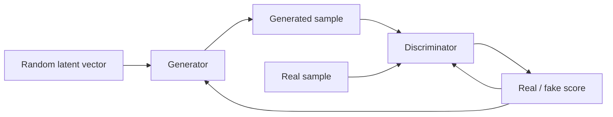
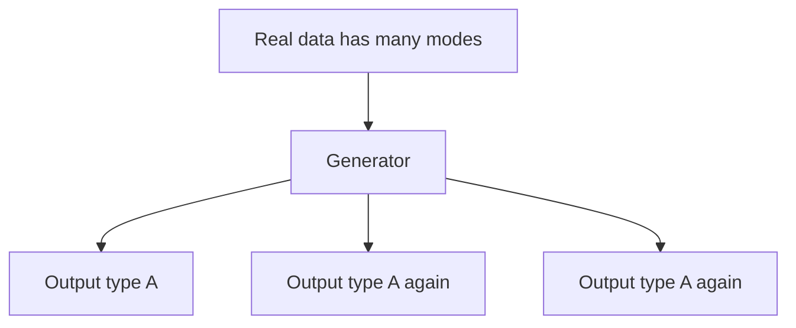

# Generative Adversarial Networks

A **Generative Adversarial Network (GAN)** trains two neural networks in competition: a **generator** creates synthetic samples and a **discriminator** tries to distinguish real samples from generated ones.

## Adversarial training loop



The discriminator learns to detect fake data while the generator learns to fool the discriminator. Their objectives push the generator toward more realistic outputs.

## Conceptual interfaces

```ts
type Vector = number[];
type ImageTensor = number[][][];

interface Generator {
  generate(latent: Vector): ImageTensor;
}

interface Discriminator {
  score(image: ImageTensor): number;
}
```

Real GAN training uses tensor frameworks and gradients; this TypeScript only names the responsibilities.

## Training intuition

```text
real batch → discriminator → improve detection
noise → generator → fake batch → discriminator
fake score → update discriminator and generator objectives
```

If training is balanced, the generator learns the data distribution well enough that generated samples become difficult to distinguish from real ones.

## Why GANs became important

GANs enabled high-quality image synthesis, super-resolution, style transfer, face generation, and domain translation before diffusion systems became the dominant architecture for many generative-media products.

## Mode collapse

A classic failure mode is **mode collapse**: the generator discovers a limited set of outputs that fool the discriminator and stops representing the diversity of the real data.



The output may look realistic but lack coverage/diversity.

## Training instability

Because two models change simultaneously, training can be unstable. Problems include:

- discriminator becoming too strong;
- generator gradients becoming unhelpful;
- oscillation;
- sensitivity to architecture and learning rates;
- mode collapse.

Variants such as Wasserstein GANs and improved normalization/loss techniques were developed to address these issues.

## GANs vs diffusion

```text
GAN
→ often one/few generator forward passes
→ historically fast sampling
→ adversarial training can be unstable

Diffusion / flow
→ iterative generative process
→ often easier/stabler training and strong controllability
→ sampling can require more compute, though modern methods reduce steps
```

Do not interpret this as “GANs obsolete.” The right architecture depends on latency, quality, domain, training assets, and available models.

## Application use

An application integrating a GAN-based service still needs ordinary asset controls:

```ts
type GeneratedAsset = {
  id: string;
  model: string;
  seed?: number;
  promptOrConditionId?: string;
  createdAt: string;
};
```

Track provenance, versions, moderation, and ownership regardless of architecture.

## Practice

1. Explain generator vs discriminator.
2. What is mode collapse?
3. Compare the training intuition of GANs and diffusion models.
4. Why should an application store model/version provenance for generated media?
