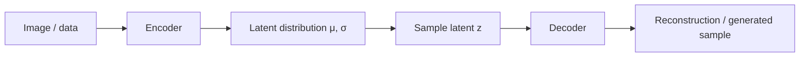
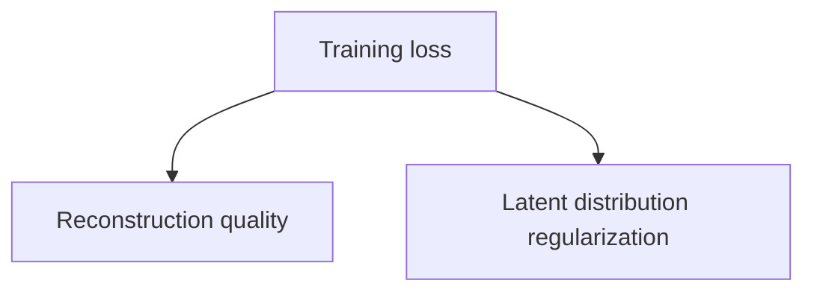
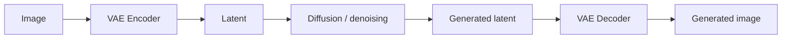

# Variational Autoencoders

A **Variational Autoencoder (VAE)** learns a compact latent representation of data and a decoder that reconstructs samples from that latent space. In modern generative-media systems, VAE-style encoders/decoders are especially important because many diffusion models operate in a compressed latent space rather than directly on full-resolution pixels.

## Architecture



Unlike a plain autoencoder that maps input to one fixed latent vector, a VAE learns parameters of a probability distribution. Sampling from that distribution encourages a smoother, more useful latent space.

## Reparameterization idea

Conceptually:

```text
z = μ + σ × ε
ε ~ Normal(0, 1)
```

```ts
function sampleLatent(mu: number[], sigma: number[]): number[] {
  return mu.map((mean, i) => mean + sigma[i] * gaussian());
}

function gaussian(): number {
  const u = Math.max(Math.random(), 1e-12);
  const v = Math.random();
  return Math.sqrt(-2 * Math.log(u)) * Math.cos(2 * Math.PI * v);
}
```

This is educational only. Training frameworks use differentiable tensor operations and automatic differentiation.

## Training objective

A VAE balances two goals:



The reconstruction term encourages output to resemble input. The KL-divergence term encourages the learned latent distribution to stay close to a chosen prior, commonly a normal distribution.

## Why latent spaces matter

A useful latent representation can:

- compress high-dimensional inputs;
- make generation cheaper;
- support interpolation;
- enable latent-space editing;
- provide an efficient operating space for diffusion.

In latent diffusion, an image can be encoded to a lower-dimensional latent tensor, denoised there, then decoded back to pixels.



## Application-engineering boundary

You typically consume a VAE as one component in a model pipeline rather than implement one in TypeScript. Keep the application contract at the asset/job boundary.

```ts
type ImageArtifact = {
  assetId: string;
  width: number;
  height: number;
  mimeType: string;
  modelVersion: string;
};
```

## Failure modes

- reconstruction artifacts from an underpowered decoder;
- loss of fine details during compression;
- latent scaling mismatches between components;
- incompatible VAE/model versions;
- color or contrast shifts after decode.

## Practice

1. Explain encoder, latent distribution, and decoder.
2. Why can latent-space diffusion be cheaper than pixel-space diffusion?
3. What metadata should an application retain about generated assets?
4. Why must a VAE and diffusion pipeline be version-compatible?
