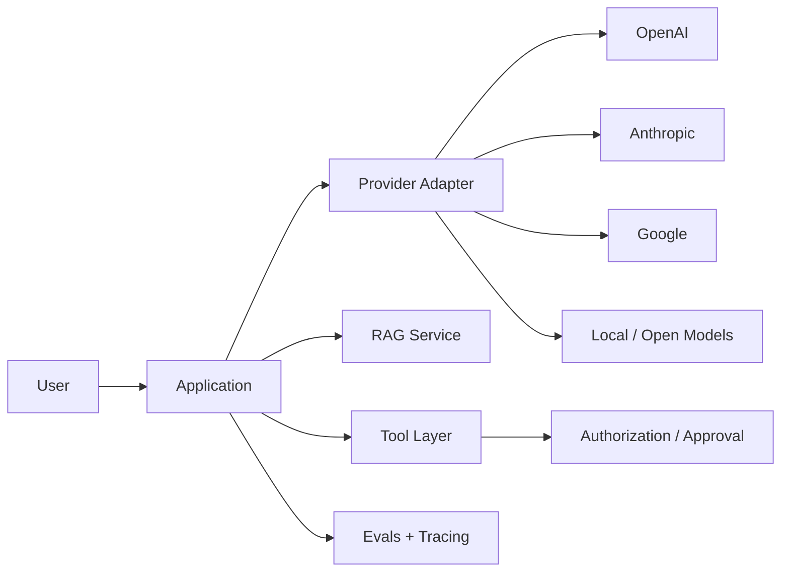

# AI Engineering Handbook

This handbook is a TypeScript-first path from software developer to senior/staff AI engineer. It focuses on **building reliable AI systems**, not on memorizing prompts or wrapping a model API.

```text
Software Developer
  ↓
LLM Foundations
  ↓
Prompting + Model APIs
  ↓
Structured Outputs + Tool Calling
  ↓
Embeddings + Vector Search
  ↓
RAG + Advanced Retrieval
  ↓
LangChain TypeScript
  ↓
LangGraph + Agent Workflows
  ↓
Agents + Multi-Agent Systems + HITL
  ↓
MCP + Permissions
  ↓
Evals + Observability + Security
  ↓
Production AI Architecture
  ↓
Senior / Staff AI Engineer
```

## What this handbook optimizes for

Production AI engineering combines two disciplines:

1. **Probabilistic model behavior** — prompts, context, sampling, retrieval relevance, tool selection, model quality, hallucination, and evaluation.
2. **Deterministic software boundaries** — schemas, authorization, retries, idempotency, queues, databases, caching, tenant isolation, observability, deployment, and incident response.

The model may propose. The application must validate, authorize, execute, observe, and recover.



Architecture examples distinguish general AI-engineering ideas from provider-specific, LangChain-specific, LangGraph-specific, MCP-specific, and vector-database-specific choices.

## TypeScript-first

Examples use strict TypeScript/Node.js whenever the ecosystem supports it. Python is discussed when useful for ecosystem context, but it is not the default implementation language.

Production examples emphasize runtime validation, timeouts and cancellation, selective retries, idempotent writes, authorization before side effects, secret management, safe logs/traces, and testable adapters for models, vector stores, and tools.

## The least-complex architecture rule

Not every AI feature needs an agent.

```text
single model call
  ↓
model + retrieval
  ↓
model + tools
  ↓
deterministic workflow
  ↓
graph workflow
  ↓
agentic workflow
  ↓
autonomous agent
  ↓
multi-agent system
```

Use the least complex design that satisfies reliability, latency, cost, and product requirements. Deterministic code is normally easier to test, secure, and reason about than model-directed control flow.

## How to study

Learn the mental model first, then the API, then failure modes and production trade-offs. Build the 15 guided projects in order, complete the production capstone, use the 300 exercises for implementation and incident practice, then use the 400-question bank and 15 mock interview rounds for interview preparation.

```text
learn → implement → measure → evaluate → break → debug → improve → explain
```

A senior AI engineer can explain not only *how* a RAG pipeline or agent works, but why the architecture is appropriate, how it fails, how quality is measured, how authorization is enforced, how cost and latency are controlled, and how the system can evolve without accidental provider lock-in.
