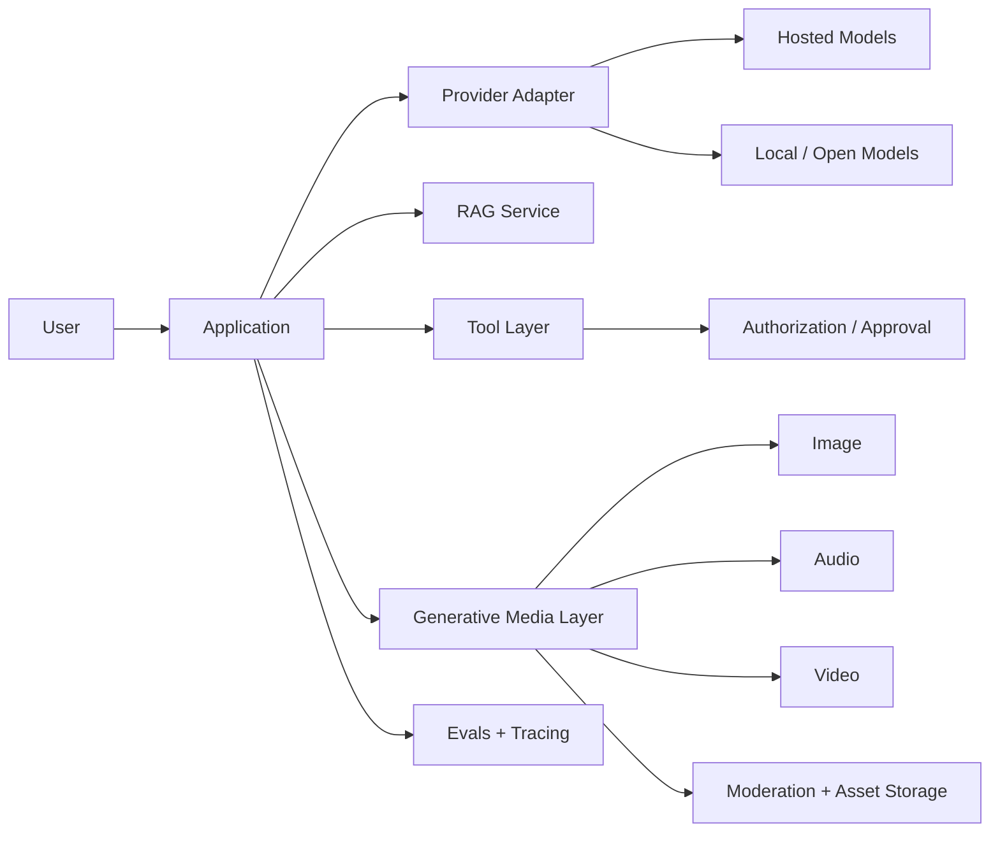

# AI Engineering Handbook

This handbook is a TypeScript-first path from software developer to senior/staff AI engineer. It focuses on **building reliable AI systems**, not on memorizing prompts or wrapping a model API.

```text
Software Developer
  ↓
AI & LLM Foundations
  ↓
Generative AI: model families, image, audio, video & multimodal systems
  ↓
Prompting + Model APIs
  ↓
Structured Outputs + Tool Calling
  ↓
Embeddings + Vector Search
  ↓
RAG + Advanced Retrieval
  ↓
LangChain TypeScript
  ↓
LangGraph + Agent Workflows
  ↓
Agents + Multi-Agent Systems + HITL
  ↓
MCP + Permissions
  ↓
Evals + Observability + Security
  ↓
Production AI Architecture
  ↓
Senior / Staff AI Engineer
```

The dedicated **Generative AI** track expands beyond LLM chat applications into generative model families, latent diffusion, Diffusion Transformers, flow matching, image generation/editing, ControlNet/IP-Adapter/LoRA concepts, text-to-speech and realtime audio, video generation and temporal consistency, multimodal systems, fine-tuning and PEFT, synthetic data, distillation, quantization, 3D generation, and production media serving.

## What this handbook optimizes for

Production AI engineering combines two disciplines:

1. **Probabilistic model behavior** — prompts, context, sampling, retrieval relevance, tool selection, image/audio/video generation, model quality, hallucination, and evaluation.
2. **Deterministic software boundaries** — schemas, authorization, retries, idempotency, queues, databases, caching, asset storage, tenant isolation, observability, deployment, and incident response.

The model may propose or generate. The application must validate, authorize, execute, observe, store, moderate, and recover.



Architecture examples distinguish general AI-engineering ideas from provider-specific, LangChain-specific, LangGraph-specific, MCP-specific, vector-database-specific, and generative-media-specific choices.

## TypeScript-first

Examples use strict TypeScript/Node.js whenever the ecosystem supports it. Python is discussed when useful for model-training and open-model ecosystem context, but it is not the default application implementation language.

Production examples emphasize runtime validation, timeouts and cancellation, selective retries, idempotent writes, authorization before side effects, secret management, safe logs/traces, job queues for long-running media generation, and testable adapters for models, vector stores, tools, media generators, and asset stores.

## The least-complex architecture rule

Not every AI feature needs an agent.

```text
single model call
  ↓
model + retrieval
  ↓
model + tools
  ↓
generative media pipeline
  ↓
deterministic workflow
  ↓
graph workflow
  ↓
agentic workflow
  ↓
autonomous agent
  ↓
multi-agent system
```

These are not a mandatory ladder: choose the **least complex design** that satisfies reliability, latency, cost, control, and product requirements. A deterministic media workflow may call several generative models without needing an autonomous agent.

## How to study

Start with AI/LLM foundations, then study the dedicated Generative AI section so you understand that text generation is only one part of the field. Continue through prompting, RAG, orchestration, agents, MCP, evaluation, security, and production architecture.

Build the 15 guided projects in order, complete the production capstone, use the 300 exercises for implementation and incident practice, then use the 400-question bank and mock interview rounds for interview preparation.

```text
learn → visualize → implement → measure → evaluate → break → debug → improve → explain
```

A senior AI engineer can explain not only *how* a RAG pipeline or agent works, but how generative models differ across text/image/audio/video, why an architecture is appropriate, how it fails, how quality is measured, how authorization is enforced, how cost and latency are controlled, and how the system can evolve without accidental provider lock-in.