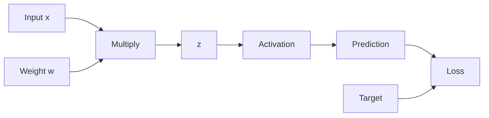

# Calculus, Derivatives, Gradients & Backpropagation

For practical ML, you need a narrow slice of calculus: slope, derivatives, partial derivatives, gradients, the chain rule, and how these ideas power backpropagation.

## Slope

For a straight line:

```text
y = m*x + b
```

`m` is the slope.

If:

```text
y = 3x + 1
```

then increasing `x` by 1 increases `y` by 3.

Slope measures **rate of change**.

## Derivative intuition

A derivative measures how quickly a function changes at a point.

For:

```text
f(x) = x^2
```

the derivative is:

```text
f'(x) = 2x
```

At `x = 3`:

```text
f'(3) = 6
```

So near `x=3`, a small increase in `x` produces roughly six times that change in `f(x)`.

## Numerical derivative

You can estimate a derivative using a tiny change:

```text
f'(x)
≈ (f(x + h) - f(x)) / h
```

Python:

```python
def f(x):
    return x**2

x = 3.0
h = 1e-5

derivative = (f(x + h) - f(x)) / h
print(derivative)  # close to 6
```

This is called a finite-difference approximation.

## Common derivatives worth recognizing

```text
d/dx c       = 0
d/dx x       = 1
d/dx x^2     = 2x
d/dx x^n     = n*x^(n-1)
d/dx e^x     = e^x
d/dx ln(x)   = 1/x
```

You do not need to memorize a huge table before starting ML.

## Loss as a function

Suppose:

```text
prediction = w*x
target = y
loss = (prediction - target)^2
```

Then loss depends on `w`.

Training asks:

> If I change `w` slightly, does loss increase or decrease, and by how much?

The derivative answers that.

## Worked one-parameter example

Given:

```text
x = 2
target = 10
prediction = w*x
loss = (w*x - target)^2
```

For `w = 3`:

```text
prediction = 6
loss = (6 - 10)^2 = 16
```

The derivative with respect to `w` is:

```text
d(loss)/dw
= 2*(w*x - target)*x
```

At `w=3`:

```text
gradient
= 2*(3*2 - 10)*2
= 2*(-4)*2
= -16
```

Negative gradient means increasing `w` should reduce loss locally.

## Partial derivatives

Models have many parameters:

```text
loss = f(w1, w2, b, ...)
```

A partial derivative measures change with respect to one variable while treating the others as fixed:

```text
∂loss/∂w1
∂loss/∂w2
∂loss/∂b
```

## Gradient

The gradient is the vector of all partial derivatives:

```text
gradient =
[
  ∂loss/∂w1,
  ∂loss/∂w2,
  ∂loss/∂b
]
```

It points in the direction of steepest local increase.

Gradient descent moves in the opposite direction.

## Chain rule

Deep networks compose functions.

Suppose:

```text
z = w*x
prediction = sigmoid(z)
loss = loss(prediction, target)
```

Then changing `w` affects:

```text
w
→ z
→ prediction
→ loss
```

The chain rule combines local rates of change:

```text
d(loss)/dw
=
d(loss)/d(prediction)
*
d(prediction)/dz
*
dz/dw
```

This is the mathematical heart of backpropagation.

## Computational graph



Forward pass:

```text
x → z → prediction → loss
```

Backward pass:

```text
loss gradient
→ prediction gradient
→ z gradient
→ weight gradient
```

## Backpropagation

Backpropagation is not a separate mysterious algorithm. It efficiently applies the chain rule through the computational graph from output back to parameters.

Conceptually:

```text
1. run forward pass
2. compute loss
3. start with derivative of loss
4. propagate gradients backward
5. accumulate parameter gradients
6. optimizer updates parameters
```

## Activation derivatives

ReLU:

```text
ReLU(x) = max(0, x)
```

Derivative:

```text
x > 0 → 1
x < 0 → 0
```

The point exactly at zero is handled by a convention in frameworks.

Sigmoid derivative:

```text
sigmoid'(x)
=
sigmoid(x) * (1 - sigmoid(x))
```

These derivatives influence gradient flow.

## Automatic differentiation

Frameworks such as PyTorch compute gradients automatically.

Conceptual PyTorch example:

```python
import torch

w = torch.tensor(3.0, requires_grad=True)
x = torch.tensor(2.0)
target = torch.tensor(10.0)

prediction = w * x
loss = (prediction - target) ** 2

loss.backward()

print(w.grad)  # -16
```

The framework records operations and applies the chain rule backward.

## Gradient checking

You can compare automatic gradients with finite differences:

```text
analytical/autodiff gradient
vs
numerical finite-difference estimate
```

This is useful when implementing custom mathematical operations.

## Vanishing gradients

When many derivatives are much smaller than 1, multiplying them through many layers can make gradients tiny.

Result:

```text
early layers learn very slowly
```

Modern activations, normalization, residual connections, and careful initialization help.

## Exploding gradients

If derivatives repeatedly multiply to large values, gradients can become huge.

Result:

- unstable training;
- NaNs;
- massive parameter updates.

Gradient clipping is one common mitigation.

## What calculus you do not need initially

You can defer:

- advanced integration;
- differential equations;
- rigorous limits;
- multivariable proofs;
- Hessian derivations;
- advanced optimization theory.

Master derivatives and gradients first.

## Practice

1. What does a derivative tell you?
2. Compute the derivative of `x^2` at `x=5`.
3. What is the difference between a derivative and a gradient?
4. Why is the chain rule essential for neural networks?
5. Explain backpropagation without using the phrase "magic algorithm."
