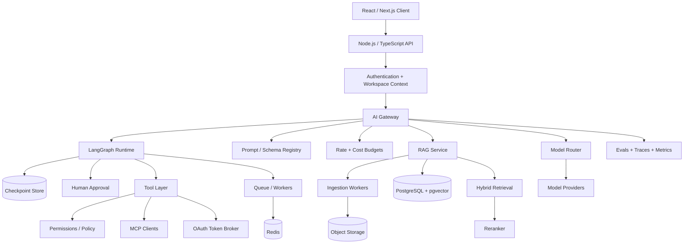

# Production Multi-Tenant AI Agent Platform

This capstone combines the complete handbook into one production system. It is not complete when a demo chat works; it is complete when tenancy, authorization, state durability, evals, observability, failure handling, cost controls, and deployment behavior are demonstrable.

## Requirements

Workspaces can authenticate users, configure assistants, select allowed model policy, connect knowledge sources, define read/write tools and MCP servers, run conversations/jobs, approve high-risk actions, inspect citations/traces/cost, and run evaluation suites before changes are promoted.

Required capabilities: authentication, multi-tenancy, model abstraction/routing, streaming, structured output, tools, RAG, hybrid retrieval, reranking, LangChain, LangGraph, checkpoints, durable execution, HITL, memory, MCP, OAuth/scopes, background jobs, retries, caching, evals, observability, rate limiting, cost tracking, security, testing, deployment.

## Architecture



## Repository structure

```text
apps/
  web/
  api/
  worker/
packages/
  auth/
  tenant/
  ai-gateway/
  model-providers/
  prompts-schemas/
  rag/
  langchain-adapters/
  agent-graph/
  tools/
  mcp/
  oauth/
  policy/
  evals/
  telemetry/
  db/
infra/
  migrations/
  containers/
  deployment/
```

Keep domain/policy packages independent from model/framework packages. LangChain integrations adapt models/retrievers/tools; LangGraph owns orchestration; neither owns tenant authorization.

## Core data model

At minimum:

```text
users
workspaces
workspace_members
assistants
assistant_versions
prompts
knowledge_sources
source_documents
chunks
embedding_versions
tool_connections
oauth_credentials
mcp_servers
runs
run_events
checkpoints
approval_requests
idempotency_records
usage_ledger
eval_datasets
eval_cases
eval_runs
audit_events
```

Every workspace-owned table includes a trusted workspace key and access is always scoped by authenticated server context. OAuth credentials are encrypted and never returned to model context.

## API design

Representative endpoints:

```text
POST   /workspaces/:id/assistants
POST   /assistants/:id/versions
POST   /knowledge-sources
POST   /knowledge-sources/:id/reindex
POST   /runs
GET    /runs/:id
GET    /runs/:id/events
POST   /runs/:id/resume
POST   /approvals/:id/decision
POST   /evals/run
GET    /usage
```

`POST /runs` accepts an idempotency key. Event transport may use SSE for streaming; authoritative run state remains in durable storage.

## Model gateway

Expose a provider-neutral contract for text/multimodal generation, structured output, embeddings, and tool-capable model calls. Policy chooses a model from task class, quality evals, latency target, tenant budget, data constraints, and provider health.

Fallbacks are validated against the same capability contract. Record model/provider/version and usage per call.

## RAG service

Ingestion is asynchronous and versioned:

```text
source → parse → normalize → structural chunk → embed → upsert → reconcile
```

Retrieval:

```text
query → authorized scope → query transform
      → dense + BM25 → fusion → rerank → dedupe/context
      → citations
```

Store source version, parser/chunker/embedding versions and source location metadata. Evaluate recall/MRR/nDCG independently from grounded answer quality.

## Agent runtime

Use LangGraph for explicit long-running state:

```text
START → understand → retrieve? → model
                      ↑          ↓
                 tool result ← tool requested?
                                  ↓
                         authorization/risk
                           ├→ read execute
                           └→ write → interrupt approval
                                      ↓ resume
                                   execute
                                      ↓
                                   answer → END
```

State includes normalized request, messages, retrieval evidence IDs, proposed tool calls, approval references, budgets, error counters, and output—not raw long-lived secrets.

## Tools, MCP & permissions

All capabilities register a deterministic policy descriptor: permission, tenant/resource resolver, risk class, idempotency behavior, timeout, and audit requirements. MCP discovery feeds the same local registry only after allowlisting; remote descriptions never grant permission.

High-risk writes require a persisted approval bound to normalized arguments and expire after a configured window. Authorization is rechecked after resume.

## OAuth

Use authorization code + PKCE for delegated user connections where applicable. Store refresh tokens encrypted; issue/use short-lived access tokens; validate scopes/resource/audience; never pass a token from one service to another unrelated resource.

Support connection revocation and make tool execution fail safely when consent is removed.

## Async jobs & reliability

Queue ingestion, research, eval runs, and other long jobs. Job records have deterministic IDs/state; workers are safe to retry. External writes use idempotency keys. Add bounded exponential backoff/jitter, circuit breakers, dead-letter handling, cancellation, and run deadlines.

Define recovery for provider outage, vector DB failure, empty retrieval, malformed structured output, expired OAuth, MCP unavailable, graph checkpoint version mismatch, and partial streaming disconnect.

## Caching & performance

Possible caches: prompt-prefix/provider caching, embeddings, query transformations, retrieval, reranking, and safe read-tool results. Keys include tenant/security scope and all semantic versions. Never share personalized context across workspaces.

Measure TTFT, total latency, retrieval/rerank spans, model output rate, tool latency, queue age, graph steps, p95/p99, and cache hit rate.

## Cost controls

Maintain a usage ledger by workspace/run/model: input/output/reasoning tokens, embedding volume, reranking calls, tool/provider costs, agent iterations, and infrastructure allocation where useful.

Enforce per-run step/token/time budgets and workspace monthly/feature limits. Route easy tasks to smaller models only when eval quality remains acceptable.

## Evals

Ship with versioned datasets for:

- structured extraction;
- retrieval relevance;
- grounded QA/citations;
- tool selection/arguments;
- unauthorized action resistance;
- agent trajectories/loop limits;
- HITL behavior;
- latency and cost budgets.

Changes to model, prompts, tools, chunking, retriever, reranker, or graph run candidate-vs-baseline evaluation before promotion.

## Observability

One trace spans HTTP request/job → model/retrieval/tool/graph operations. Record prompt/schema/model versions, retrieved IDs/scores, tool status, retries, state transitions, tokens, latency, cost, and terminal outcome. Redact PII/secrets and use access-controlled trace storage.

## Security

Threat-model prompt injection, poisoned documents, malicious MCP servers, SSRF, command/file/network tools, confused deputy, cross-tenant retrieval, token theft, replayed approvals, duplicate writes, secret leakage, unsafe caches, and denial-of-wallet loops.

Controls include server-derived tenant context, least privilege, allowlists, scoped OAuth, egress restrictions, sandboxing, approval, idempotency, audit logs, quotas, and a kill switch for tool classes/providers.

## Testing strategy

- unit: schemas, policies, routing, chunking, cost math, cache keys;
- integration: provider/vector/OAuth/MCP contracts;
- tenancy: attempt cross-workspace access at every resource path;
- graph: every branch, retry, interrupt/resume, replay, cancellation;
- chaos: provider/vector/queue/token failures;
- load: streaming concurrency, queues, retrieval p95;
- eval: probabilistic task quality and trajectories;
- deployment smoke: authenticated run, RAG, approval tool, trace, eval.

## Deployment

Containerize API/workers, run database migrations safely, separate secrets/config, use managed durable data stores where appropriate, and roll out model/prompt/graph changes with versioned compatibility. CI runs TypeScript/tests/evals sample/build; production promotion uses staged traffic and rollback-ready version identifiers.

## Acceptance criteria

The capstone passes only if two independent workspaces can run simultaneously without data/tool leakage; ingestion updates/deletes reconcile; hybrid RAG provides valid citations; a high-risk write survives interrupt/restart and executes exactly once after approval; fallback routing is observed; eval regression blocks a bad candidate; budgets stop runaway loops; OAuth revocation prevents tool use; and dashboards expose latency, failures, token/cost, and task success.

## Senior / Staff review questions

1. Which parts belong in a shared AI platform vs each product team?
2. How would you migrate embedding/chunking versions without downtime?
3. What must remain stable when moving from LangGraph to another runtime?
4. How does a model-provider outage degrade user experience safely?
5. What evidence proves tenant isolation for retrieval, traces, caches, and MCP tools?
6. How do you define a successful AI task and attribute its cost?
7. Which capabilities need human approval, and how is approval bound to exact side effects?
8. How do you roll out a new model when offline evals improve but p95 latency doubles?
