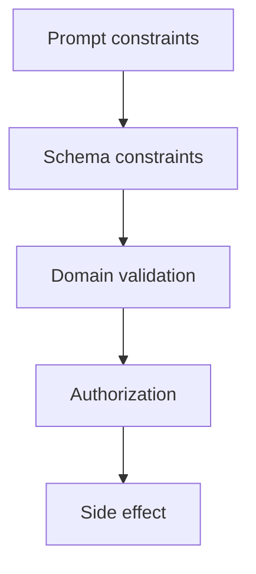

# Constraint Prompting

Constraint prompting defines boundaries such as allowed labels, maximum length, evidence requirements, language, refusal behavior, and prohibited assumptions.

Constraints help the model understand the contract, but **hard invariants should be implemented in schemas and code whenever possible**.

## Layers of constraints



## Prompt example

```text
- Choose exactly one label: billing, account, bug, other.
- Use only the supplied ticket.
- Maximum rationale: 120 characters.
- If evidence is insufficient, choose other.
```

## Code-enforced contract

```ts
import { z } from "zod";

const Result = z.object({
  label: z.enum(["billing", "account", "bug", "other"]),
  rationale: z.string().max(120),
});
```

The schema enforces shape. Business code still checks semantics.

```ts
function canRefund(amount: number, approvalLimit: number): boolean {
  return amount <= approvalLimit;
}
```

Do not rely on a sentence such as “never refund more than the approval limit.”

## Positive constraints

Prefer describing the allowed behavior clearly instead of writing pages of negatives.

```text
Return one supported status value.
```

is usually better than:

```text
Do not return pending. Do not return maybe. Do not return unknown...
```

when an enum can express the domain.

## Practice

1. Convert a prose-only output requirement into a Zod schema.
2. Identify which constraints belong in prompt, schema, and authorization code.
3. Why can too many negative instructions make a prompt harder to maintain?
