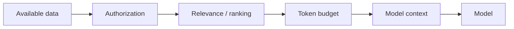
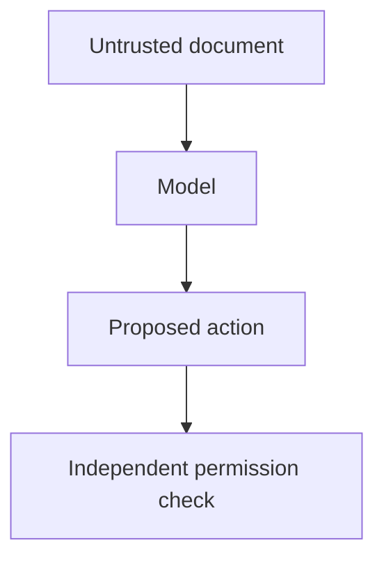

# Context Prompting

Context prompting supplies the information a model needs to complete the task: source documents, policies, user state, retrieved evidence, prior messages, or tool results.

The goal is not maximum context. It is **relevant, authorized, well-labeled context**.

## Context pipeline



## TypeScript context builder

```ts
type ContextChunk = {
  id: string;
  text: string;
  score: number;
  allowed: boolean;
};

function chooseContext(chunks: ContextChunk[], limit: number) {
  return chunks
    .filter(chunk => chunk.allowed)
    .sort((a, b) => b.score - a.score)
    .slice(0, limit);
}
```

Authorization should happen before private data reaches the model.

## Label evidence

```text
<SOURCE id="policy-17">
Refunds are allowed within 30 days of delivery.
</SOURCE>
```

Source IDs enable citations and debugging.

## Context is untrusted when the source is untrusted

Retrieved web pages, uploaded files, emails, and tool outputs may contain prompt injection.



Do not turn a document into trusted instructions simply because it appears in the context window.

## Practice

1. Design a context builder for a tenant-aware support bot.
2. What metadata would you preserve for citations?
3. Why can adding more documents reduce answer quality?
