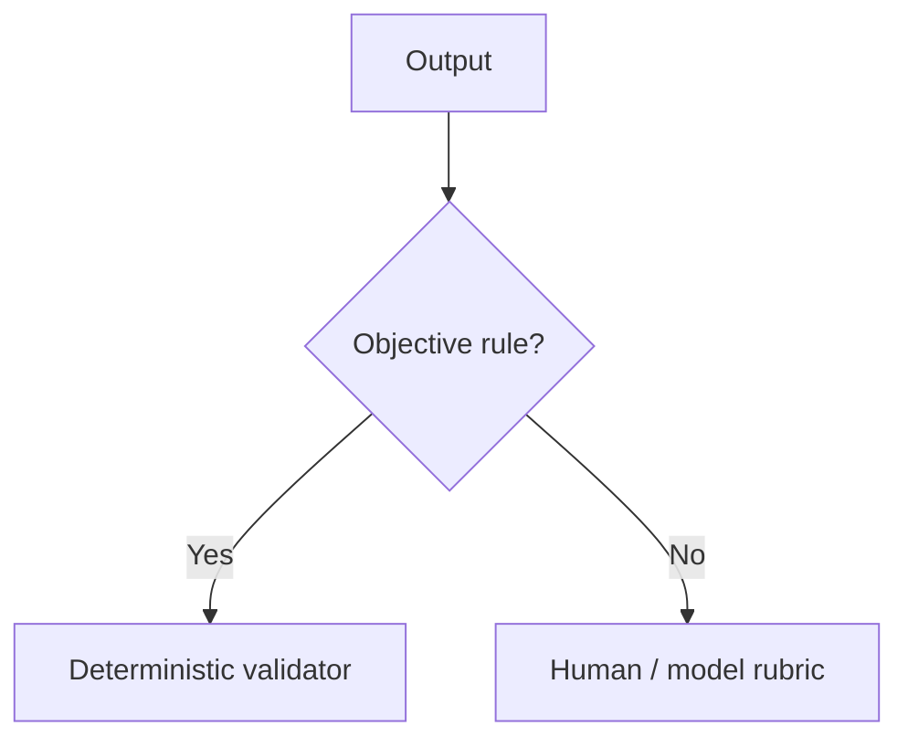

# Critique & Revision Prompting

A critique/revision workflow asks for a draft, evaluates it against a rubric, then revises specific defects.

This can improve open-ended writing, code, and analysis—but every extra model call adds latency and cost.

## Workflow


## Structured critique

```ts
import { z } from "zod";

const Critique = z.object({
  accepted: z.boolean(),
  defects: z.array(z.object({
    criterion: z.string(),
    evidence: z.string(),
    fix: z.string(),
  })),
});
```

A rubric makes critique more useful than “make this better.”

## Bounded loop

```ts
async function reviseUntilAccepted(maxRounds = 2) {
  let draft = await generateDraft();

  for (let round = 0; round < maxRounds; round++) {
    const critique = Critique.parse(await evaluateDraft(draft));
    if (critique.accepted) return draft;
    draft = await reviseDraft(draft, critique.defects);
  }

  return draft;
}
```

Always bound self-improvement loops.

## Prefer deterministic validators when possible

If the requirement is objective—valid JSON, max length, required citation IDs, type correctness—code is cheaper and more reliable than another model call.



## Practice

1. Write a five-item rubric for a technical design review.
2. Which rubric items could be deterministic validators?
3. Why should revision loops have a maximum number of rounds?
