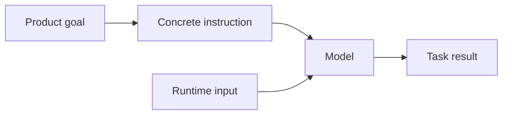
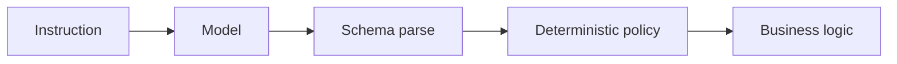

# Instruction Prompting

Instruction prompting tells the model **what task to perform, what success means, and which decision rules matter**.

## Pattern



Bad:

```text
Be helpful with this invoice.
```

Better:

```text
Extract supplier, invoice number, currency, and total.
Do not infer missing fields. Return null when evidence is absent.
```

## TypeScript template

```ts
function extractionInstruction(document: string): string {
  return `
TASK
Extract supplier, invoice number, currency, and total.

RULES
- Use only the supplied document.
- Do not calculate a missing total.
- Return null for missing fields.

<DOCUMENT>
${document}
</DOCUMENT>
`.trim();
}
```

## Good instruction characteristics

- action-oriented;
- specific enough to evaluate;
- explicit about ambiguous cases;
- free of irrelevant persona text;
- separated from untrusted input;
- consistent with the actual schema and application policy.

## Put hard rules in code too



A prompt can guide behavior, but authorization, money limits, and data integrity must remain deterministic.

## Practice

1. Rewrite “review this code” into a measurable security-review instruction.
2. Add an explicit missing-information rule.
3. Identify two requirements that belong in code rather than only in the prompt.
