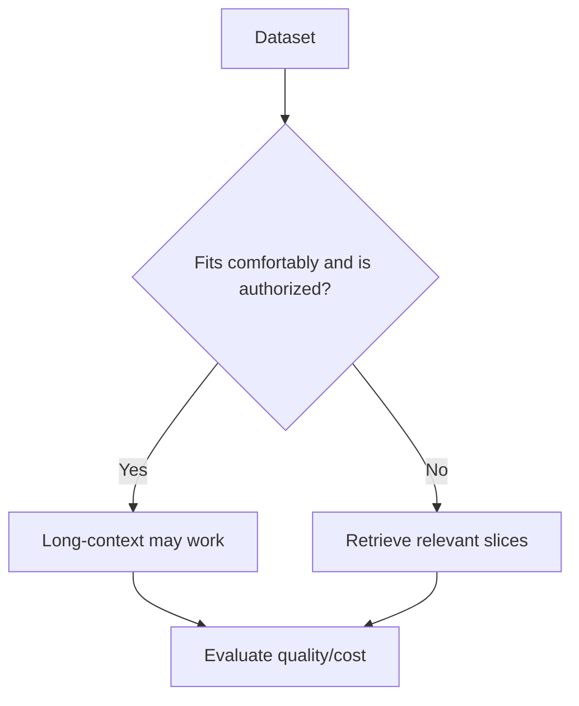

# Long-Context Prompting

Long-context prompting supplies a large body of documents, code, transcripts, or records directly to the model. A large context window gives capacity, but does not guarantee that every token will be used equally well.

## Architecture


## Structure the context

```text
<SOURCE id="contract-a">
...
</SOURCE>

<SOURCE id="contract-b">
...
</SOURCE>

TASK
Compare termination clauses and cite each supporting source.
```

Current model guidance can vary on whether instructions should appear before or after large context blocks. Test the exact target model rather than treating one layout as universal.

## TypeScript context assembly

```ts
type Source = { id: string; text: string };

function renderSources(sources: Source[]): string {
  return sources
    .map(s => `<SOURCE id="${s.id}">\n${s.text}\n</SOURCE>`)
    .join("\n\n");
}
```

## Long context vs RAG



Hybrid designs are common: retrieval chooses high-value evidence, then a long-context model compares many retrieved sources together.

## Evaluate position effects

Put the same critical fact near the beginning, middle, and end of a test corpus. Measure whether answer quality changes.

```ts
const positions = ["beginning", "middle", "end"] as const;
```

Also test distractors, duplicate evidence, conflicting sources, and injection attempts.

## Practice

1. Design a long-context test for comparing ten contracts.
2. Why can 200k tokens of capacity still produce a bad answer?
3. When would RAG be safer than sending the entire corpus?
