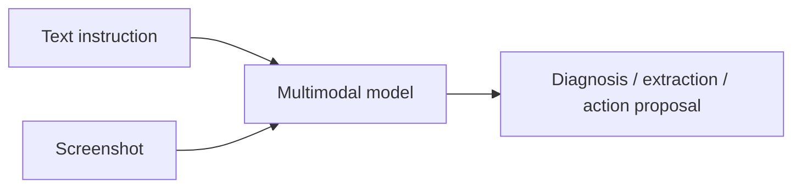
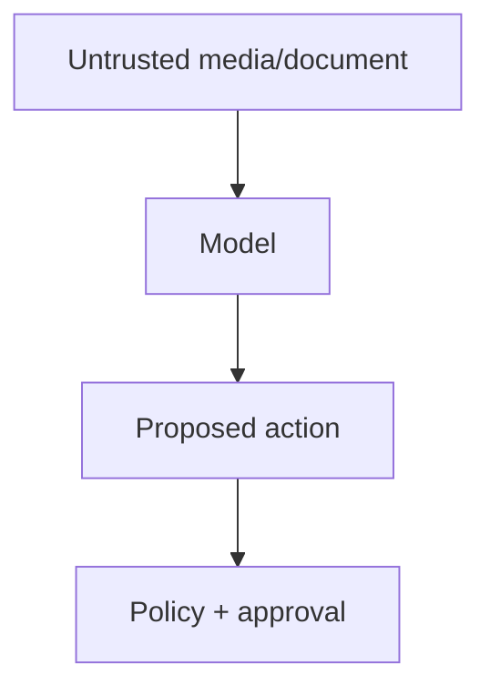

# Multimodal Prompting

Multimodal prompting combines text instructions with images, audio, video, documents, or other model-supported inputs.

The instruction should make the relationship between modalities explicit.

## Example flow



Bad:

```text
What is wrong?
```

Better:

```text
Inspect the attached checkout screenshot.
Identify visible validation errors and map each error to the form field it belongs to.
Do not infer backend errors that are not visible.
```

## TypeScript domain model

```ts
type MultimodalInput = {
  instruction: string;
  images?: { url: string; purpose: string }[];
  audio?: { url: string; purpose: string }[];
  documents?: { url: string; sourceId: string }[];
};
```

Your provider adapter translates this domain model into the current provider-specific request format.

## Ground references

```text
Image A = checkout screenshot
Image B = design reference

Compare Image A with Image B and list only visible layout differences.
```

For video/audio, specify time ranges when possible.

```ts
type MediaSegment = {
  assetId: string;
  startSeconds: number;
  endSeconds: number;
};
```

## Security

Images, PDFs, audio transcripts, and web pages can contain adversarial instructions.



Treat content as data unless the application explicitly trusts it as instructions.

## Practice

1. Write a prompt that compares a screenshot with a design reference.
2. How would you cite a video segment in the output?
3. Why can a PDF contain prompt injection even if the user never typed malicious text?
