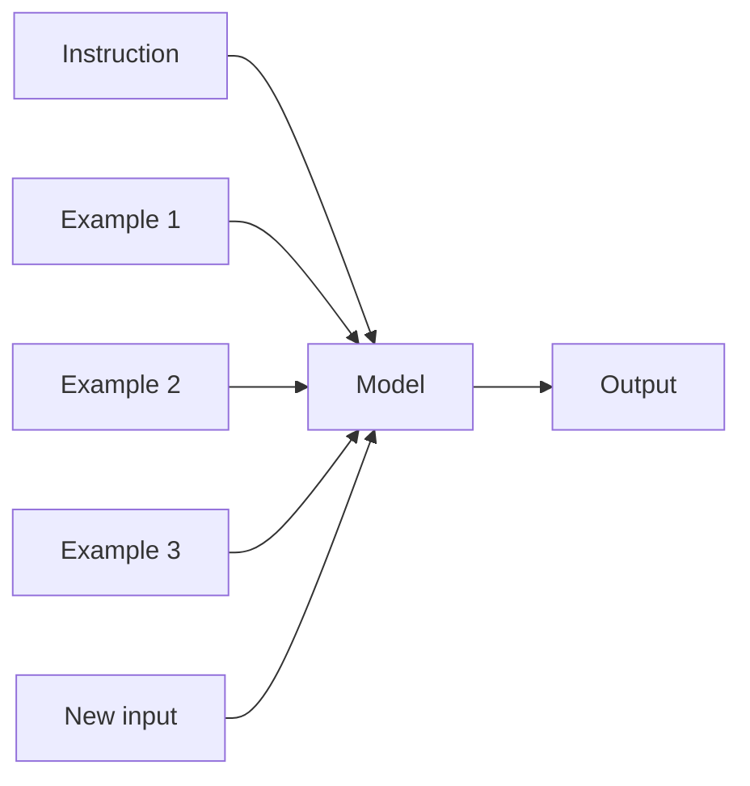
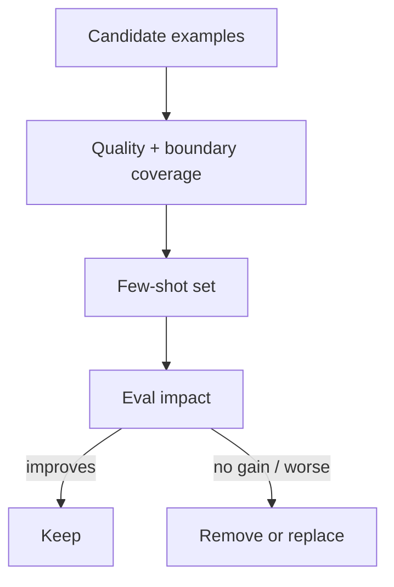
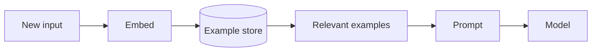

# One-Shot & Few-Shot Prompting

**One-shot prompting** gives one worked example before the new task.

**Few-shot prompting** gives several examples so the model can infer decision boundaries, style, format, or task behavior from demonstrations.

## Pattern



## One-shot example

```text
Classify tickets as billing, account, bug, or other.

Example:
Input: "I cannot reset my password"
Output: account

Now classify:
Input: "I was charged two times"
```

## Few-shot example

```text
Input: "Charged twice for order 12"
Output: billing

Input: "Password reset email never arrives"
Output: account

Input: "App crashes after selecting a photo"
Output: bug

Input: "Do you support dark mode?"
Output: other
```

The examples demonstrate boundaries between labels.

## Example selection matters

Good examples are:

- representative;
- correct;
- diverse;
- focused on difficult distinctions;
- consistent with the current schema/policy.

Bad examples can actively teach the wrong behavior.



## TypeScript representation

```ts
type Example = {
  input: string;
  output: "billing" | "account" | "bug" | "other";
};

const examples: Example[] = [
  { input: "Charged twice", output: "billing" },
  { input: "Password reset failed", output: "account" },
  { input: "App crashes on upload", output: "bug" },
];

function renderExamples(items: Example[]): string {
  return items
    .map((x, i) => `Example ${i + 1}\nInput: ${x.input}\nOutput: ${x.output}`)
    .join("\n\n");
}
```

## Static vs retrieved examples

A fixed few-shot set works for stable tasks. For broad domains, you can retrieve examples similar to the current request.



This is sometimes called dynamic few-shot prompting or example retrieval.

## Cost trade-off

Examples consume context tokens on every request unless provider caching helps reuse a stable prefix.

```text
more examples
→ more context
→ potentially higher cost/latency
→ not necessarily higher quality
```

Use the smallest set that measurably improves the task.

## Examples vs fine-tuning

If a task requires dozens or hundreds of examples in every prompt, consider whether:

- the instruction is unclear;
- examples can be retrieved dynamically;
- a deterministic classifier is better;
- fine-tuning is justified.

Few-shot prompting is not always the final architecture.

## Avoid data leakage

Do not put secrets, personal data, or production records into examples unless your data policy and model/provider configuration allow it.

Use synthetic or redacted examples where possible.

## Example order bias

Models can be sensitive to example ordering. Test:

- label balance;
- hard examples first/last;
- conflicting examples;
- repeated labels;
- edge cases.

## Few-shot + schema

Examples teach semantics; schemas enforce shape.

```text
few-shot examples → "what this label means"
schema            → "what output shape is allowed"
```

Use both when both problems exist.

## Practice

1. Create four examples that teach the boundary between `billing` and `account`.
2. Which examples would you remove if token budget is tight?
3. Design a dynamic few-shot retrieval schema.
4. Explain why examples must still be covered by regression evals.
