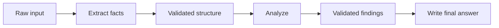
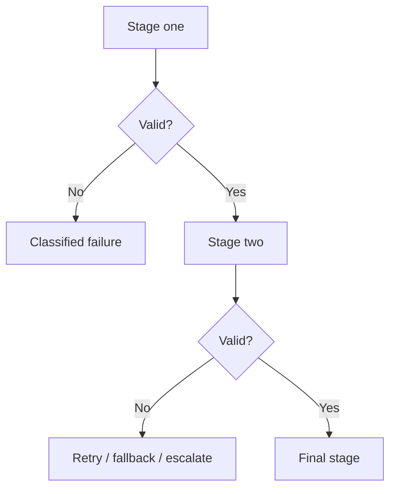

# Prompt Chaining

Prompt chaining connects multiple model or deterministic steps so each stage has a narrower responsibility and a typed handoff.



## Why chain prompts?

A single giant prompt may combine extraction, retrieval, reasoning, formatting, and validation. Splitting stages can improve observability and allow each stage to use the cheapest appropriate model.

## Typed handoffs

```ts
import { z } from "zod";

const Facts = z.object({
  customerId: z.string().nullable(),
  issue: z.string(),
});

const Findings = z.object({
  cause: z.string(),
  evidenceIds: z.array(z.string()),
});
```

Parse one stage before feeding it to the next.

```ts
async function runChain(text: string) {
  const facts = Facts.parse(await extractFacts(text));
  const sources = await retrieve(facts.issue);
  const findings = Findings.parse(await analyze(facts, sources));
  return writeAnswer(findings);
}
```

## Failure handling



Do not blindly replay the entire chain if only one retryable stage failed.

## Practice

1. Split a document-review prompt into three typed stages.
2. Which stage could use a smaller model?
3. Why are typed handoffs safer than passing free-form prose between every step?
