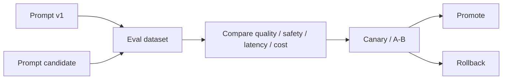
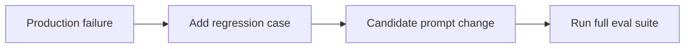

# Prompt Evals, Versioning & Rollout

A production prompt is code-like behavior configuration. Changes should be versioned, evaluated, compared with a baseline, and rolled out with evidence.

## Lifecycle



## Prompt record

```ts
type PromptVersion = {
  id: string;
  version: string;
  template: string;
  modelPolicy: string;
  createdAt: string;
  evalSuiteVersion: string;
};
```

Log the prompt version in traces so production failures can be reproduced.

## Eval cases

```ts
type EvalCase = {
  id: string;
  input: string;
  expectedLabel?: string;
  requiredFacts?: string[];
  forbiddenClaims?: string[];
};
```

Use deterministic graders for exact properties and calibrated human/model rubrics for subjective quality.

## Regression gate

```ts
type EvalSummary = {
  accuracy: number;
  safetyPassRate: number;
  p95LatencyMs: number;
  averageCostUsd: number;
};

function canShip(candidate: EvalSummary, baseline: EvalSummary): boolean {
  return (
    candidate.accuracy >= baseline.accuracy &&
    candidate.safetyPassRate >= baseline.safetyPassRate &&
    candidate.p95LatencyMs <= baseline.p95LatencyMs * 1.15
  );
}
```

Real thresholds should come from product SLOs, not this example.

## Avoid anecdotal prompt editing

One bad production output is a test case—not proof that a random rewrite is better.



## Practice

1. Define five eval cases for a support-ticket classifier.
2. What trace metadata is needed to reproduce a prompt failure?
3. Design a rollback condition for a prompt canary.
