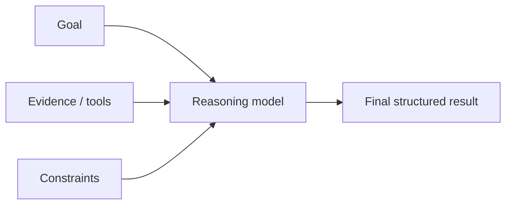
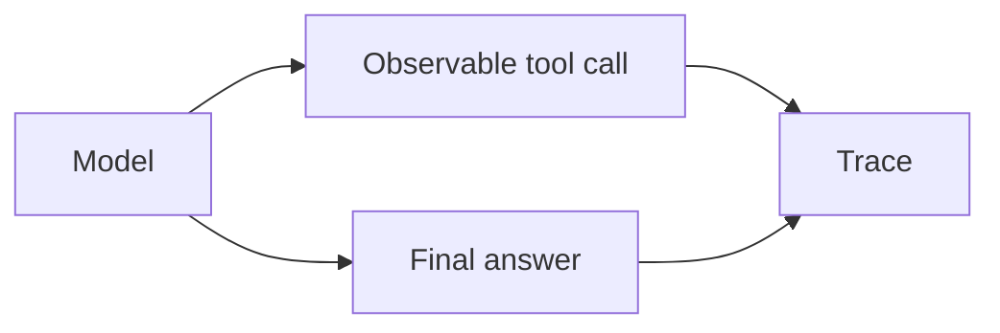

# Prompting Reasoning Models

Reasoning-capable models may spend additional internal computation on difficult tasks. Prompt them with a clear objective, complete constraints, useful evidence, and an explicit output contract rather than trying to force a theatrical step-by-step transcript.

## Good pattern



## Example

```text
Review the migration plan for data-loss and rollback risks.
Use the supplied schema and deployment constraints.
Return findings by severity with evidence and remediation.
If a risk cannot be determined from the evidence, mark it unknown.
```

## TypeScript task contract

```ts
import { z } from "zod";

const Finding = z.object({
  severity: z.enum(["low", "medium", "high", "critical"]),
  risk: z.string(),
  evidence: z.string(),
  remediation: z.string(),
});

const Review = z.object({ findings: z.array(Finding) });
```

## Reasoning effort is a routing decision

```ts
type ReasoningEffort = "low" | "medium" | "high";

function chooseEffort(complexity: number): ReasoningEffort {
  if (complexity >= 8) return "high";
  if (complexity >= 4) return "medium";
  return "low";
}
```

Use real provider settings from current API docs; the enum here demonstrates application policy.

## Do not request hidden reasoning as your audit log

For observability, record model/config version, retrieved evidence, tool calls, validated arguments, state transitions, and final output.



## Practice

1. Rewrite a “think step by step” prompt into an outcome-focused reasoning prompt.
2. Design an eval to compare low and high reasoning effort.
3. What observable events should an agent trace contain?
